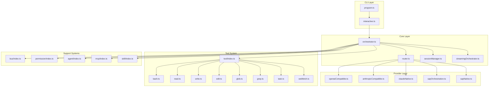
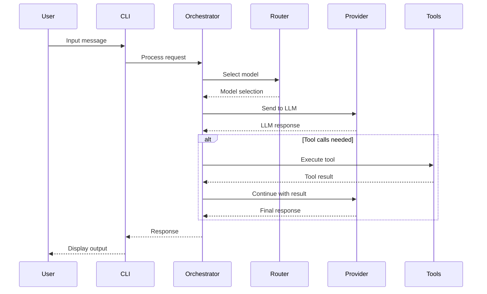
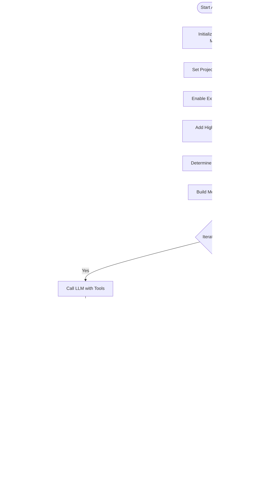
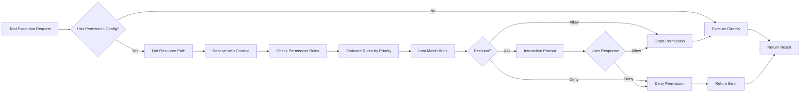
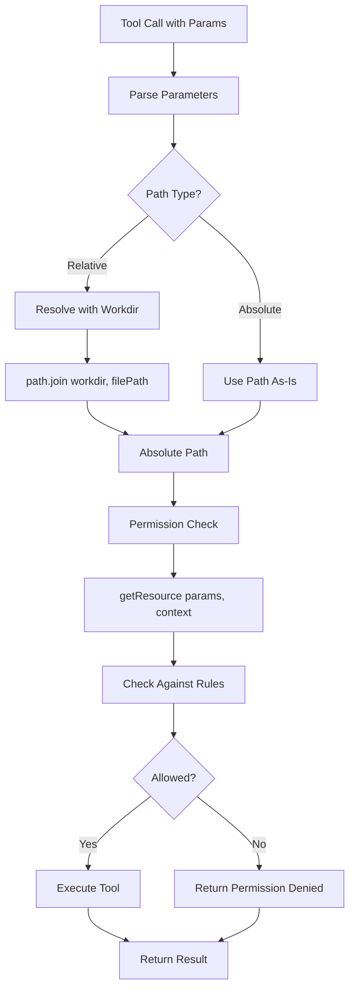
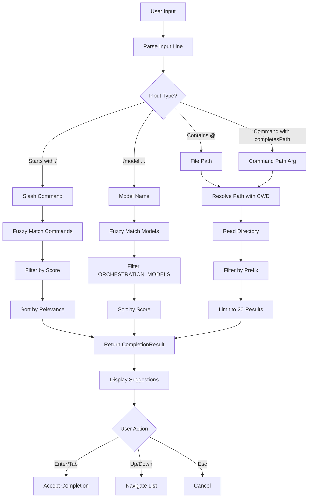
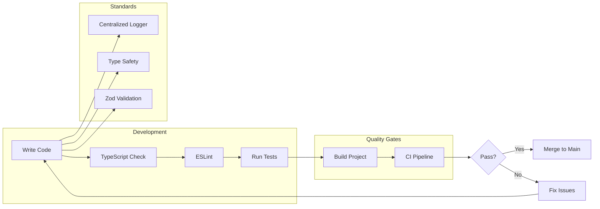

# Alexi Architecture

This document describes the high-level architecture of Alexi, an AI-powered CLI assistant.

## Overview

Alexi is a TypeScript/Node.js application that orchestrates multiple LLM providers with intelligent routing, session management, and extensible tool systems.

## System Architecture



## Module Descriptions

### CLI Layer

| Module | File | Description |
|--------|------|-------------|
| Program | `src/cli/program.ts` | CLI entry point using Commander.js |
| Interactive | `src/cli/interactive.ts` | Interactive mode with streaming UI |

### Core Layer

| Module | File | Description |
|--------|------|-------------|
| Orchestrator | `src/core/orchestrator.ts` | Main orchestration logic |
| Router | `src/core/router.ts` | Model selection and routing |
| Session Manager | `src/core/sessionManager.ts` | Conversation session persistence |
| Streaming Orchestrator | `src/core/streamingOrchestrator.ts` | Real-time streaming support |
| Agentic Chat | `src/core/agenticChat.ts` | Autonomous agent with tool execution loop |
| Stage Manager | `src/core/stageManager.ts` | Workflow stage management |
| Workflow Manager | `src/core/workflowManager.ts` | Multi-stage workflow orchestration |

### Provider Layer

Alexi uses SAP AI Core Orchestration API as the sole provider for all LLM operations.

| Module | File | Description |
|--------|------|-------------|
| SAP Orchestration | `src/providers/sapOrchestration.ts` | SAP AI Core via SDK (sole provider) |
| Provider Index | `src/providers/index.ts` | Provider resolution and default model selection |

### Tool System

| Tool | File | Description |
|------|------|-------------|
| Bash | `src/tool/tools/bash.ts` | Execute shell commands with hierarchical permissions |
| Bash Hierarchy | `src/tool/tools/bash-hierarchy.ts` | Progressive permission rules for bash commands |
| Read | `src/tool/tools/read.ts` | Read files and directories |
| Write | `src/tool/tools/write.ts` | Write files |
| Edit | `src/tool/tools/edit.ts` | Edit files with string replacement |
| Glob | `src/tool/tools/glob.ts` | Find files by pattern |
| Grep | `src/tool/tools/grep.ts` | Search file contents |
| WarpGrep | `src/tool/tools/warpgrep.ts` | AI-powered semantic codebase search |
| Task | `src/tool/tools/task.ts` | Launch sub-agents |
| WebFetch | `src/tool/tools/webfetch.ts` | Fetch web content |
| Question | `src/tool/tools/question.ts` | Ask user questions |
| TodoWrite | `src/tool/tools/todowrite.ts` | Manage task lists |

### Support Systems

| Module | File | Description |
|--------|------|-------------|
| Event Bus | `src/bus/index.ts` | Pub/sub event system |
| Permission | `src/permission/index.ts` | File access control |
| Agent | `src/agent/index.ts` | Autonomous agent system |
| Agent System | `src/agent/system.ts` | System prompt assembly with instruction files |
| MCP | `src/mcp/index.ts` | Model Context Protocol |
| Skill | `src/skill/index.ts` | Specialized prompt skills |
| Compaction | `src/compaction/index.ts` | Context compression |
| Profile | `src/profile/index.ts` | User profile management |
| User Config | `src/config/userConfig.ts` | Persistent user configuration |
| Autocomplete | `src/cli/utils/completer.ts` | Slash command and path completion |
| Logger | `src/utils/logger.ts` | Centralized logging utility |
| Clipboard | `src/utils/clipboard.ts` | Cross-platform clipboard image handling |

## Data Flow



## Agentic Chat Flow



## Permission System Flow



## Tool System with Context Resolution

The tool system resolves relative paths using the workdir context:



## Autocomplete System

The autocomplete engine provides intelligent completions for slash commands, model names, and file paths across both the readline REPL and Ink TUI.



### Completion Types

The autocomplete system supports three completion types:

1. **Slash Commands**: Matches command names and aliases with fuzzy matching
   - Example: `/mod` matches `/model`, `/models`
   - Displays command description and aliases

2. **Model Names**: Completes model identifiers from `ORCHESTRATION_MODELS`
   - Example: `gpt` matches `gpt-4o`, `gpt-4o-mini`, `gpt-4.1`
   - Only triggered after `/model ` command

3. **File Paths**: Completes relative and absolute file paths
   - Example: `src/c` matches `src/cli/`, `src/config/`, `src/core/`
   - Triggered by `@` prefix or commands with `completesPath` flag
   - Directories suffixed with `/`
   - Hidden files excluded unless explicitly typed

### Fuzzy Matching Algorithm

The completer uses a lightweight fuzzy matching algorithm:

- **Prefix match**: `target.startsWith(query)` — highest score
  - Score: `(query.length / target.length) * 100 + 50`
- **Subsequence match**: All characters in query appear in target in order
  - Score: `consecutiveMatches * 10`
- **No match**: Returns `score: 0`

## Configuration

### Environment Variables

```
AICORE_SERVICE_KEY    # SAP AI Core credentials (required)
AICORE_RESOURCE_GROUP # SAP AI Core resource group (required)
AICORE_MODEL          # Default model override (optional)
MORPH_API_KEY         # WarpGrep semantic search API key (optional)
```

### User Configuration

User preferences are persisted in `~/.alexi/config.json`:

```json
{
  "defaultModel": "gpt-4o",
  "soundEnabled": true
}
```

#### Default Model Resolution

Default model is resolved in the following order (first non-empty wins):

1. `AICORE_MODEL` environment variable (explicit env always wins)
2. `defaultModel` in `~/.alexi/config.json` (persistent user preference)
3. Hardcoded `gpt-4o` fallback

The `/model` command persists the selected model to `~/.alexi/config.json` automatically.

### Instruction Files

Alexi loads instruction files from multiple sources to build the system prompt:

1. **Project-level AGENTS.md** (`workdir/AGENTS.md`)
   - Project-specific instructions for AI agents
   - Loaded with `<agents-md>` tags

2. **User-level ALEXI.md** (`~/.alexi/ALEXI.md`)
   - User-level instructions loaded into every session
   - Loaded with `<user-instructions>` tags

3. **Project-level rule files** (`workdir/.alexi/rules/*.md`)
   - Scoped rule files for specific contexts
   - Loaded with `<rule file="...">` tags

Use `/memory` command to list, edit, and initialize instruction files.

### Routing Configuration

Routing rules are defined in `routing-config.json` or `~/.alexi/routing-config.json`:

```json
{
  "rules": [
    {
      "name": "code-tasks",
      "priority": 100,
      "condition": { "contains": ["code", "implement", "fix"] },
      "model": "anthropic--claude-4-sonnet"
    }
  ],
  "default": {
    "model": "anthropic--claude-4-sonnet"
  }
}
```

## Directory Structure

```
alexi/
├── src/
│   ├── cli/           # CLI entry points
│   ├── core/          # Core orchestration
│   ├── providers/     # LLM providers
│   ├── tool/          # Tool system
│   │   └── tools/     # Individual tools
│   ├── agent/         # Agent system
│   ├── bus/           # Event bus
│   ├── permission/    # Permission system
│   ├── mcp/           # MCP integration
│   ├── skill/         # Skill system
│   ├── config/        # Configuration
│   ├── log/           # Logging
│   ├── profile/       # Profile management
│   └── ...
├── tests/             # Test files
├── dist/              # Compiled output
└── docs/              # Documentation
```

## Key Design Decisions

### 1. Multi-Provider Architecture

Alexi supports multiple LLM providers through a unified interface, allowing:
- Easy switching between providers
- Fallback mechanisms
- Cost optimization through routing

### 2. Tool System with Permission Control

Tools are implemented as independent modules that:
- Follow a consistent interface based on Zod schema validation
- Can be enabled/disabled per session
- Support permission-based access control with last-match-wins rule evaluation
- Resolve relative paths using workdir context for agentic operations
- Support interactive permission prompts and high-priority allow rules
- Convert Zod schemas to JSON Schema for LLM function calling with proper type handling

### 3. Agentic Execution Mode

The agentic chat system enables autonomous file operations:
- Automatic permission configuration for write and execute actions
- High-priority allow rules (priority 200) override default ask prompts
- External directory access for full workspace capability
- Tool execution loop with LLM-driven decision making
- Iteration limits to prevent infinite loops (default: 50)

### 4. Event-Driven Architecture

The event bus enables:
- Loose coupling between modules
- Plugin extensibility
- Real-time streaming updates
- Permission events (DoomLoopDetected, ExternalAccessAttempted)

### 5. Session Management

Sessions provide:
- Multi-turn conversation context
- Persistence across CLI invocations
- Export and sharing capabilities

## Security Considerations

1. **Secrets Management**: Secrets are redacted in exports and logs
2. **Permission System**: File access is controlled by configurable rules
3. **Environment Isolation**: Sensitive config stored in `~/.alexi/`
4. **Type Safety**: Strict TypeScript configuration with proper type assertions
5. **Logging**: Centralized logger replaces direct console calls for better control

## Logging System

Alexi uses a centralized logging utility to provide consistent logging across the application.

### Logger API

```typescript
import { logger } from './utils/logger.js';

// Set log level (debug, info, warn, error)
logger.setLevel('debug');

// Log messages at different levels
logger.debug('Debug message', additionalData);
logger.info('Info message');
logger.warn('Warning message');
logger.error('Error message', error);

// Print without formatting (for CLI output)
logger.print('Raw output');
```

### Log Levels

| Level | Priority | Description | Output Format |
|-------|----------|-------------|---------------|
| `debug` | 0 | Detailed debugging information | `[DEBUG] message` |
| `info` | 1 | General informational messages | `message` (no prefix) |
| `warn` | 2 | Warning messages | `[WARN] message` |
| `error` | 3 | Error messages | `[ERROR] message` |

The logger respects the configured log level and only outputs messages at or above that level. The default level is `info`.

### ESLint Integration

The logger utility is the only module permitted to use direct console calls. All other modules should import and use the centralized logger to maintain ESLint compliance.

```typescript
// ❌ Avoid direct console usage
console.log('message');

// ✅ Use centralized logger
import { logger } from './utils/logger.js';
logger.info('message');
```

## Type Safety and Code Quality

### TypeScript Configuration

Alexi uses strict TypeScript configuration with proper type assertions:

```typescript
// Model capability filtering with explicit type assertion
const models = config.models.filter(
  (m) => (m as ModelCapability & { enabled?: boolean }).enabled !== false
);

// Zod schema type handling with interface definitions
interface ZodDefBase {
  description?: string;
}

const def = (schema as unknown as { _def: ZodDefBase })._def;
```

### ESLint Rules

Key ESLint rules enforced:

- `no-console: warn` - Prevents direct console usage (except in logger)
- `@typescript-eslint/no-explicit-any: warn` - Flags any type usage
- `@typescript-eslint/no-unused-vars: error` - Prevents unused variables
- `prefer-const: error` - Enforces const for immutable variables
- `eqeqeq: error` - Requires strict equality checks

### Code Quality Diagram



## Future Improvements

- [ ] Add more provider implementations
- [ ] Improve test coverage
- [ ] Add metrics and telemetry
- [ ] Implement caching layer
- [ ] Add web UI option
