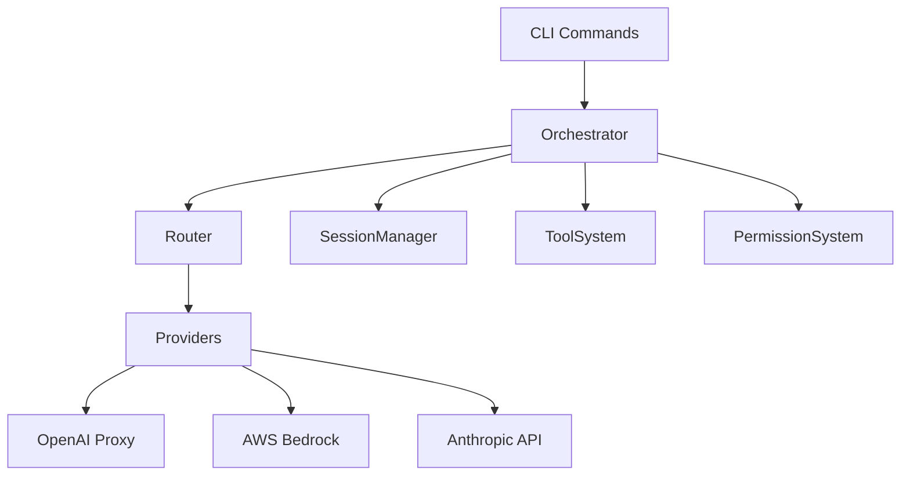
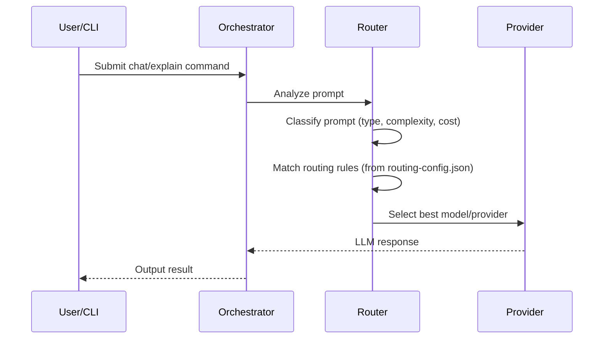
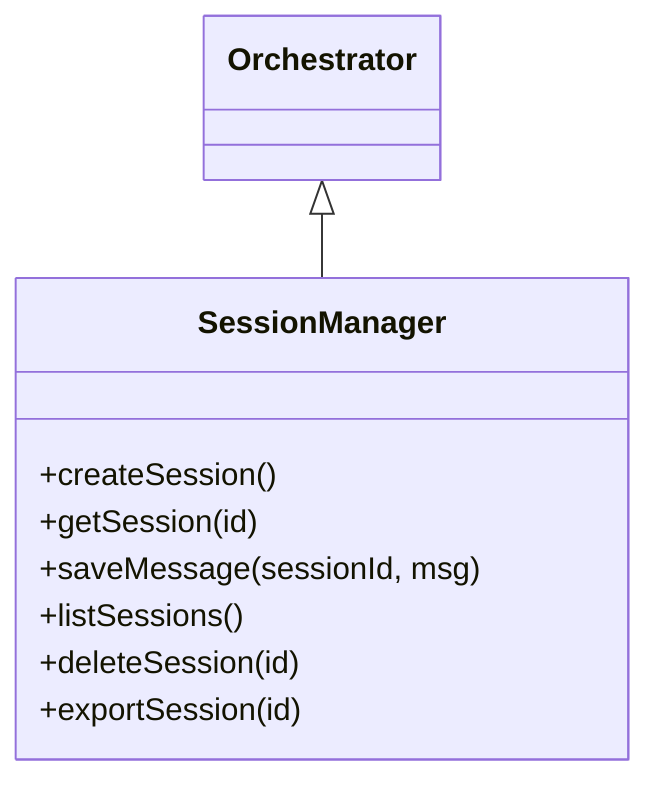
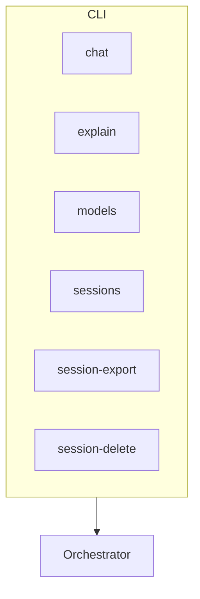
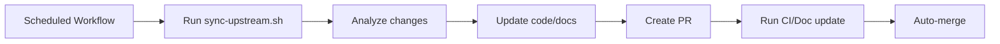

# Alexi System Architecture

Alexi is an intelligent LLM orchestrator for SAP AI Core, supporting multi-provider integration (Claude, GPT, OpenAI-compatible), automatic model routing, session management, rule-based configuration, and autonomous self-updating. This document outlines the technical architecture, core flows, and development structure.

---

## Table of Contents

- [System Overview](#system-overview)
- [Component Diagram](#component-diagram)
- [Provider Resolution Flow](#provider-resolution-flow)
- [Routing Decision Flow](#routing-decision-flow)
- [Session Management](#session-management)
- [CLI Command Structure](#cli-command-structure)
- [Autonomous Self-Updating System](#autonomous-self-updating-system)
- [Directory Layout](#directory-layout)

---

## System Overview

Alexi orchestrates requests to LLM providers, automatically selects the best model via prompt classification and rule-based routing, manages multi-turn sessions, and exposes a CLI for chat, model management, and session operations. Core features include:

- **Multi-Provider Support:** OpenAI-compatible proxy, AWS Bedrock (Claude), native Anthropic Messages API
- **Auto-Routing:** Uses prompt classifier and routing rules (JSON config) to select model
- **Session Management:** Stores and resumes conversations with context
- **Rule-Based Configuration:** Flexible routing and permission rules
- **Autonomous Sync:** Pulls updates from upstream AI assistant repos


## Component Diagram



- **Orchestrator:** Core logic (`src/core/`)
- **Router:** Model selection logic (`src/core/router.ts`)
- **Providers:** LLM integrations (`src/providers/`)
- **SessionManager:** Persistence and retrieval (`src/session/`)
- **ToolSystem:** File and shell tools (`src/tool/`)
- **PermissionSystem:** Rule-based access control


## Provider Resolution Flow

This flow shows how Alexi resolves which model/provider to use for a given request.



Key files:
- `src/core/router.ts`: Routing logic, model registry
- `routing-config.json`: Rules and provider capabilities

## Routing Decision Flow

Alexi's router determines the optimal LLM for each prompt using scoring and priorities.

```mermaid
flowchart TD
    A[Prompt] --> B[Classifier]
    B --> C[Routing Rules (Priority)]
    C --> D[Model Registry Filter]
    D --> E[Scoring/Ranking]
    E --> F[Model Selection]
```

- **Classifier:** Determines type (reasoning, code, chat), complexity, etc.
- **Routing Rules:** JSON rules with priorities, e.g., prefer Claude for summary, GPT for math
- **Model Registry:** List of enabled models (`enabled !== false`)
- **Scoring:** Assigns scores based on rule matches, capabilities, and cost

**Code Example:** Model registry filtering (from `src/core/router.ts`):

```typescript
function getModelRegistry(): ModelCapability[] {
  return getConfig().models.filter(
    (m) => (m as ModelCapability & { enabled?: boolean }).enabled !== false
  );
}
```

## Session Management

Sessions enable multi-turn conversations, context preservation, and export/delete actions.



- Sessions are stored with context, messages, and model info
- Sessions can be exported to markdown or deleted
- Session manager used in CLI and orchestrator logic

**Example usage:**

```typescript
const session = sessionManager.getSession('abc-123');
sessionManager.saveMessage('abc-123', {
  role: 'user',
  content: 'Tell me more about SAP AI Core.'
});
```

## CLI Command Structure

All core features are exposed via CLI commands using Commander.js (`src/cli/program.ts`).



- `alexi chat`: Start conversation or continue session
- `alexi explain`: Debug routing/model selection
- `alexi models`: List available models
- `alexi sessions`: List sessions
- `alexi session-export`: Export session to markdown
- `alexi session-delete`: Delete session

## Autonomous Self-Updating System

Alexi includes a GitHub Actions + shell script system for syncing with upstream AI assistant repositories (kilocode, opencode, claude-code).



- `.github/workflows/sync-upstream.yml`: Schedules daily sync
- `scripts/sync-upstream.sh`: Fetches and applies upstream changes
- `.github/templates/`: Maintains prompt templates
- `.github/last-sync-commits.json`: Tracks upstream commit state

## Directory Layout

```text
alexi/
├── src/
│   ├── cli/
│   ├── providers/
│   ├── router/
│   ├── session/
│   └── core/
├── scripts/
├── .github/
│   ├── workflows/
│   ├── templates/
│   └── last-sync-commits.json
├── routing-config.json
├── package.json
├── tsconfig.json
└── README.md
```

---

Alexi's modular design ensures extensibility for new providers, models, tools, and automation tasks. For more detail, consult [`docs/API.md`](./API.md) and the codebase.
