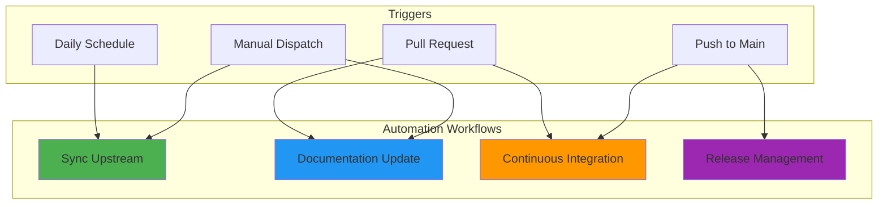
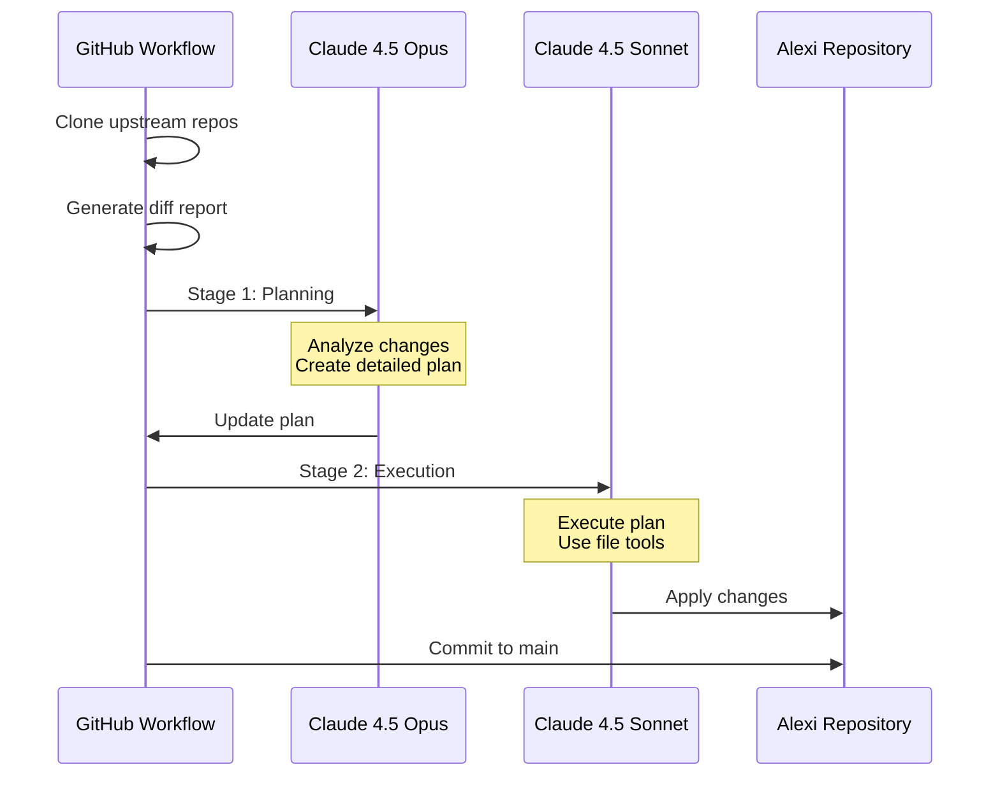
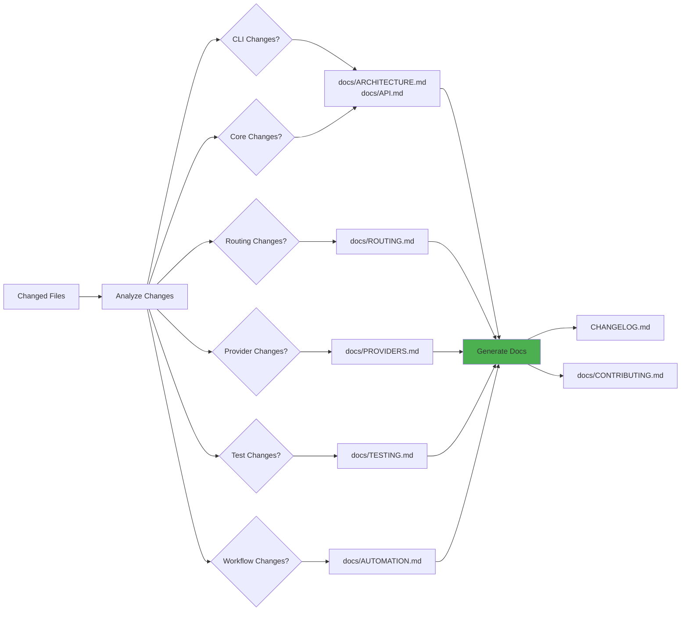
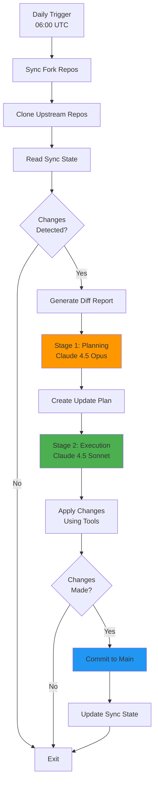
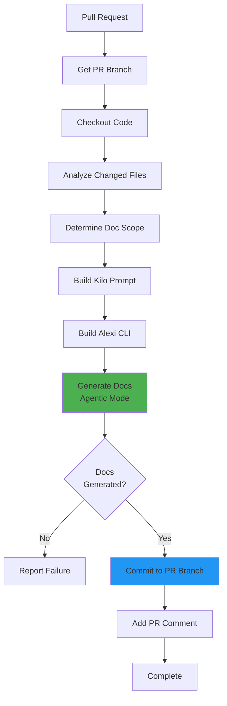
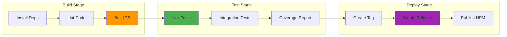

# Automation Guide

This document describes all GitHub Actions workflows, automated processes, and CI/CD pipelines in the Alexi project.

## Table of Contents

- [Overview](#overview)
- [Workflows](#workflows)
- [Autonomous Sync System](#autonomous-sync-system)
- [Documentation Update Workflow](#documentation-update-workflow)
- [CI/CD Pipeline](#cicd-pipeline)
- [Required Secrets](#required-secrets)
- [Workflow Diagrams](#workflow-diagrams)

## Overview

Alexi uses GitHub Actions for automated testing, documentation generation, and upstream synchronization. The automation system includes:

- **Autonomous Upstream Sync**: Daily synchronization with upstream AI coding assistant repositories
- **Documentation Updates**: Automatic documentation generation on pull requests
- **Continuous Integration**: Automated testing and linting
- **Release Management**: Automated version tagging and release creation



## Workflows

### 1. Sync Upstream Changes

**File**: `.github/workflows/sync-upstream.yml`

Automatically synchronizes changes from upstream AI coding assistant repositories and applies relevant updates to Alexi.

#### Trigger Schedule

```yaml
schedule:
  - cron: '0 6 * * *'  # Daily at 06:00 UTC
```

#### Manual Trigger Options

```bash
# Trigger via GitHub CLI
gh workflow run sync-upstream.yml

# With options
gh workflow run sync-upstream.yml \
  -f dry_run=true \
  -f force_sync=false
```

#### Workflow Parameters

| Parameter | Type | Default | Description |
|-----------|------|---------|-------------|
| `dry_run` | boolean | false | Only analyze changes, do not create PR |
| `force_sync` | boolean | false | Sync even if no changes detected |

#### Upstream Repositories

The workflow syncs from three upstream sources:

1. **kilocode** (Kilo-Org/kilocode)
   - Fork: ausard/kilocode
   - Kilo AI coding assistant

2. **opencode** (anomalyco/opencode)
   - Fork: ausard/opencode
   - OpenCode AI terminal assistant

3. **claude-code** (anthropics/claude-code)
   - Direct clone (no fork)
   - Anthropic's Claude Code CLI

#### Two-Stage Update Process

The sync workflow uses a sophisticated two-stage AI process:



**Stage 1: Planning (Claude 4.5 Opus)**
- Analyzes upstream changes from diff report
- Creates detailed update plan with code snippets
- Prioritizes changes: critical > high > medium > low
- Considers SAP AI Core compatibility

**Stage 2: Execution (Claude 4.5 Sonnet)**
- Executes the update plan using agentic tools
- Uses `read`, `write`, `edit`, `glob`, `grep` tools
- Applies changes directly to repository
- Maintains existing code style and patterns

#### Sync State Tracking

The workflow tracks sync state in `.github/last-sync-commits.json`:

```json
{
  "kilocode": {
    "last_synced_commit": "abc123...",
    "last_synced_at": "2024-01-15T06:00:00Z",
    "upstream": "Kilo-Org/kilocode",
    "fork": "ausard/kilocode"
  },
  "opencode": {
    "last_synced_commit": "def456...",
    "last_synced_at": "2024-01-15T06:00:00Z",
    "upstream": "anomalyco/opencode",
    "fork": "ausard/opencode"
  },
  "claude-code": {
    "last_synced_commit": "ghi789...",
    "last_synced_at": "2024-01-15T06:00:00Z",
    "upstream": "anthropics/claude-code",
    "fork": "direct-clone"
  }
}
```

#### Auto-Merge Behavior

The workflow commits directly to the main branch (autonomous mode):

- No pull request created
- Changes committed immediately after execution
- Two-stage AI process ensures quality control
- Commit message includes sync details and AI models used

### 2. Documentation Update

**File**: `.github/workflows/documentation-update.yml`

Automatically generates and updates documentation when code changes are detected in pull requests.

#### Trigger Conditions

```yaml
on:
  pull_request:
    types: [opened, synchronize, reopened]
    branches: [main, master]
  workflow_dispatch:
    inputs:
      pr_number: number
      force_full_regeneration: boolean
```

#### Documentation Scope Detection

The workflow analyzes changed files and determines which documentation needs updating:



#### File Path Handling

The workflow ensures correct file paths for documentation:

- Most documentation: `docs/` directory (e.g., `docs/ARCHITECTURE.md`)
- Changelog: Repository root (`CHANGELOG.md`)
- Contributing: `docs/` directory (`docs/CONTRIBUTING.md`)

#### AI Documentation Generation

The workflow uses Alexi's agentic mode to generate documentation:

```bash
node dist/cli/program.js agent \
  --message-file kilo-prompt.md \
  --model "anthropic--claude-4.5-sonnet" \
  --max-iterations 30 \
  --tools "read,write,edit,glob,grep" \
  --workdir "$(pwd)" \
  --system "You are an expert technical writer..."
```

#### Workflow Steps

1. **Analyze Changes**: Detect which files changed
2. **Determine Scope**: Identify affected documentation
3. **Build Prompt**: Create comprehensive prompt with context
4. **Generate Docs**: Use AI to update documentation
5. **Commit Changes**: Push updates to PR branch

### 3. Continuous Integration

**File**: `.github/workflows/ci.yml`

Runs automated tests and linting on pull requests and pushes.

#### CI Pipeline

```mermaid
graph LR
    Trigger[PR/Push] --> Checkout[Checkout Code]
    Checkout --> Setup[Setup Node.js 22]
    Setup --> Install[Install Dependencies]
    Install --> Lint[Run Linting]
    Lint --> Build[Build Project]
    Build --> Test[Run Tests]
    Test --> Coverage[Generate Coverage]
    Coverage --> Report[Upload Report]
    
    style Test fill:#4CAF50
    style Coverage fill:#2196F3
```



#### Test Execution

```bash
# Install dependencies
npm ci

# Run linting
npm run lint

# Build project
npm run build

# Run tests with coverage
npm run test:coverage
```

### 4. Release Management

**File**: `.github/workflows/release.yml`

Automates version tagging and release creation when changes are merged to main.

#### Release Process

1. Detect version from `package.json`
2. Create git tag
3. Generate release notes from CHANGELOG.md
4. Create GitHub release
5. Publish to npm (if configured)

## Required Secrets

The following secrets must be configured in GitHub repository settings:

### SAP AI Core Credentials

| Secret | Description | Required For |
|--------|-------------|--------------|
| `AICORE_SERVICE_KEY` | SAP AI Core service key JSON | Sync, Documentation |
| `AICORE_RESOURCE_GROUP` | AI Core resource group name | Sync, Documentation |

### GitHub Access

| Secret | Description | Required For |
|--------|-------------|--------------|
| `GITHUB_TOKEN` | Automatically provided by GitHub | All workflows |
| `GH_PAT` | Personal access token (optional) | Cross-repo fork sync |

### Configuration Example

To configure secrets:

```bash
# Using GitHub CLI
gh secret set AICORE_SERVICE_KEY < service-key.json
gh secret set AICORE_RESOURCE_GROUP --body "default"

# Or via GitHub UI
# Settings > Secrets and variables > Actions > New repository secret
```

## Workflow Diagrams

### Sync Upstream Workflow



### Documentation Update Workflow



### CI/CD Pipeline



## Monitoring and Debugging

### View Workflow Runs

```bash
# List recent workflow runs
gh run list

# View specific run
gh run view <run-id>

# View logs
gh run view <run-id> --log
```

### Debug Failed Workflows

1. Check workflow logs in GitHub Actions tab
2. Review AI-generated reports in `.github/reports/`
3. Check sync state in `.github/last-sync-commits.json`
4. Verify secrets are configured correctly

### Common Issues

**Issue**: Sync workflow fails with "GH_PAT not configured"
- **Solution**: This is expected if cross-repo sync is not needed. The workflow will skip fork sync gracefully.

**Issue**: Documentation generation times out
- **Solution**: Increase `max-iterations` parameter or reduce documentation scope.

**Issue**: AI makes incorrect changes
- **Solution**: Review the planning stage output in `.github/reports/update-plan-*.md` and adjust prompts if needed.

## Best Practices

### Workflow Development

1. **Test Locally First**: Test changes with `act` or manual workflow dispatch
2. **Use Dry Run Mode**: Test sync workflow with `dry_run=true`
3. **Monitor AI Output**: Review generated plans and execution logs
4. **Version Control**: Keep workflow files in version control
5. **Document Changes**: Update this guide when modifying workflows

### Security Considerations

1. **Protect Secrets**: Never log secret values
2. **Limit Permissions**: Use minimal required permissions
3. **Review AI Changes**: Audit changes made by autonomous sync
4. **Use Protected Branches**: Require reviews for workflow changes

### Performance Optimization

1. **Cache Dependencies**: Use GitHub Actions cache for npm packages
2. **Parallel Jobs**: Run independent jobs in parallel
3. **Conditional Execution**: Skip unnecessary steps with conditions
4. **Optimize AI Prompts**: Keep prompts focused and concise

## Future Enhancements

Planned improvements to the automation system:

1. **Intelligent Merge Conflict Resolution**: AI-powered conflict resolution
2. **Automated Testing of Synced Changes**: Run tests before committing
3. **Rollback Mechanism**: Automatic rollback on test failures
4. **Multi-Model Validation**: Use multiple AI models for verification
5. **Performance Metrics**: Track sync success rates and execution times

## Contributing

When modifying workflows:

1. Test changes in a fork first
2. Document new secrets or configuration
3. Update this guide with changes
4. Add workflow diagrams for complex flows
5. Follow existing naming conventions

For more information, see [CONTRIBUTING.md](CONTRIBUTING.md).
