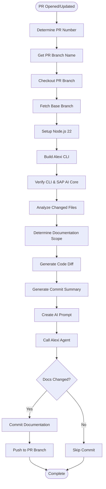
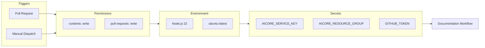
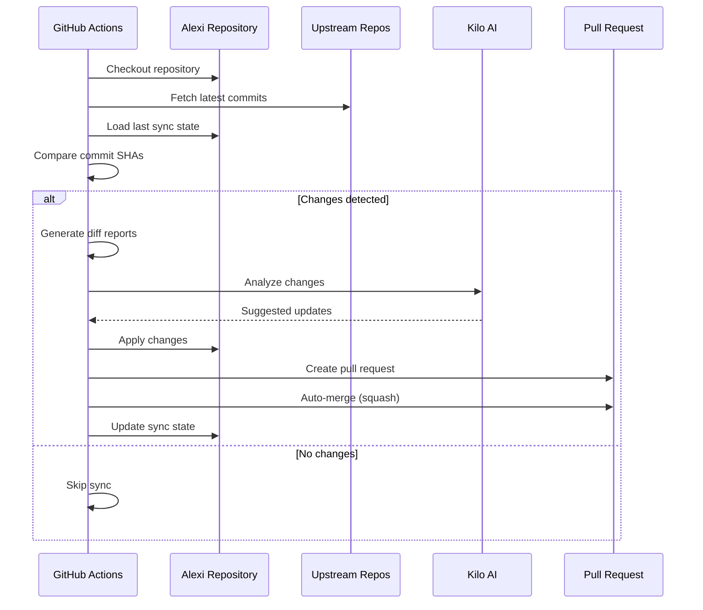

# Alexi Automation Documentation

This document describes the automated workflows and CI/CD processes in the Alexi project.

## Table of Contents

- [Overview](#overview)
- [GitHub Actions Workflows](#github-actions-workflows)
- [Documentation Update Workflow](#documentation-update-workflow)
- [Workflow Diagrams](#workflow-diagrams)
- [Required Secrets](#required-secrets)
- [Local Testing](#local-testing)

## Overview

Alexi uses GitHub Actions to automate several critical processes:

1. **Documentation Updates**: Automatically generates and updates documentation when code changes are detected
2. **Autonomous Sync**: Syncs with upstream AI coding assistant repositories
3. **CI/CD**: Builds, tests, and validates code changes

## GitHub Actions Workflows

### Documentation Update Workflow

**File**: `.github/workflows/documentation-update.yml`

The documentation update workflow automatically generates and updates documentation files based on code changes in pull requests.

#### Triggers

- **Pull Request Events**: Opened, synchronized, or reopened PRs to main/master branches
- **Manual Dispatch**: Can be triggered manually with PR number and optional force regeneration flag

#### Workflow Steps



#### Change Detection Logic

The workflow analyzes changed files to determine which documentation needs updating:

| Changed Files | Documentation Updated |
|---------------|----------------------|
| CLI files (`src/cli/**`) | `docs/ARCHITECTURE.md`, `docs/API.md` |
| Core files (`src/core/**`) | `docs/ARCHITECTURE.md`, `docs/API.md` |
| Routing files (`src/router/**`, `routing-config.json`) | `docs/ROUTING.md` |
| Provider files (`src/providers/**`) | `docs/PROVIDERS.md` |
| Config files (`*.json`, `.env.example`) | `docs/CONFIGURATION.md` |
| Test files (`tests/**`, `*.test.ts`) | `docs/TESTING.md` |
| Workflow files (`.github/workflows/**`) | `docs/AUTOMATION.md` |
| Script files (`scripts/**`) | `docs/AUTOMATION.md` |

Additionally, `CHANGELOG.md` (in repository root) and `docs/CONTRIBUTING.md` are always updated.

#### File Path Handling

The workflow uses precise file path specifications:

- Most documentation files are in the `docs/` directory (e.g., `docs/ARCHITECTURE.md`)
- `CHANGELOG.md` is in the repository root (not `docs/`)
- The scope.md file includes full relative paths to ensure correct file placement

#### AI-Powered Documentation Generation

The workflow uses Alexi's agent mode to generate documentation:

```bash
alexi agent \
  --message-file prompt.md \
  --model anthropic--claude-4.5-sonnet \
  --workdir . \
  --max-iterations 50 \
  --verbose
```

The AI agent:
1. Reads the generated prompt with code changes and documentation scope
2. Examines existing documentation files
3. Updates or creates documentation files as needed
4. Ensures consistency with project standards
5. Includes Mermaid diagrams where appropriate

#### Documentation Requirements

The workflow enforces these requirements:

- Minimum 3 Mermaid diagrams per major document
- Professional technical language (no emojis)
- Actual code examples from the repository
- TypeScript type definitions for key interfaces
- Keep a Changelog format for CHANGELOG.md

### Workflow Configuration



### Workflow Inputs

When triggered manually via `workflow_dispatch`:

| Input | Type | Required | Default | Description |
|-------|------|----------|---------|-------------|
| `pr_number` | number | Yes | - | Pull request number to process |
| `force_full_regeneration` | boolean | No | false | Force full documentation regeneration |

### Workflow Outputs

The workflow produces:

1. **Updated Documentation Files**: Modified or created .md files in the repository
2. **Commit**: A single commit with message "docs: update documentation for PR #N"
3. **Analysis Report**: Temporary files showing changed files and documentation scope

### Error Handling

The workflow includes robust error handling:

- Validates PR number exists
- Checks if PR branch can be fetched
- Verifies Alexi CLI builds successfully
- Confirms SAP AI Core credentials are configured
- Handles cases where no documentation changes are needed
- Reports errors via GitHub Actions annotations

## Upstream Sync Workflow

**File**: `.github/workflows/sync-upstream.yml`

The sync workflow automatically updates Alexi by syncing with upstream AI coding assistant repositories.

### Monitored Repositories

| Repository | Description | Source |
|------------|-------------|--------|
| **kilocode** | Kilo AI coding assistant | [Kilo-Org/kilocode](https://github.com/Kilo-Org/kilocode) |
| **opencode** | OpenCode AI terminal assistant | [anomalyco/opencode](https://github.com/anomalyco/opencode) |
| **claude-code** | Anthropic's Claude Code CLI | [anthropics/claude-code](https://github.com/anthropics/claude-code) |

### Sync Process Flow



### Sync Triggers

- **Scheduled**: Daily at 06:00 UTC
- **Manual**: Via GitHub Actions UI with options:
  - `dry_run`: Analyze without applying changes
  - `force_sync`: Sync even if no changes detected

### Sync State Management

The workflow maintains sync state in `.github/last-sync-commits.json`:

```json
{
  "kilocode": "abc123...",
  "opencode": "def456...",
  "claude-code": "ghi789...",
  "lastSyncDate": "2024-01-15T06:00:00Z"
}
```

## Required Secrets

The following GitHub secrets must be configured in the repository:

### AICORE_SERVICE_KEY

Full SAP AI Core service key in JSON format.

```json
{
  "clientid": "...",
  "clientsecret": "...",
  "url": "...",
  "serviceurls": {
    "AI_API_URL": "..."
  }
}
```

**Usage**: Authentication with SAP AI Core for LLM access

### AICORE_RESOURCE_GROUP

SAP AI Core resource group identifier (e.g., "default", "production").

**Usage**: Specifies which resource group to use for deployments

### GITHUB_TOKEN

Automatically provided by GitHub Actions. Used for:
- Fetching PR information
- Committing documentation changes
- Creating and managing pull requests

### GH_PAT (Optional)

Personal Access Token with repo permissions. Required for:
- Auto-merging pull requests in sync workflow
- Cross-repository operations

## Local Testing

### Testing Documentation Generation

You can test the documentation generation process locally:

```bash
# 1. Build the project
npm run build

# 2. Create a test prompt file
cat > test-prompt.md << 'EOF'
# Task: Generate Documentation for Alexi

Update the following documentation files:
- docs/ARCHITECTURE.md
- CHANGELOG.md

## Changed Files
src/utils/logger.ts
EOF

# 3. Run the agent
node dist/cli/program.js agent \
  --message-file test-prompt.md \
  --model anthropic--claude-4.5-sonnet \
  --workdir . \
  --max-iterations 50 \
  --verbose
```

### Testing Upstream Sync

The upstream sync can be tested locally using the sync script:

```bash
# Dry run - analyze without applying
./scripts/sync-upstream.sh --dry-run --verbose

# Full sync with auto-apply
./scripts/sync-upstream.sh --yes
```

## Workflow Best Practices

### Documentation Updates

1. **Let the workflow run**: The workflow automatically triggers on PR events
2. **Review generated docs**: Check the documentation changes before merging
3. **Force regeneration**: Use manual dispatch with force flag if needed
4. **Update scope logic**: Modify the workflow if new file patterns need documentation

### Upstream Sync

1. **Monitor daily syncs**: Check workflow runs for successful syncs
2. **Review sync PRs**: Examine changes before auto-merge
3. **Handle conflicts**: Manually resolve if auto-merge fails
4. **Update sync state**: Ensure `.github/last-sync-commits.json` is current

### Secrets Management

1. **Rotate credentials**: Update secrets periodically
2. **Test after rotation**: Verify workflows after secret updates
3. **Use least privilege**: Grant minimum required permissions
4. **Document changes**: Update this file if secret requirements change

## Troubleshooting

### Documentation Workflow Fails

**Issue**: Workflow fails to generate documentation

**Solutions**:
1. Check if Alexi CLI builds successfully
2. Verify SAP AI Core credentials are valid
3. Ensure PR branch is accessible
4. Check if file paths in scope.md are correct
5. Review agent logs for errors

### Sync Workflow Fails

**Issue**: Upstream sync fails or creates incorrect changes

**Solutions**:
1. Verify upstream repositories are accessible
2. Check if diff generation succeeds
3. Review AI analysis output
4. Ensure GH_PAT has required permissions
5. Manually resolve merge conflicts

### Permission Errors

**Issue**: Workflow cannot commit or push changes

**Solutions**:
1. Verify GITHUB_TOKEN has write permissions
2. Check repository settings for Actions permissions
3. Ensure branch protection rules allow bot commits
4. Review workflow permissions in YAML file

## Future Enhancements

Planned improvements to automation:

- [ ] Add automated testing workflow
- [ ] Implement deployment automation
- [ ] Add code quality checks
- [ ] Create release automation workflow
- [ ] Add automated changelog generation from commits
- [ ] Implement semantic versioning automation
- [ ] Add performance benchmarking workflow
