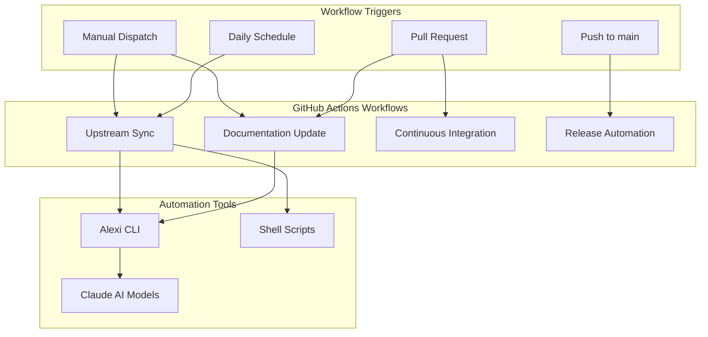
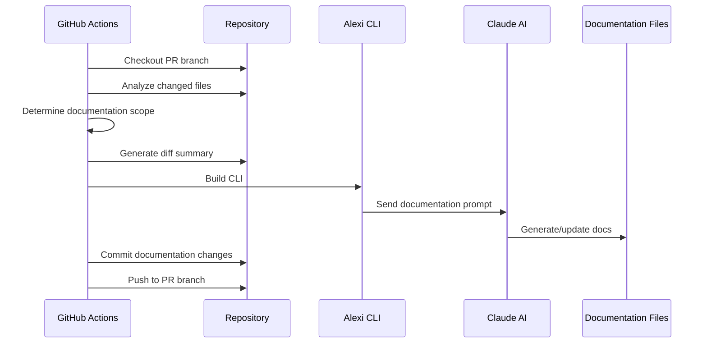
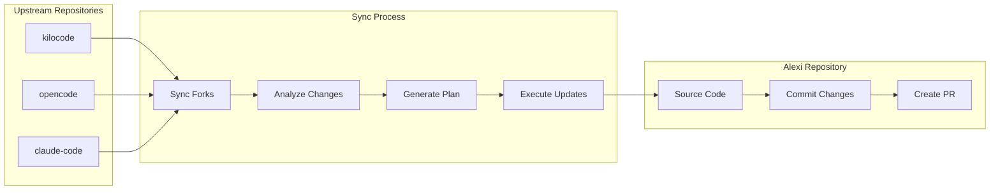

# Automation and CI/CD

This document describes the GitHub Actions workflows and automation systems in the Alexi project.

## Overview

Alexi uses GitHub Actions for continuous integration, automated documentation updates, and autonomous upstream synchronization. The automation system consists of multiple workflows that handle different aspects of the development lifecycle.

## Workflow Architecture



## Workflows

### 1. Documentation Update Workflow

**File**: `.github/workflows/documentation-update.yml`

**Triggers**:
- Pull request events (opened, synchronize, reopened)
- Manual workflow dispatch with PR number

**Purpose**: Automatically generates and updates documentation based on code changes in pull requests.

#### Workflow Steps



#### Key Features

1. **Intelligent Scope Detection**: Analyzes changed files to determine which documentation needs updating
   - Core/CLI changes trigger `ARCHITECTURE.md` and `API.md` updates
   - Routing changes trigger `ROUTING.md` updates
   - Provider changes trigger `PROVIDERS.md` updates
   - Workflow/script changes trigger `AUTOMATION.md` updates
   - Always updates `CHANGELOG.md` and `CONTRIBUTING.md`

2. **Code Analysis**: Generates detailed analysis including:
   - Changed file list with categorization
   - Commit history since last documentation update
   - Code diff statistics
   - TypeScript and configuration change previews

3. **AI-Powered Generation**: Uses Claude AI models through Alexi CLI to:
   - Analyze code changes
   - Update documentation with accurate technical details
   - Generate Mermaid diagrams
   - Maintain consistent documentation style

4. **Force Regeneration**: Manual trigger option to regenerate all documentation

#### Environment Variables

```bash
AICORE_SERVICE_KEY      # SAP AI Core service credentials
AICORE_RESOURCE_GROUP   # SAP AI Core resource group ID
```

#### Configuration

The workflow determines documentation scope based on file patterns:

| Pattern | Documentation Triggered |
|---------|------------------------|
| `src/cli/**`, `src/core/**` | ARCHITECTURE.md, API.md |
| `src/router/**`, `routing-config.json` | ROUTING.md |
| `src/providers/**` | PROVIDERS.md |
| `*.json`, `.env*` | CONFIGURATION.md |
| `*.test.ts`, `*.spec.ts` | TESTING.md |
| `.github/workflows/**`, `scripts/**` | AUTOMATION.md |
| All changes | CHANGELOG.md, CONTRIBUTING.md |

### 2. Upstream Sync Workflow

**File**: `.github/workflows/sync-upstream.yml`

**Triggers**:
- Daily schedule at 06:00 UTC
- Manual workflow dispatch with options:
  - `dry_run`: Analyze changes without creating PR
  - `force_sync`: Sync even if no changes detected

**Purpose**: Automatically synchronizes changes from upstream AI coding assistant repositories (kilocode, opencode, claude-code) and applies relevant updates to Alexi.

#### Upstream Repositories

| Repository | Purpose | Sync Source | Branch |
|------------|---------|-------------|--------|
| kilocode | AI coding assistant patterns | Kilo-Org/kilocode | main (with --force) |
| opencode | Open source coding patterns | anomalyco/opencode | dev (with --force) |
| claude-code | Anthropic Claude patterns | anthropics/claude-code | main |

#### Workflow Architecture



#### Sync Process

The upstream sync workflow follows a sophisticated two-stage AI-powered process:

**Stage 1: Planning (Claude 4.5 Opus)**
1. Clone upstream repositories
2. Read previous sync state from `.github/last-sync-commits.json`
3. Generate diff report comparing current vs last synced commits
4. Use Claude 4.5 Opus to analyze changes and create detailed update plan
5. Plan includes:
   - Critical, high, medium, and low priority changes
   - Exact code snippets and modifications
   - SAP AI Core compatibility considerations
   - File-by-file change instructions

**Stage 2: Execution (Claude 4.5 Sonnet with Tools)**
1. Read the generated update plan
2. Use agentic mode with enabled tools:
   - `read`: Examine existing files
   - `write`: Create new files
   - `edit`: Modify existing files with exact string replacement
   - `glob`: Find files by pattern
   - `grep`: Search file contents
3. Execute changes in priority order
4. Maximum 50 iterations for complex updates
5. Generate execution summary
6. Automatic retry on transient API errors (up to 3 attempts)

**Key Enhancements**:
- **Non-streaming commit messages**: Uses `complete()` instead of streaming to prevent infinite loading states
- **Retry logic**: Handles transient SAP AI Core API errors with exponential backoff
- **Error backoff**: Circuit breaker pattern for fatal errors (4xx status codes)
- **Debug logging**: `ALEXI_DEBUG_MESSAGES=1` for troubleshooting API issues

**Stage 3: PR Creation**
1. Commit all changes made by the AI agent
2. Update `.github/last-sync-commits.json` with new commit hashes
3. Create pull request with:
   - Detailed description of upstream changes
   - Links to upstream commits
   - Diff report attachment
   - Auto-merge enabled for trusted updates

#### Sync State Management

The workflow maintains sync state in `.github/last-sync-commits.json`:

```json
{
  "kilocode": {
    "last_synced_commit": "abc123...",
    "last_sync_date": "2024-01-15T06:00:00Z"
  },
  "opencode": {
    "last_synced_commit": "def456...",
    "last_sync_date": "2024-01-15T06:00:00Z"
  },
  "claude-code": {
    "last_synced_commit": "ghi789...",
    "last_sync_date": "2024-01-15T06:00:00Z"
  }
}
```

#### Auto-Merge Behavior

The workflow automatically merges PRs when:
- All CI checks pass
- Changes are from trusted upstream sources
- No merge conflicts exist
- PR is properly labeled with `upstream-sync`

#### Dry Run Mode

Manual trigger with `dry_run: true` will:
- Analyze all upstream changes
- Generate update plan
- Show proposed changes in workflow logs
- NOT create a pull request
- NOT commit any changes

### 3. Continuous Integration Workflow

**File**: `.github/workflows/ci.yml`

**Triggers**:
- Push to any branch
- Pull requests

**Purpose**: Runs tests, linting, and build verification.

**Steps**:
1. Checkout code
2. Set up Node.js 22
3. Install dependencies
4. Run TypeScript compiler
5. Run tests
6. Run linters

### 4. CI Auto-Fix Workflow

**File**: `.github/workflows/ci-auto-fix.yml`

**Triggers**:
- Workflow run completion (when CI workflow fails on auto/* branches)
- Manual workflow dispatch with run ID and branch name

**Purpose**: Automatically diagnoses and fixes CI failures on auto/* branches using Alexi's agentic capabilities.

#### Workflow Architecture

```mermaid
graph TB
    subgraph Trigger[\"Workflow Triggers\"]
        CIFail[CI Failure on auto/*]
        Manual[Manual Dispatch]
    end
    
    subgraph Analysis[\"Failure Analysis\"]
        Collect[Collect Failed Job Logs]
        Parse[Parse Error Messages]
        Build[Build Fix Prompt]
    end
    
    subgraph Fixing[\"Auto-Fix Process\"]
        QuickFix[Quick Fixes<br/>lint:fix, format]
        AgentFix[Alexi Agent Fix<br/>read, write, edit, bash]
        Verify[Verify Fixes]
    end
    
    subgraph Output[\"PR Update\"]
        Commit[Commit Changes]
        Push[Push to Branch]
        Comment[Post PR Comment]
    end
    
    CIFail --> Collect
    Manual --> Collect
    Collect --> Parse
    Parse --> Build
    Build --> QuickFix
    QuickFix --> AgentFix
    AgentFix --> Verify
    Verify --> Commit
    Commit --> Push
    Push --> Comment
    
    style AgentFix fill:#4CAF50
    style Verify fill:#2196F3
```

#### Key Features

1. **Intelligent Failure Detection**: Collects logs from all failed CI jobs with exact error messages, file paths, and line numbers

2. **Two-Stage Fix Process**:
   - **Quick Fixes**: Runs `npm run lint:fix` and `npm run format` for deterministic auto-fixes
   - **AI Agent Fixes**: Uses Alexi agent mode with tools (read, write, edit, glob, grep, bash) to apply targeted fixes

3. **Targeted Verification**: Re-runs only the checks that originally failed to verify fixes

4. **Rate Limiting**: Maximum 2 auto-fix runs per branch per day to prevent infinite loops

5. **Branch Filtering**: Only processes branches matching `auto/*` pattern

#### Workflow Steps

**Step 1: Determine Branch and Run ID**
- Extracts branch name and CI run ID from workflow trigger
- Guards against non-auto/* branches

**Step 2: Check Retry Count**
- Queries GitHub API for previous auto-fix runs on the branch
- Skips if already ran 2+ times today on the same branch

**Step 3: Collect Failed Job Logs**
- Fetches all jobs from the failed CI run
- Filters for jobs with `conclusion == "failure"`
- Downloads full logs for each failed job
- Generates `ci-failures.md` with structured failure report

**Step 3b: Preserve ci-failures.md**
- Saves `ci-failures.md` to `/tmp/ci-failures.md` before checkout
- Prevents file loss during branch checkout

**Step 4: Checkout PR Branch**
- Checks out the auto/* branch that triggered the failure
- Configures git with alexi-bot identity

**Step 4b: Restore ci-failures.md**
- Restores `ci-failures.md` from `/tmp` after checkout
- Ensures failure logs are available for analysis

**Step 5: Build Alexi CLI**
- Installs dependencies
- Builds Alexi CLI from source

**Step 6: Run Quick Auto-Fixes**
- Runs `npm run lint:fix` to fix linting issues
- Runs `npm run format` to fix formatting issues
- Tracks if any changes were made

**Step 7: Build Fix Prompt**
- Assembles comprehensive fix prompt with:
  - Failed check names
  - Full error logs with file paths and line numbers
  - Specific verification commands for each check type
  - Instructions to make minimal, targeted fixes

**Step 8: Run Alexi Agent**
- Invokes Alexi agent mode with:
  - System prompt: `.github/prompts/ci-fix-system.md`
  - Message: `ci-fix-prompt.md` (failure details)
  - Tools: read, write, edit, glob, grep, bash
  - Max iterations: 20
  - High effort level
  - Auto-routing enabled

**Step 9: Verify Fixes**
- Re-runs only the checks that originally failed:
  - Lint failures → `npm run lint`
  - Type errors → `npm run typecheck`
  - Format failures → `npm run format:check`
  - Test failures → `npm run test:coverage`
  - Build failures → `npm run build`
- Generates verification results summary

**Step 10: Commit and Push**
- Stages changes in `src/` and `tests/` directories only
- Commits with message: `fix(ci): auto-fix CI failures [skip ci] [alexi-bot]`
- Pushes to the auto/* branch
- CI re-triggers automatically on push

**Step 11: Post PR Comment**
- Posts detailed comment to PR with:
  - Success/failure status
  - Number of files changed
  - Verification results
  - Bot output snippet
  - Link to workflow run

#### Example Fix Prompt

```markdown
# CI Fix Task

You are fixing CI failures on branch: **`auto/feature-name`**

## Failed CI Checks

The following checks failed and need to be fixed:

- Lint
- Type Check

## CI Failure Details

### Job: Lint

**URL**: https://github.com/.../actions/runs/123/jobs/456

### Failed Steps

- **Run linting** (step 5)

### Log Output (last 200 lines)
```
/home/runner/work/alexi/alexi/src/tool/tools/edit.ts
  45:7  error  'oldString' is defined but never used  @typescript-eslint/no-unused-vars

✖ 1 problem (1 error, 0 warnings)
```

## Your Task

1. Read the failure logs above carefully
2. Identify the exact files and lines that need to be changed
3. Read those files using the `read` tool
4. Make **minimal, targeted fixes** — only change what is broken
5. After each fix, verify it using the `bash` tool:
   - For lint failures: `npm run lint`
   - For type errors: `npm run typecheck`

Focus **only** on the checks listed above. Do not touch unrelated code.
```

#### Rate Limiting Logic

```typescript
// Count completed auto-fix runs today on this branch
const today = new Date().toISOString().split('T')[0];
const runCount = await gh.api(
  `repos/${repo}/actions/workflows/${workflowId}/runs?branch=${branch}&created=>=${today}T00:00:00Z&status=completed`
);

if (runCount >= 2) {
  console.log('Already ran 2 times today. Skipping to avoid infinite loop.');
  exit(0);
}
```

#### System Prompt

Located at `.github/prompts/ci-fix-system.md`:

```markdown
You are an expert software engineer fixing CI failures in the Alexi codebase.

Your role:
- Read CI failure logs carefully
- Identify exact files and lines causing failures
- Make minimal, targeted fixes
- Verify each fix using bash tool
- Do NOT make unrelated changes

Available tools:
- read: Read file contents
- write: Create or overwrite files
- edit: Make exact string replacements
- glob: Find files by pattern
- grep: Search file contents
- bash: Run verification commands

Always verify fixes before completing the task.
```

### 5. Release Workflows

**Files**: 
- `.github/workflows/release.yml`
- `.github/workflows/tag-release.yml`
- `.github/workflows/on-release-merge.yml`

**Purpose**: Automate version bumping, changelog generation, and release publishing.

## GitHub Secrets Required

The automation workflows require the following secrets to be configured in the repository settings:

| Secret | Purpose | Required For |
|--------|---------|--------------|
| `AICORE_SERVICE_KEY` | SAP AI Core authentication | Documentation Update, Upstream Sync, CI Auto-Fix |
| `AICORE_RESOURCE_GROUP` | SAP AI Core resource group | Documentation Update, Upstream Sync, CI Auto-Fix |
| `GH_PAT` | GitHub Personal Access Token | Upstream Sync (cross-repo operations) |
| `GITHUB_TOKEN` | Default GitHub token | All workflows (automatically provided) |

### Setting Up Secrets

1. Navigate to repository Settings > Secrets and variables > Actions
2. Click "New repository secret"
3. Add each required secret with appropriate values

#### AICORE_SERVICE_KEY Format

The service key should be a JSON string containing SAP AI Core credentials:

```json
{
  "clientid": "your-client-id",
  "clientsecret": "your-client-secret",
  "url": "https://your-auth-url",
  "serviceurls": {
    "AI_API_URL": "https://your-ai-api-url"
  }
}
```

#### GH_PAT Permissions

The Personal Access Token needs the following permissions:
- `repo` (full control of private repositories)
- `workflow` (update GitHub Actions workflows)

## Local Development Scripts

### Sync Upstream Script

**File**: `scripts/sync-upstream.sh`

Local version of the upstream sync workflow for development and testing.

**Usage**:
```bash
./scripts/sync-upstream.sh [OPTIONS]

Options:
  --dry-run           Analyze changes without applying
  --kilocode-dir DIR  Path to kilocode repository
  --opencode-dir DIR  Path to opencode repository
  --verbose           Enable verbose output
```

### Generate Diff Report Script

**File**: `scripts/generate-diff-report.sh`

Generates detailed diff reports comparing upstream repositories.

**Usage**:
```bash
./scripts/generate-diff-report.sh \
  --kilocode-dir ../kilocode \
  --opencode-dir ../opencode \
  --last-sync .github/last-sync-commits.json \
  --format markdown \
  --output diff-report.md
```

## Agentic File Operations

The automation system leverages Alexi's agentic capabilities with automatic permission management:

### Permission Configuration

In agentic mode, the tool system automatically configures high-priority permission rules:

```typescript
// Automatic write permissions for workdir
{
  id: 'agentic-allow-write',
  priority: 200,
  description: 'Allow writing files in workdir for agentic mode',
  actions: ['write'],
  paths: ['<workdir>/**'],
  decision: 'allow'
}

// Automatic execute permissions
{
  id: 'agentic-allow-execute',
  priority: 200,
  description: 'Allow executing commands for agentic mode',
  actions: ['execute'],
  decision: 'allow'
}
```

### Tool Context Resolution

The `write` and `edit` tools now support relative path resolution:

```typescript
// tools/write.ts and tools/edit.ts
permission: {
  action: 'write',
  getResource: (params, context) => {
    // Resolve relative paths to absolute using workdir
    if (path.isAbsolute(params.filePath)) {
      return params.filePath;
    }
    return path.join(context?.workdir || process.cwd(), params.filePath);
  }
}
```

This enhancement allows the AI agent to:
- Work with relative file paths naturally
- Respect workdir boundaries for permission checks
- Operate autonomously within the project directory
- Support external directory operations when explicitly allowed

## Workflow Maintenance

### Updating Workflows

1. Edit workflow YAML files in `.github/workflows/`
2. Test changes using manual workflow dispatch
3. Commit and push changes
4. Workflow changes automatically trigger `AUTOMATION.md` update

### Debugging Workflows

1. Check workflow run logs in GitHub Actions tab
2. Use workflow dispatch with verbose flags
3. Review generated reports in `.github/reports/`
4. Check sync state in `.github/last-sync-commits.json`

### Common Issues

**Issue**: Documentation update fails with permission error
**Solution**: Verify `AICORE_SERVICE_KEY` and `AICORE_RESOURCE_GROUP` secrets are set correctly

**Issue**: Upstream sync creates no PR
**Solution**: Check if upstream repositories have new commits since last sync

**Issue**: AI agent makes incorrect changes
**Solution**: Review generated plan in `.github/reports/update-plan-*.md` and adjust prompts

## Best Practices

1. **Always test workflow changes**: Use manual dispatch with dry-run mode first
2. **Review AI-generated changes**: Check PR diffs before merging
3. **Keep secrets updated**: Rotate credentials regularly
4. **Monitor workflow costs**: Claude API usage is tracked in SAP AI Core
5. **Document workflow modifications**: Update this file when changing workflows

## Future Enhancements

Planned improvements to the automation system:

- [ ] Support for additional upstream repositories
- [ ] Configurable sync schedules per repository
- [ ] Automated testing of synced changes before PR creation
- [ ] Slack/Teams notifications for sync results
- [ ] Rollback mechanism for failed syncs
- [ ] Metrics dashboard for sync success rates
