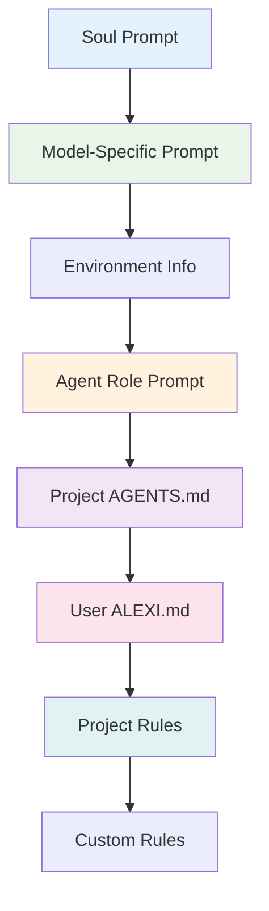

# Configuration

This document describes all configuration options available in Alexi, including environment variables, user configuration files, routing rules, and instruction files.

## Table of Contents

- [Environment Variables](#environment-variables)
- [User Configuration](#user-configuration)
- [Routing Configuration](#routing-configuration)
- [Instruction Files](#instruction-files)
- [Project Context](#project-context)
- [Configuration Examples](#configuration-examples)

## Environment Variables

### Required Variables

#### AICORE_SERVICE_KEY

SAP AI Core service key in JSON format. Contains authentication credentials for SAP AI Core.

```bash
export AICORE_SERVICE_KEY='{
  "clientid": "your-client-id",
  "clientsecret": "your-client-secret",
  "url": "https://your-auth-url",
  "serviceurls": {
    "AI_API_URL": "https://your-ai-api-url"
  }
}'
```

### Optional Variables

#### AICORE_RESOURCE_GROUP

SAP AI Core resource group identifier. Defaults to "default" if not specified.

```bash
export AICORE_RESOURCE_GROUP=production
```

#### AICORE_MODEL

Default model to use when no model is specified. Can be overridden by user configuration.

```bash
export AICORE_MODEL=gpt-4o
```

#### ALEXI_MAX_IMAGE_SIZE_MB

Maximum size in megabytes for image attachments. Defaults to 20MB if not specified.

```bash
export ALEXI_MAX_IMAGE_SIZE_MB=20
```

#### SAP_PROXY_BASE_URL

Base URL for OpenAI-compatible proxy endpoint (for proxy mode).

```bash
export SAP_PROXY_BASE_URL=http://127.0.0.1:3001/v1
```

#### SAP_PROXY_API_KEY

API key for proxy endpoint authentication.

```bash
export SAP_PROXY_API_KEY=your_secret_key
```

#### MORPH_API_KEY

API key for WarpGrep semantic code search (optional).

```bash
export MORPH_API_KEY=your_morph_api_key
```

## User Configuration

User configuration is stored in `~/.alexi/config.json` and persists settings across sessions.

### Configuration File Location

```bash
~/.alexi/config.json
```

### Configuration Schema

```typescript
interface UserConfig {
  defaultModel?: string;          // Persistent default model
  soundEnabled?: boolean;         // Enable notification sounds
  autoRoute?: boolean;            // Auto-routing preference
  vimMode?: boolean;              // Enable Vim mode in TUI
  theme?: 'dark' | 'light';       // TUI theme preference
  [key: string]: unknown;         // Extensible for custom settings
}
```

### Managing Configuration

#### Via CLI Commands

```bash
# Show current configuration
alexi config show

# Set a configuration value
alexi config set defaultModel gpt-4o

# Show configuration file path
alexi config path
```

#### Via Interactive Mode

```bash
# Switch model and save as default
/model gpt-4o

# Show configuration
/config show

# Set configuration value
/config set key value
```

#### Programmatic Access

```typescript
import {
  loadFullConfig,
  saveFullConfig,
  getConfigValue,
  setConfigValue,
  getConfigDefaultModel,
  setConfigDefaultModel
} from './config/userConfig.js';

// Load entire config
const config = loadFullConfig();

// Get specific value
const defaultModel = getConfigDefaultModel();

// Set and persist value
setConfigDefaultModel('claude-4-sonnet');
```

### Configuration API

```typescript
// Load full config object
function loadFullConfig(): Record<string, unknown>

// Save full config object
function saveFullConfig(config: Record<string, unknown>): void

// Get single value
function getConfigValue(key: string): unknown

// Set single value
function setConfigValue(key: string, value: unknown): void

// Delete single value
function deleteConfigValue(key: string): void

// Typed accessors
function getConfigDefaultModel(): string | undefined
function setConfigDefaultModel(model: string): void

// Batch update with options
interface UpdateGlobalOptions {
  dispose?: boolean;
}

function updateGlobal(
  updates: Partial<Record<string, unknown>>,
  options?: UpdateGlobalOptions
): void
```

#### Batch Configuration Updates

The `updateGlobal` function allows updating multiple configuration keys atomically:

```typescript
import { updateGlobal } from './config/userConfig.js';

// Update multiple settings at once
updateGlobal({
  defaultModel: 'gpt-4o',
  soundEnabled: false,
  autoRoute: true
});

// Update with disposal control
updateGlobal(
  { defaultModel: 'anthropic--claude-4.5-sonnet' },
  { dispose: false }
);
```

The `dispose` option controls whether cached configuration instances should be disposed after update. Default behavior preserves backward compatibility with `dispose: true`.

## Routing Configuration

Routing configuration controls automatic model selection based on prompt analysis.

### Configuration Files

Alexi searches for routing configuration in the following order:

1. `routing-config.json` (project-level)
2. `~/.alexi/routing-config.json` (user-level)
3. Built-in default configuration

### Routing Configuration Schema

```typescript
interface RoutingConfig {
  rules: RoutingRule[];
  default: {
    model: string;
  };
}

interface RoutingRule {
  name: string;
  priority: number;
  condition: {
    contains?: string[];
    regex?: string;
    complexity?: 'simple' | 'medium' | 'complex';
    taskType?: string;
  };
  model: string;
  reason?: string;
}
```

### Example Routing Configuration

```json
{
  "rules": [
    {
      "name": "code-tasks",
      "priority": 100,
      "condition": {
        "contains": ["code", "implement", "refactor"]
      },
      "model": "anthropic--claude-4-sonnet",
      "reason": "Claude excels at code generation and refactoring"
    },
    {
      "name": "reasoning-tasks",
      "priority": 90,
      "condition": {
        "complexity": "complex",
        "contains": ["analyze", "explain", "reason"]
      },
      "model": "gpt-4.1",
      "reason": "GPT-4.1 has extended reasoning capabilities"
    },
    {
      "name": "simple-queries",
      "priority": 50,
      "condition": {
        "complexity": "simple"
      },
      "model": "gpt-4o-mini",
      "reason": "Cost-effective for simple queries"
    }
  ],
  "default": {
    "model": "anthropic--claude-4-sonnet"
  }
}
```

## Instruction Files

Instruction files provide context and guidelines to AI agents. Alexi supports a multi-layer instruction system.

### Instruction File Hierarchy



### 1. Project-Level Instructions (AGENTS.md)

Located in the project root directory.

**Path**: `./AGENTS.md`

**Purpose**: Provides project-specific context, coding standards, and build instructions.

**Example**:

```markdown
# AGENTS.md

## Project Overview

Alexi is a TypeScript/Node.js CLI application — an intelligent LLM orchestrator for SAP AI Core.

## Build & Test Commands

```bash
npm run build
npm test
```

## Code Style

- Use 2 spaces for indentation
- Always use async/await over raw promises
- Prefer interfaces over types for object shapes
```

### 2. User-Level Instructions (ALEXI.md)

Located in the user's home directory.

**Path**: `~/.alexi/ALEXI.md`

**Purpose**: Global user preferences and coding style that apply to all projects.

**Example**:

```markdown
# ALEXI.md

## Personal Preferences

- I prefer verbose variable names for clarity
- Always add JSDoc comments to exported functions
- Use functional programming patterns when possible

## Formatting

- Maximum line length: 100 characters
- Use single quotes for strings
```

### 3. Project-Level Rules (.alexi/rules/*.md)

Located in the project's `.alexi/rules/` directory.

**Path**: `./.alexi/rules/*.md`

**Purpose**: Scoped rules for specific aspects of the project (e.g., API design, database patterns).

**Example**:

```
.alexi/
└── rules/
    ├── api-design.md
    ├── database-patterns.md
    └── security-guidelines.md
```

### Managing Instruction Files

#### Via /memory Command

```bash
# List all instruction files
/memory

# Edit project instructions
/memory edit project

# Edit user instructions
/memory edit user

# Create AGENTS.md from template
/memory init
```

#### System Prompt Assembly

The system prompt is assembled in the following order:

1. Soul prompt (core identity)
2. Model-specific instructions (Anthropic, OpenAI, Gemini)
3. Environment info (workdir, git repo, platform, date)
4. Agent role prompt (code, debug, plan, explore)
5. Project AGENTS.md (if exists)
6. User ~/.alexi/ALEXI.md (if exists)
7. Project .alexi/rules/*.md (if exist)
8. Custom rules (user-provided via API)

```typescript
import { buildAssembledSystemPrompt } from './agent/system.js';

const systemPrompt = buildAssembledSystemPrompt({
  agentId: 'code',
  modelId: 'anthropic--claude-4-sonnet',
  workdir: process.cwd(),
  customRules: 'Additional instructions here',
  skipEnv: false,
  skipAgentsMd: false
});
```

## Project Context

Project context provides additional information about the codebase structure and architecture.

### Context Files

#### .alexi/context.json

Project-level context configuration.

```json
{
  "projectName": "alexi",
  "description": "Intelligent LLM orchestrator for SAP AI Core",
  "architecture": {
    "patterns": ["event-driven", "plugin-based"],
    "layers": ["cli", "core", "providers", "tools"]
  },
  "conventions": {
    "naming": "camelCase for files, PascalCase for classes",
    "imports": "Always use .js extension for local imports"
  }
}
```

#### .alexi/invariants.md

Architectural invariants that should never be violated.

```markdown
# Architectural Invariants

1. All LLM calls must go through SAP AI Core Orchestration API
2. Tool execution requires permission checks
3. Session state must be persisted to disk
4. Error handling must use Result<T> pattern
```

## Configuration Examples

### Cost Optimization

Prioritize cheaper models while maintaining quality.

```json
{
  "rules": [
    {
      "name": "prefer-mini",
      "priority": 100,
      "condition": {
        "complexity": "simple"
      },
      "model": "gpt-4o-mini"
    },
    {
      "name": "fallback-sonnet",
      "priority": 50,
      "condition": {},
      "model": "anthropic--claude-4-sonnet"
    }
  ],
  "default": {
    "model": "gpt-4o-mini"
  }
}
```

### Quality Optimization

Always use the most capable models.

```json
{
  "rules": [
    {
      "name": "always-opus",
      "priority": 100,
      "condition": {},
      "model": "anthropic--claude-4.5-opus"
    }
  ],
  "default": {
    "model": "anthropic--claude-4.5-opus"
  }
}
```

### Task-Specific Routing

Route different task types to specialized models.

```json
{
  "rules": [
    {
      "name": "code-generation",
      "priority": 100,
      "condition": {
        "contains": ["implement", "write code", "create function"]
      },
      "model": "anthropic--claude-4-sonnet"
    },
    {
      "name": "data-analysis",
      "priority": 90,
      "condition": {
        "contains": ["analyze data", "statistics", "visualize"]
      },
      "model": "gpt-4o"
    },
    {
      "name": "documentation",
      "priority": 80,
      "condition": {
        "contains": ["document", "explain", "describe"]
      },
      "model": "gpt-4o-mini"
    }
  ],
  "default": {
    "model": "anthropic--claude-4-sonnet"
  }
}
```

### Development Stage Routing

Route based on development stage.

```json
{
  "rules": [
    {
      "name": "prototyping",
      "priority": 100,
      "condition": {
        "contains": ["prototype", "spike", "experiment"]
      },
      "model": "gpt-4o-mini"
    },
    {
      "name": "production",
      "priority": 90,
      "condition": {
        "contains": ["production", "release", "deploy"]
      },
      "model": "anthropic--claude-4.5-opus"
    }
  ],
  "default": {
    "model": "anthropic--claude-4-sonnet"
  }
}
```

## Session Storage Configuration

Session files are stored in `~/.alexi/sessions/`.

### Session File Structure

```
~/.alexi/
├── sessions/
│   ├── abc-123.json
│   ├── def-456.json
│   └── ghi-789.json
├── config.json
├── ALEXI.md
└── mcp-servers.json
```

### Session Schema

```typescript
interface Session {
  id: string;
  title: string;
  createdAt: string;
  updatedAt: string;
  messages: Message[];
  model: string;
  usage: TokenUsage;
  metadata: {
    agent?: string;
    stage?: string;
    workdir?: string;
  };
}
```

## Configuration Best Practices

1. **Use Environment Variables for Secrets**: Never commit API keys or credentials to version control
2. **Use User Config for Preferences**: Store personal preferences in ~/.alexi/config.json
3. **Use Routing Config for Model Selection**: Define routing rules in routing-config.json
4. **Use Instruction Files for Context**: Provide project context via AGENTS.md and .alexi/rules/
5. **Use Skills for Reusable Behaviors**: Define skills in .alexi/skills/ directory
6. **Version Control Project Files**: Commit AGENTS.md and .alexi/ to version control
7. **Keep User Files Private**: Never commit ~/.alexi/ directory

## Skill Configuration

Skills are reusable AI behaviors stored in Markdown files with YAML frontmatter.

### Skill Locations

Skills are discovered from multiple locations:

1. Project skills: `.alexi/skills/*.md`
2. Global skills: `~/.alexi/skills/*.md`
3. Built-in skills: Included with Alexi

### Skill File Format

```markdown
---
id: code-review
name: Code Review
description: Perform thorough code review with best practices
category: review
tags: [quality, security, performance]
aliases: [review, cr]
preferredModel: anthropic--claude-4-sonnet
temperature: 0.3
maxTokens: 4000
tools: [read, grep, glob]
disabledTools: [write, edit]
---

# Code Review Instructions

When reviewing code, focus on:

1. **Code Quality**: Check for readability, maintainability, and adherence to best practices
2. **Security**: Look for potential vulnerabilities and security issues
3. **Performance**: Identify performance bottlenecks and optimization opportunities
4. **Testing**: Ensure adequate test coverage and quality
5. **Documentation**: Verify documentation completeness and accuracy

Use the read, grep, and glob tools to examine the codebase.
Do not modify any files during review.
```

### Skill Schema

```typescript
interface Skill {
  id: string;                     // Unique identifier
  name: string;                   // Display name
  description: string;            // Brief description
  prompt: string;                 // Main prompt content
  
  // Optional structured prompts
  prompts?: {
    system?: string;              // System-level instructions
    review?: string;              // Review-specific prompt
    planning?: string;            // Planning-specific prompt
    codeReview?: string;          // Code review prompt
  };
  
  // Tool constraints
  tools?: string[];               // Allowed tools
  disabledTools?: string[];       // Explicitly disabled tools
  
  // Model preferences
  preferredModel?: string;        // Preferred model ID
  temperature?: number;           // Temperature (0-2)
  maxTokens?: number;             // Max tokens
  
  // Metadata
  category?: string;              // Skill category
  tags?: string[];                // Tags for filtering
  aliases?: string[];             // Alternative names
  
  // Source information
  source?: 'builtin' | 'file' | 'mcp';
  sourcePath?: string;
}
```

### Creating Custom Skills

1. Create a `.alexi/skills/` directory in your project
2. Add Markdown files with YAML frontmatter
3. Skills are automatically discovered on startup

Example: `.alexi/skills/api-design.md`

```markdown
---
id: api-design
name: API Design Review
description: Review API design for consistency and best practices
category: review
tags: [api, design, rest]
preferredModel: anthropic--claude-4-sonnet
temperature: 0.3
tools: [read, grep, glob]
---

# API Design Review

Review the API design focusing on:
- RESTful principles
- Consistent naming conventions
- Proper HTTP methods and status codes
- Error handling patterns
- Authentication and authorization
```

### Using Skills in Interactive Mode

```bash
# List available skills
/skills

# Activate a skill
/skill code-review

# Activate using alias
/skill review
```

## TUI Configuration

The Terminal UI can be customized through user configuration and keyboard shortcuts.

### TUI Settings

```typescript
// User config for TUI
interface TUIConfig {
  theme?: 'dark' | 'light';       // Color theme
  vimMode?: boolean;              // Enable Vim keybindings
  sidebarWidth?: number;          // Sidebar width (characters)
  logLevel?: 'debug' | 'info' | 'warn' | 'error';
}
```

### Theme Configuration

Themes are defined in `src/cli/tui/theme/`:

```typescript
// dark.ts
export const darkTheme: Theme = {
  name: 'dark',
  colors: {
    text: '#E0E0E0',
    dimText: '#888888',
    primary: '#42A5F5',
    success: '#66BB6A',
    warning: '#FFA726',
    error: '#EF5350',
    border: '#424242',
    background: '#1E1E1E',
    diffAdd: '#66BB6A',
    diffRemove: '#EF5350',
    diffContext: '#888888',
    diffAddBg: '#1B5E20',
    diffRemoveBg: '#B71C1C',
    diffLineNumber: '#616161',
  },
};
```

### Vim Mode Configuration

Enable Vim mode in user config:

```json
{
  "vimMode": true
}
```

Vim mode provides:
- Normal mode: `Esc` to enter
- Insert mode: `i` to enter
- Visual mode: `v` to enter
- Command mode: `:` to enter
- Navigation: `h`, `j`, `k`, `l`
- Operators: `d`, `y`, `c`, `p`

### Keyboard Shortcuts

TUI keyboard shortcuts can be customized through the keybind system:

```typescript
// Custom keybindings
const customKeybinds = {
  'Ctrl+L': 'toggle-page',
  'Ctrl+B': 'toggle-sidebar',
  'Ctrl+K': 'command-palette',
  'Ctrl+X': 'leader-mode',
};
```

## Config File Protection

Configuration files are protected by the permission system.

### Protected Files and Directories

```typescript
// Protected config directories
const CONFIG_DIRS = [
  '.kilo/',
  '.kilocode/',
  '.opencode/',
  '.alexi/',
];

// Protected root files
const CONFIG_ROOT_FILES = [
  'kilo.json',
  'kilo.jsonc',
  'opencode.json',
  'opencode.jsonc',
  'alexi.json',
  'alexi.jsonc',
  'AGENTS.md',
];

// Excluded subdirectories (not protected)
const EXCLUDED_SUBDIRS = [
  'plans/',
];
```

### Protection Behavior

When the agent attempts to modify config files:

1. Write/edit operations require explicit approval
2. "Always allow" option is disabled
3. Each change requires individual confirmation
4. Global config directory (`~/.alexi/`) is protected

### Checking Config Protection

```typescript
import { ConfigProtection } from './permission/config-paths.js';

// Check if path is protected
const isProtected = ConfigProtection.isRelative('.alexi/context.json');

// Check absolute path
const isAbsoluteProtected = ConfigProtection.isAbsolute(
  '/project/.alexi/config.json',
  '/project'
);

// Check permission request
const isConfigRequest = ConfigProtection.isRequest({
  patterns: ['.alexi/context.json'],
  permission: 'write',
});
```

## Configuration Validation

Alexi validates configuration files on startup and provides helpful error messages:

```bash
# Validate routing configuration
alexi explain -m "test prompt"

# Check environment variables
alexi doctor

# Show current configuration
alexi config show
```

## Troubleshooting

### Configuration Not Loading

1. Check file exists: `ls ~/.alexi/config.json`
2. Validate JSON syntax: `cat ~/.alexi/config.json | jq`
3. Check file permissions: `ls -la ~/.alexi/config.json`

### Routing Not Working

1. Verify routing-config.json syntax
2. Check rule priorities (higher = evaluated later)
3. Use `alexi explain` to see routing decisions

### Instruction Files Not Applied

1. Verify file paths: `ls AGENTS.md ~/.alexi/ALEXI.md`
2. Check file encoding (must be UTF-8)
3. Use `/memory` command to list loaded files

## Related Documentation

- [API Documentation](API.md) - CLI commands and TypeScript APIs
- [Architecture](ARCHITECTURE.md) - System architecture and design
- [Testing Guide](TESTING.md) - Testing configuration and environment setup
