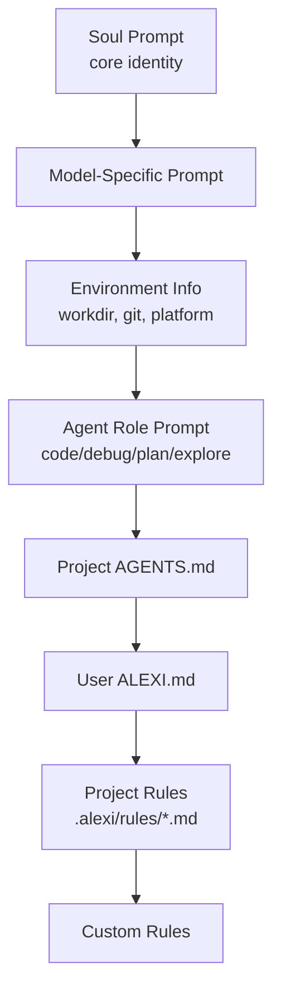

# Configuration

This document describes all configuration options available in Alexi, including environment variables, user configuration files, routing rules, compaction settings, hooks, and instruction files.

## Table of Contents

- [Environment Variables](#environment-variables)
- [User Configuration](#user-configuration)
- [Routing Configuration](#routing-configuration)
- [Compaction Configuration](#compaction-configuration)
- [Hooks Configuration](#hooks-configuration)
- [Instruction Files](#instruction-files)
- [Project Context](#project-context)
- [Session Storage](#session-storage)
- [Configuration Examples](#configuration-examples)

## Environment Variables

### Required Variables

#### AICORE_SERVICE_KEY

SAP AI Core service key in JSON format. Contains authentication credentials for SAP AI Core.

```bash
export AICORE_SERVICE_KEY='{
  "clientid": "your-client-id",
  "clientsecret": "your-client-secret",
  "url": "https://your-auth-url",
  "serviceurls": {
    "AI_API_URL": "https://your-ai-api-url"
  }
}'
```

### Optional Variables

#### AICORE_RESOURCE_GROUP

SAP AI Core resource group identifier. Defaults to `"default"` if not specified.

```bash
export AICORE_RESOURCE_GROUP=production
```

#### AICORE_MODEL

Default model to use when no model is specified. Can be overridden by user configuration.

```bash
export AICORE_MODEL=gpt-4o
```

The value is validated against the dynamic model catalog (`src/providers/modelCatalog.ts`) on first use. If the id is not recognised, `getProviderForModelWithFallback` falls back to `preferences.fallbackModel` in the routing config (or hardcoded `gpt-4o`) and publishes a one-shot `ProviderModelFellBack` event so misconfiguration is visible at the first turn rather than silently masquerading as a working setup.

#### ALEXI_MAX_IMAGE_SIZE_MB

Maximum size in megabytes for image attachments. Defaults to 20MB if not specified.

```bash
export ALEXI_MAX_IMAGE_SIZE_MB=20
```

#### ALEXI_NO_NOTIFICATIONS

Ephemeral opt-out for desktop notifications. When set to `1`, the notifications module treats the current context as non-interactive and silently skips every dispatch, regardless of the persistent `notifications: allow` config setting. Use this to silence notifications for a single session (`alexi chat -m "..."`) without editing `~/.alexi/config.json`. Any other value (including empty string) is ignored.

```bash
export ALEXI_NO_NOTIFICATIONS=1
```

See [Native Notifications](#native-notifications-notifications) below for the full decision matrix.

#### SAP_PROXY_BASE_URL

Base URL for OpenAI-compatible proxy endpoint (for proxy mode).

```bash
export SAP_PROXY_BASE_URL=http://127.0.0.1:3001/v1
```

#### SAP_PROXY_API_KEY

API key for proxy endpoint authentication.

```bash
export SAP_PROXY_API_KEY=your_secret_key
```

#### MORPH_API_KEY

API key for WarpGrep semantic code search. Consumed by the standalone
[`alexi-mcp-warpgrep`](./mcp-servers.md#alexi-mcp-warpgrep---semantic-code-search)
MCP server; Alexi's built-in tool surface no longer reads this variable
(the built-in `codebase_search` tool was removed in `1.20.3`). Set it in
the MCP server's `env` block of `mcp-servers.json`, or export it in the
shell that spawns Alexi so the child MCP process inherits it.

```bash
export MORPH_API_KEY=your_morph_api_key
```

#### ALEXI_EXPERIMENTAL_BACKGROUND_TASKS

Enable experimental background task execution in the task tool.

```bash
export ALEXI_EXPERIMENTAL_BACKGROUND_TASKS=true
```

#### ALEXI_EXPERIMENTAL_MCP_APPS

Enable the experimental MCP Apps HTTP surface (introduced in 1.21.4). When set to `1`, `isMCPAppsEnabled()` returns `true` and the `mcpAppsListResources` / `mcpAppsCallTool` verbs may be invoked. HTTP handlers that expose these verbs MUST gate on the flag; callers that ignore the gate risk exposing an unstable API. See [Experimental MCP Apps](#experimental-mcp-apps) below.

```bash
export ALEXI_EXPERIMENTAL_MCP_APPS=1
```

#### MAX_SUBAGENT_DEPTH

Override the maximum subagent nesting depth for the `task` tool. A top-level user session has depth 0; each `task` invocation would spawn a subagent one level deeper. Spawning at depth greater than this value is rejected before any provider request is made. Defaults to `3`; values above `~10` are strongly discouraged because latency and cost multiply per level. Non-numeric or non-positive values fall back to the default.

```bash
export MAX_SUBAGENT_DEPTH=5
```

#### ALEXI_PROJECT_DIR

Override the project directory for configuration resolution.

```bash
export ALEXI_PROJECT_DIR=/path/to/project
```

#### ALEXI_DISABLE_CA_HARVEST

Disable the automatic OS trust-store CA harvest performed by
`src/providers/ca.ts` at CLI startup. When set to a truthy value (`1`, `true`,
or `yes`, case-insensitive), Alexi skips reading the macOS Keychain or Linux
CA bundle and installs nothing onto `https.globalAgent.options.ca`. Node's
built-in root store plus any `NODE_EXTRA_CA_CERTS` continue to apply natively.

```bash
# Skip the auto-harvest entirely (Node built-in + NODE_EXTRA_CA_CERTS only)
export ALEXI_DISABLE_CA_HARVEST=1
```

Use this when you want a strictly minimal trust store, when the macOS
`security` command is slow or blocked, or when isolating the harvest during
TLS troubleshooting. See
[docs/PROVIDERS.md#auto-ca-harvesting](PROVIDERS.md#auto-ca-harvesting) for the
full mechanism, per-platform discovery order, and programmatic API.

#### NODE_EXTRA_CA_CERTS

Standard Node.js environment variable pointing at a PEM bundle of additional
trust anchors. Alexi reads this file (via `readNodeExtraCACerts` in
`src/providers/ca.ts`) and merges its `CERTIFICATE` blocks into the same
`https.globalAgent.options.ca` list as the harvested OS trust anchors — the
file is not replaced, so user extras and OS-discovered CAs coexist.

```bash
export NODE_EXTRA_CA_CERTS=/path/to/corporate-bundle.pem
```

#### XDG_STATE_HOME

Standard XDG base-directory variable pointing at the parent of the preferred
state directory. When set, Alexi treats `$XDG_STATE_HOME/alexi` as the
preferred location for persistent state (session store, snapshot flag, MCP
runtime state). See `src/core/global/paths.ts` for the resolution logic.

**Important:** when `XDG_STATE_HOME` is set explicitly, Alexi does NOT fall
back to `<dataDir>/state` on failure — the user's explicit choice wins and
any writability error surfaces at startup. When the variable is unset, the
default fallback is `<dataDir>/state` (typically `~/.alexi/state`) with
sticky preference: once the fallback has been chosen it is preferred on
subsequent runs so the resolved directory does not flap between locations
across restarts.

```bash
# Explicit — no fallback, failures surface immediately
export XDG_STATE_HOME=/var/lib/alexi/state
```

#### ALEXI_SANDBOX

Set to `1` to signal that Alexi is running under macOS `sandbox-exec` or an
analogous restricted environment. When this flag is set, git subcommands
that mutate the working tree, index, refs, or config are escalated through
the interactive permission prompt so the user is aware their sandbox is
about to be punched through. See
[ARCHITECTURE.md — Sandbox Git-Write Detection](./ARCHITECTURE.md#sandbox-git-write-detection)
for the classification list and rationale.

```bash
export ALEXI_SANDBOX=1
```

Read-only git subcommands (`log`, `status`, `diff`, `show`, `ls-files`,
`rev-parse`, …) are NOT escalated — only write-shaped subcommands such as
`add`, `commit`, `push`, `checkout`, `config`, `stash`, `merge`, `rebase`,
`reset`, `restore`, `revert`, `rm`, `submodule`, `switch`, `tag`, `worktree`.

## User Configuration

User configuration is stored in `~/.alexi/config.json` and persists settings across sessions.

### Configuration File Location

```bash
~/.alexi/config.json
```

### Configuration Schema

```typescript
interface UserConfig {
  defaultModel?: string;          // Persistent default model
  agent?: string;                 // Default agent slug for `alexi agent` / `alexi chat`
                                  //   (overridden per-invocation by `--agent <name>`)
  soundEnabled?: boolean;         // Enable notification sounds
  autoRoute?: boolean;            // Auto-routing preference
  mcpToolDisplay?: 'expanded' | 'collapsed'; // TUI disclosure default for
                                             //   completed MCP tool blocks
  mcp_tool_display?: 'expanded' | 'collapsed'; // Upstream snake_case alias for
                                               //   cross-tool config portability
  persistAuthTokens?: boolean;    // Cache SAP AI Core OAuth tokens on disk
  notifications?: 'allow' | 'deny' | 'ask';   // Desktop-notification consent —
                                              //   see Native Notifications below
  [key: string]: unknown;         // Extensible for custom settings
}
```

The `agent` field accepts any built-in agent slug (`code`, `debug`, `plan`,
`explore`, `orchestrator`) or a custom agent slug loaded from
`~/.alexi/agents/*.md` or `<project>/.alexi/agents/*.md`. Unknown slugs log
a warning and fall back to the default agent (no crash).

### Managing Configuration

#### Via CLI Commands

```bash
# Show current configuration
alexi config show

# Set a configuration value
alexi config set defaultModel gpt-4o

# Show configuration file path
alexi config path
```

#### Via Interactive Mode

```bash
# Switch model and save as default
/model gpt-4o

# Show configuration
/config show

# Set configuration value
/config set soundEnabled true
```

#### Programmatic Access

```typescript
import {
  loadFullConfig,
  saveFullConfig,
  getConfigValue,
  setConfigValue,
  getConfigDefaultModel,
  setConfigDefaultModel,
  updateGlobal,
} from './config/userConfig.js';

// Load entire config
const config = loadFullConfig();

// Get/set specific values
const model = getConfigDefaultModel();
setConfigDefaultModel('anthropic--claude-4-sonnet');

// Batch update (atomic)
updateGlobal({
  defaultModel: 'gpt-4o',
  soundEnabled: false,
  autoRoute: true,
});
```

### TUI Tool Call Display (`mcpToolDisplay`)

Controls whether MCP tool blocks stay expanded or collapse automatically once
the tool has finished executing in the interactive Ink TUI. MCP-namespaced
tools are those whose name starts with the `mcp__<server>__<tool>` prefix (see
`src/permission/index.ts`). Built-in tools (`read`, `write`, `edit`, `bash`,
`grep`, `glob`, etc.) always collapse on completion regardless of this
setting — the preference is intentionally scoped to MCP output so users can
inspect remote tool results without an extra keypress while keeping fast
built-in tools tidy.

| Value         | Behaviour after tool completion                              |
| ------------- | ------------------------------------------------------------ |
| `'collapsed'` | Default. Both built-in and MCP tool blocks collapse to a one-line summary. Matches Alexi's historical behaviour and upstream kilocode default. |
| `'expanded'`  | MCP tool blocks stay expanded so the full body remains visible; built-in tools still collapse. |

Failure output ignores this preference — any tool that reports
`ToolExecutionFailed` auto-expands so errors are always immediately visible.
For the exact wiring, see `resolveCompletedExpansion(toolName)` in
`src/cli/tui/hooks/useToolEvents.ts:24-39`.

For cross-tool config portability with upstream kilocode (which uses
`mcp_tool_display` under kilocode #13010 lineage), the getter accepts either
the camelCase `mcpToolDisplay` key OR the snake_case `mcp_tool_display` key.
When both keys are present, the camelCase key wins. Non-string / unknown
values fall back to the `'collapsed'` default so a corrupt config never
crashes the TUI.

```typescript
import {
  getConfigMcpToolDisplay,
  setConfigMcpToolDisplay,
  type McpToolDisplay,
} from './config/userConfig.js';

// Read the current preference (returns 'collapsed' by default)
const display: McpToolDisplay = getConfigMcpToolDisplay();

// Persist a new preference
setConfigMcpToolDisplay('expanded');
```

Direct config file examples:

```json
{
  "mcpToolDisplay": "expanded"
}
```

```json
{
  "mcp_tool_display": "expanded"
}
```

The setter throws a descriptive `Error` for any value other than
`'expanded'` or `'collapsed'`:

```typescript
setConfigMcpToolDisplay('sideways');
// throws: mcpToolDisplay must be 'expanded' or 'collapsed' (got 'sideways')
```

### Auth Token Caching (`persistAuthTokens`)

Controls whether SAP AI Core OAuth access tokens are cached to
`~/.alexi/tokens.json` between sessions. Defaults to `true` (caching enabled)
so interactive sessions start faster by skipping a fresh token exchange.
Security-sensitive deployments can opt out:

```json
{
  "persistAuthTokens": false
}
```

When disabled, every session performs a fresh authentication and no tokens
are written to disk. Non-boolean values fall back to `true`.

### Native Notifications (`notifications`)

Controls whether Alexi surfaces desktop notifications when a streaming chat completes cleanly or when a long-running bash command finishes. Persisted under the `notifications` key in `~/.alexi/config.json` (see [`src/core/notifications.ts`](../src/core/notifications.ts) and the [API reference](API.md#native-notifications-api)).

Accepted values:

| Value | Behaviour |
|-------|-----------|
| `allow` | Notifications dispatch via `node-notifier` on every completion. |
| `deny` | Notifications are suppressed silently. `node-notifier` is never loaded. |
| `ask` (or unset) | On the first interactive call, Alexi prompts via `@inquirer/prompts` `confirm` and persists the answer. Non-interactive contexts silently skip without prompting. |

Any other value coerces to `ask` when read.

```jsonc
{
  "notifications": "allow"
}
```

**Non-interactive short-circuits.** Even with `notifications: allow`, dispatch is suppressed when any of the following holds so agent workflows and CI runs never trigger a surprise desktop alert:

- `ALEXI_NO_NOTIFICATIONS=1` is set.
- `CI` is set to any value other than `0` / `false`.
- Either `process.stdin` or `process.stdout` is not a TTY.

**Which events fire.** Two internal call sites currently emit notifications:

- `streamChat` fires `Alexi: Task completed` when the streaming loop exits via the `completedCleanly` branch. Aborts, provider errors, context-overflow retries, and rate-limit backoffs do NOT fire — the "task completed" signal is truthful.
- The `bash` tool fires `Command finished: <description or command>` when either the command detached before exit, OR the foreground elapsed time reached the exported `LONG_RUNNING_THRESHOLD_MS` (30 seconds). Short-running foreground commands (`ls`, `git status`) never fire.

Both events resolve the same `notifications` key on every call, so a single `deny` decision silences both surfaces and a single `allow` re-enables both. Editing the key from `deny` to `allow` mid-session takes effect on the next event without any restart.

**Safety guarantee.** All errors — a missing native binary (`terminal-notifier`, `notify-send`, `snoretoast`), a failing `node-notifier` load, a broken inquirer prompt, an unwritable home directory — are swallowed at `logger.debug` level. No notification failure can throw or take down the CLI.

**Runtime dependency.** `node-notifier@^10.0.1` is loaded via a cached dynamic import on the first `allow` call, so users who deny never pay the native-binary probe cost.

**Example: disable notifications on a shared box:**

```jsonc
{
  "notifications": "deny"
}
```

**Example: disable via environment variable (no persistent change):**

```bash
export ALEXI_NO_NOTIFICATIONS=1
alexi chat -m "..."
```

## Routing Configuration

Routing configuration controls automatic model selection based on prompt analysis.

### Configuration Files

Alexi searches for routing configuration in order:

1. `routing-config.json` (project-level)
2. `~/.alexi/routing-config.json` (user-level)
3. Built-in default configuration

### Routing Configuration Schema

```typescript
interface RoutingConfig {
  rules: RoutingRule[];
  default: {
    model: string;
  };
}

interface RoutingRule {
  name: string;
  priority: number;      // Higher priority = evaluated first
  condition: {
    contains?: string[];          // Keywords in prompt
    regex?: string;               // Regex pattern match
    complexity?: 'simple' | 'medium' | 'complex';
    taskType?: string;            // Task classification
  };
  model: string;                  // Model ID to route to
  reason?: string;                // Human-readable explanation
}
```

### Prompt Classification

The router classifies prompts into:

**Task Types:**
- `simple-qa` -- Basic questions and lookups
- `coding` -- Code generation, modification, debugging
- `deep-reasoning` -- Complex analysis, math, logic
- `creative-writing` -- Creative content generation
- `general-qa` -- General knowledge questions

**Complexity Levels:**
- `simple` -- Short, straightforward prompts
- `medium` -- Moderate complexity
- `complex` -- Long, multi-step, or reasoning-heavy

### Model Capability Matching

```typescript
interface ModelCapability {
  id: string;
  type: 'openai' | 'claude' | 'gemini';
  costTier: 'cheap' | 'medium' | 'expensive';
  strengths: string[];   // Task types the model excels at
  maxTokens: number;
  reasoning: boolean;    // Has extended reasoning capability
}
```

### Example Routing Configuration

```json
{
  "rules": [
    {
      "name": "code-tasks",
      "priority": 100,
      "condition": {
        "contains": ["code", "implement", "refactor"]
      },
      "model": "anthropic--claude-4-sonnet",
      "reason": "Claude excels at code generation and refactoring"
    },
    {
      "name": "reasoning-tasks",
      "priority": 90,
      "condition": {
        "complexity": "complex",
        "contains": ["analyze", "explain", "reason"]
      },
      "model": "gpt-4.1",
      "reason": "GPT-4.1 has extended reasoning capabilities"
    },
    {
      "name": "simple-queries",
      "priority": 50,
      "condition": {
        "complexity": "simple"
      },
      "model": "gpt-4o-mini",
      "reason": "Cost-effective for simple queries"
    }
  ],
  "default": {
    "model": "anthropic--claude-4-sonnet"
  }
}
```

## Compaction Configuration

Context compaction manages conversation length when approaching token limits.

### Configuration Schema

```typescript
interface CompactionConfig {
  maxTokens?: number;            // Default: 100000
  warningThreshold?: number;     // Default: 0.8 (80% of maxTokens)
  strategy?: CompactionStrategy; // Default: 'sliding'
  preserveRecent?: number;       // Default: 4 (messages to always keep)
}

type CompactionStrategy = 'truncate' | 'summarize' | 'sliding' | 'smart';
```

### Strategies

| Strategy | Description | Use Case |
|----------|-------------|----------|
| `truncate` | Remove oldest messages beyond limit | Fast, minimal processing |
| `summarize` | AI-powered summarization of old messages | Best context retention |
| `sliding` | Sliding window, keeping N recent messages | Predictable behavior |
| `smart` | Hybrid: importance scoring + selective summarization | Long complex sessions |

### Reactive Overflow Seeding

When context overflow is detected during LLM calls, compaction is triggered with an `overflowTokens` parameter that seeds the target summary size:

```typescript
// Target calculation:
const targetSummaryTokens = Math.max(
  1,
  Math.floor(totalOldTokens - overflowTokens * 1.5)
);
// Instruction: "Keep your summary under approximately N tokens."
```

### Chunked Compaction

Large contexts are split into chunks at natural boundaries before compaction:

```typescript
import { compactInChunks } from '../core/compaction-chunks.js';

// Split at ~100K token boundaries (newline-aware)
const result = await compactInChunks(largeContent, summarizeFn, 100000);
```

## Hooks Configuration

Lifecycle hooks execute at specific events during tool execution and session management.

### Hook Definition

```typescript
interface HookDefinition {
  event: HookEvent;
  type: 'command' | 'http' | 'script';
  command?: string;            // Shell command (for type: 'command')
  url?: string;                // Endpoint URL (for type: 'http')
  method?: 'GET' | 'POST';
  headers?: Record<string, string>;
  script?: string;             // JS/TS file path (for type: 'script')
  timeout?: number;            // Default: 30000ms
  enabled?: boolean;           // Default: true
  description?: string;
  continueOnBlock?: boolean;   // Feed rejection to model instead of halting
}
```

### Hook Events

| Event | When Triggered |
|-------|---------------|
| `SessionStart` | Session begins or resumes |
| `SessionEnd` | Session terminates |
| `PreToolUse` | Before tool execution |
| `PostToolUse` | After successful tool execution |
| `PostToolUseFailure` | After failed tool execution |
| `PermissionRequest` | Permission dialog appears |
| `Stop` | Agent finishes responding |
| `Error` | Error occurred |

### Block Cap

Consecutive `Stop` hook rejections are capped to prevent infinite loops. When the cap is reached, the hook result includes `capped: true` and execution halts.

### continueOnBlock

When `continueOnBlock: true`, hook rejections feed the error message back to the model as context instead of halting execution. This allows the model to adapt its behavior.

## Permission Provenance

Every permission decision (`allow` / `deny` / `ask`) carries a `PermissionProvenance`
record that describes *why* the decision was made. This is critical for SAP AI
Core enterprise compliance auditing where every permission decision needs a paper
trail, and it lets the TUI render a "why was this denied?" line alongside the
denied call.

### PermissionProvenance Shape

```typescript
// src/permission/provenance.ts
export interface PermissionProvenance {
  decision: 'allow' | 'deny' | 'ask';
  ruleSource: 'config' | 'session' | 'agent' | 'sandbox' | 'default';
  ruleId?: string;
  ruleDescription?: string;
  matchedPattern?: string;
  reason?: string;
}
```

- `ruleSource` identifies where the deciding rule came from:
  - `config` — a rule in the persisted permission rule set
  - `session` — a per-session grant (e.g., "allow this operation for the rest
    of the session" chosen from an ask prompt)
  - `agent` — an agent-scoped rule injected by the current agent profile
  - `sandbox` — a sandbox / dangerously-skip-permissions override
  - `default` — no rule matched, decision defaulted to `ask`
- `matchedPattern` is a best-effort human-readable pattern (`tools[0]`,
  `paths[0]`, `commands[0]`, or `hosts[0]` from the matched rule) used only
  for display.
- `reason` is an optional free-form string; the session-grant path sets it to
  `"session grant"`.

### Reading and Formatting Provenance

The provenance surface is re-exported from `src/permission/index.ts`, so
consumers can import everything from one module:

```typescript
import {
  recordDenial,
  getDenialProvenance,
  formatProvenanceMessage,
  clearDenialStore,
  type PermissionProvenance,
} from '../permission/index.js';

// PermissionManager.check(ctx) returns { decision, rule, granted, provenance }
const result = permissionManager.check(ctx);
if (!result.granted && result.provenance) {
  console.log(formatProvenanceMessage(result.provenance));
  // -> Denied by config rule "block-dotfiles"
  //    or: Auto-approved by session (matched src/**)
  //    or: Awaiting approval
}

// Denials are also recorded in a process-local store keyed by operation id.
const p = getDenialProvenance(operationId);
if (p) {
  console.log('Historical denial:', formatProvenanceMessage(p));
}
```

`formatProvenanceMessage(p)` returns one of three shapes:

- `Denied by <ruleSource> rule "<ruleId>": <reason>` (when `decision === 'deny'`)
- `Auto-approved by <ruleSource> (matched <matchedPattern>)` (when `decision === 'allow'`)
- `Awaiting approval` (when `decision === 'ask'`)

### Denial Store Lifecycle

`recordDenial(toolCallId, provenance)` writes to a **process-local, unbounded**
`Map<string, PermissionProvenance>`. In short-lived CLI runs the map is
reclaimed at process exit. In the long-running server surface
(`src/server/index.ts`), teardown code MUST call `clearDenialStore()` on
session end to avoid slow growth. Tests that seed the store MUST call it in
`afterEach`.

## Instruction Files

Instruction files provide context and guidelines to AI agents via a multi-layer system.

### Instruction File Hierarchy


```mermaid
graph TB
    Soul[Soul Prompt<br/>core identity] --> Model[Model-Specific Prompt]
    Model --> Env[Environment Info<br/>workdir, git, platform]
    Env --> Agent[Agent Role Prompt<br/>code/debug/plan/explore]
    Agent --> Project[Project AGENTS.md]
    Project --> User[User ALEXI.md]
    User --> Rules[Project Rules<br/>.alexi/rules/*.md]
    Rules --> Custom[Custom Rules]
```

### 1. Project-Level Instructions (AGENTS.md)

**Path**: `./AGENTS.md`

Provides project-specific context, coding standards, and build instructions.

```markdown
# AGENTS.md

## Project Overview
Alexi is a TypeScript/Node.js CLI application.

## Build & Test Commands
npm run build
npm test

## Code Style
- Use 2 spaces for indentation
- Always use .js extension for local imports
```

### 2. User-Level Instructions (ALEXI.md)

**Path**: `~/.alexi/ALEXI.md`

Global user preferences applied to all projects.

### 3. Project-Level Rules

**Default paths** (scanned in priority order — first match wins on conflict):

1. `<workdir>/.alexi/rules/*.md`
2. `<workdir>/.kilo/rules/*.md`
3. `<workdir>/.kilocode/rules/*.md`
4. `<workdir>/.opencode/rules/*.md`
5. `<workdir>/.cline/rules/*.md`
6. `<workdir>/rules/*.md`
7. `~/.alexi/rules/*.md` (user-level, lowest precedence)

Scoped rules for specific aspects (API design, security, database patterns).
The extra `.kilo/`, `.kilocode/`, `.opencode/`, and `.cline/` directories are
supported so teams migrating from other agent tools (Kilo Code, OpenCode,
Cline) can drop their existing rule files in place without renaming.

**Conflict resolution**: When two rule files share the same basename
(e.g. `.alexi/rules/style.md` and `.kilo/rules/style.md`) the higher-priority
copy is used and the shadowed file is logged as a warning at startup:

```text
Rule 'style' redefined in /workdir/.kilo/rules/style.md (using /workdir/.alexi/rules/style.md)
```

**Custom paths (`rulesPath`)**: Add a `rulesPath` field to either the
project-local `<workdir>/.alexi/config.json` or the global
`~/.alexi/config.json` to declare additional rule directories. Custom paths
are scanned *before* the defaults and therefore win on conflict.

```json
{
  "rulesPath": ["custom/rules", ".company/standards"]
}
```

`rulesPath` accepts either a single string or an array of strings. Paths may
be relative to the project (e.g. `custom/rules`), absolute, or start with
`~/` to resolve against the user home directory. When both the project and
global config declare `rulesPath`, project entries take precedence and
global entries are appended.

**Startup logging**: Every discovered rules file is logged at INFO level so
operators can see exactly which rules the model receives:

```text
Loaded rules from /workdir/.alexi/rules/style.md (1234 bytes)
Loaded rules from /workdir/.kilo/rules/security.md (876 bytes)
Discovered 2 rules files
```

### 4. Custom Agents with File Inclusion

Agent prompt files support `{file:path/to/file}` inclusion syntax:

```markdown
---
slug: my-agent
name: My Custom Agent
---

{file:../shared/preamble.md}

You are a specialized agent for...

{file:./tools-reference.md}
```

Inclusions are recursive up to a depth of 3. Paths are resolved relative to the agent file's directory.

### Managing Instruction Files

```bash
# List all instruction files
/memory

# Edit project instructions
/memory edit project

# Edit user instructions
/memory edit user

# Create AGENTS.md from template
/memory init
```

## Project Context

### .alexi/context.json

Project-level context configuration:

```json
{
  "projectName": "alexi",
  "description": "Intelligent LLM orchestrator for SAP AI Core",
  "architecture": {
    "patterns": ["event-driven", "plugin-based"],
    "layers": ["cli", "core", "providers", "tools"]
  },
  "conventions": {
    "naming": "camelCase for files, PascalCase for classes",
    "imports": "Always use .js extension for local imports"
  }
}
```

### .alexi/invariants.md

Architectural invariants that should never be violated:

```markdown
# Architectural Invariants

1. All LLM calls must go through SAP AI Core Orchestration API
2. Tool execution requires permission checks
3. Session state must be persisted to disk
4. Error handling must use Result<T> pattern
```

## Session Storage

Sessions are stored as JSON files in `~/.alexi/sessions/`.

### Directory Structure

```
~/.alexi/
├── sessions/
│   ├── abc-123.json
│   ├── def-456.json
│   └── ghi-789.json
├── state/                       # persistent state (fallback for XDG_STATE_HOME)
│   └── snapshot.json            # { "disabled": boolean } — snapshots disable flag
├── config.json
├── ALEXI.md
├── routing-config.json
├── mcp-servers.json
└── agents/
    └── custom-agent.md
```

### State Directory Resolution

The `state/` sub-directory is resolved by `src/core/global/paths.ts` with a
writability probe and a sticky fallback:

1. If `$XDG_STATE_HOME` is set, Alexi uses `$XDG_STATE_HOME/alexi` and does
   NOT fall back on failure — the user's explicit choice wins.
2. Otherwise the preferred location is the XDG default (typically
   `~/.local/state/alexi`); on failure, Alexi falls back to `<dataDir>/state`
   (usually `~/.alexi/state`).
3. The fallback is **sticky**: once selected it is preferred on subsequent
   runs so the resolved directory does not flap between locations.

Writability is checked by creating an exclusive-mode temp file (`wx` flag,
mode `0o600`). If the state directory is unwritable AND no fallback is
available, Alexi fails fast at startup with the underlying `EACCES` / `EROFS`
error rather than silently disabling persistence.

### Snapshot Disable Persistence

The snapshots-disabled flag persists across CLI restarts via
`state/snapshot.json`:

```json
{ "disabled": true }
```

A missing or unreadable file is treated as "not disabled" (snapshots on by
default) so an unwritable state directory degrades gracefully. See
[API.md — Snapshot Persistence API](./API.md#snapshot-persistence-api) for
the programmatic surface (`disableSnapshots`, `enableSnapshots`,
`shouldSnapshot`, `SNAPSHOT_DISABLE_STATE_KEY`).

### SQLite Databases

When Alexi persists state to SQLite (session store shared between CLI and
daemon), the connection is opened with a canonical PRAGMA sequence defined
in `src/core/database/database.ts`:

```
PRAGMA busy_timeout = 5000       -- MUST come first (arms busy handler before WAL recovery)
PRAGMA journal_mode = WAL
PRAGMA synchronous = NORMAL
PRAGMA cache_size = -64000       -- 64 MB page cache
PRAGMA foreign_keys = ON
PRAGMA wal_checkpoint(PASSIVE)
```

Order matters: when two processes open the same database and one is racing
to recover an abandoned WAL/SHM segment, the busy handler must already be
installed before `journal_mode = WAL` runs — otherwise the recovering
process can crash with `SQLITE_BUSY` before any retry logic kicks in. SAP AI
Core deployments frequently run the daemon and CLI in parallel against the
same session store, so this ordering is a required stability guarantee.

### Session Schema

```typescript
interface Session {
  id: string;
  title: string;
  createdAt: string;
  updatedAt: string;
  messages: Message[];
  model: string;
  usage: TokenUsage;
  metadata: {
    agent?: string;
    stage?: string;
    workdir?: string;
  };
}
```

Session titles are auto-generated from the first user message. Sessions support auto-compaction when configurable `maxContextTokens` (default: 128K) is reached.

> **Not a session-config surface (2026-07-26 sync noise):** the 2026-07-26 upstream sync (commit `0985297e`, version bump `1.18.11` → `1.18.12`) added a 4-line orphan file at `src/context/server-session-reducer.ts` declaring a non-exported `reduceSession(session: Session): Session` function that references two undeclared free identifiers (`Session` and `optimizeSessionData`) and has no `return` statement. It is **not** part of the session-persistence pipeline documented in this section — canonical session state is managed by the `SessionManager` class in `src/core/sessionManager.ts`, with checkpoint / undo semantics in `src/core/checkpoints.ts` and `src/undo/`. There is no reducer-shaped session pipeline in Alexi, and setting any environment variable or configuration key cannot activate this file because nothing imports it. The stub is pending autohealing deletion; see the CHANGELOG `### Added` entry for 2026-07-26. A companion 2026-07-26 orphan under `src/context/global-sync/bootstrap.ts` similarly declares a `bootstrapGlobalSync()` function against an undeclared `initializeContext()` identifier and is unrelated to Alexi's real upstream-sync entrypoint (the `.github/workflows/sync-upstream.yml` GitHub Actions workflow plus the tracked commits at `.github/last-sync-commits.json`).

## Configuration Examples

### Cost Optimization

Prioritize cheaper models while maintaining quality for simple tasks.

```json
{
  "rules": [
    {
      "name": "prefer-mini",
      "priority": 100,
      "condition": {
        "complexity": "simple"
      },
      "model": "gpt-4o-mini"
    },
    {
      "name": "medium-sonnet",
      "priority": 80,
      "condition": {
        "complexity": "medium"
      },
      "model": "anthropic--claude-4-sonnet"
    }
  ],
  "default": {
    "model": "gpt-4o-mini"
  }
}
```

### Quality Optimization

Always use the most capable models regardless of cost.

```json
{
  "rules": [
    {
      "name": "always-opus",
      "priority": 100,
      "condition": {},
      "model": "anthropic--claude-4.5-opus"
    }
  ],
  "default": {
    "model": "anthropic--claude-4.5-opus"
  }
}
```

### Task-Specific Routing

Route different task types to specialized models.

```json
{
  "rules": [
    {
      "name": "code-generation",
      "priority": 100,
      "condition": {
        "contains": ["implement", "write code", "create function"]
      },
      "model": "anthropic--claude-4-sonnet"
    },
    {
      "name": "data-analysis",
      "priority": 90,
      "condition": {
        "contains": ["analyze data", "statistics", "visualize"]
      },
      "model": "gpt-4o"
    },
    {
      "name": "documentation",
      "priority": 80,
      "condition": {
        "contains": ["document", "explain", "describe"]
      },
      "model": "gpt-4o-mini"
    }
  ],
  "default": {
    "model": "anthropic--claude-4-sonnet"
  }
}
```

### Specific Model Preferences

Force a specific model for all interactions.

```json
{
  "rules": [],
  "default": {
    "model": "anthropic--claude-4-sonnet"
  }
}
```

Combined with user config:

```json
{
  "defaultModel": "anthropic--claude-4-sonnet",
  "autoRoute": false
}
```

## Network Configuration

Network reconnection behavior is managed by the `NetworkManager` class with configurable retry parameters:

### NetworkManager Options

```typescript
interface NetworkManagerOptions {
  maxRetries?: number;    // Maximum reconnection attempts (default: 5)
  baseDelayMs?: number;   // Initial backoff delay in ms (default: 1000)
  maxDelayMs?: number;    // Maximum backoff delay cap in ms (default: 30000)
}
```

### Exponential Backoff

The reconnection delay follows the formula:

```
delay = min(baseDelayMs * 2^(retryCount - 1), maxDelayMs)
```

For example, with default settings: 1s, 2s, 4s, 8s, 16s (capped at 30s).

### Events

| Event | Payload | Description |
|-------|---------|-------------|
| `reconnect:attempt` | `{ attempt, maxRetries }` | Reconnection attempt started |
| `reconnect:success` | `{}` | Successfully reconnected |
| `reconnect:failed` | `{ error }` | All retry attempts exhausted |

## Reference System Configuration

External repository references allow agents to access code from other repositories:

### Reference Configuration

```typescript
interface ReferenceConfig {
  type: 'local' | 'git';
  path?: string;           // For local references
  url?: string;            // For git references
  branch?: string;         // Git branch (default: main)
  sparse?: string[];       // Sparse checkout paths
}
```

### Repository Cache

The repository cache uses TTL-based expiration:

```typescript
interface RepositoryCacheOptions {
  capacity?: number;  // Max cache entries (default: 1000)
  ttlMs?: number;     // Time-to-live in ms (default: 3600000 = 1 hour)
}
```

Typed error classes for cache operations:
- `CacheMissError` -- Entry not found
- `CacheStaleError` -- Entry expired (includes age in ms)
- `CacheCapacityError` -- Cache at maximum capacity

## Configuration Validation

Alexi validates configuration on startup:

```bash
# Check routing config via explain
alexi explain -m "test prompt"

# Run health checks
alexi doctor

# Show resolved configuration
alexi config show
```

## Troubleshooting

### Configuration Not Loading

1. Check file exists: `ls ~/.alexi/config.json`
2. Validate JSON syntax: `cat ~/.alexi/config.json | jq`
3. Check file permissions: `ls -la ~/.alexi/config.json`

### Routing Not Working

1. Verify `routing-config.json` syntax
2. Check rule priorities (highest priority rule that matches wins)
3. Use `alexi explain -m "<prompt>"` to debug routing decisions
4. Verify model IDs match available SAP AI Core deployments

### Instruction Files Not Applied

1. Verify file paths: `ls AGENTS.md ~/.alexi/ALEXI.md`
2. Check file encoding (must be UTF-8)
3. Use `/memory` command to list loaded instruction files

### Hooks Not Executing

1. Verify `enabled: true` (or omitted, defaults to true)
2. Check timeout is sufficient for the operation
3. Verify script paths are correct and executable
4. Check hook event matches the desired trigger point

## Instance Cache Invalidation on Config Change

Introduced in 1.20.2 (ports kilocode `19a2a3c4d`). When `updateGlobal(updates, { dispose: true })` writes to `~/.alexi/config.json`, Alexi now flushes every registered per-instance config cache so in-flight sessions see the fresh values without a restart. This matters for:

- SAP AI Core credential rotation (`AICORE_SERVICE_KEY` refresh)
- Model rotation via the `defaultModel` field
- Routing config rewrites
- Permission ruleset changes

### Opting out

Pass `dispose: false` to `updateGlobal` when you want a batch update to be visible in memory only after the next session restart:

```ts
import { updateGlobal } from './config/userConfig.js';

updateGlobal(
  { defaultModel: 'sap-ai-core/anthropic--claude-4.7-opus' },
  { dispose: false }
);
```

### Registering a cache disposer

Modules that maintain a config-derived cache register a disposer at module load:

```ts
import { registerInstanceCache } from './config/invalidation.js';

const dispose = registerInstanceCache(() => routingConfigCache.clear());
// ...
dispose(); // on teardown
```

Errors thrown by individual disposers are caught and logged via `console.warn` so a misbehaving disposer never blocks the rest of the flush.

## Experimental Filesystem Watcher

Introduced in 1.20.2. The filesystem watcher only initializes when the workspace location has VCS metadata AND the experimental flag is enabled. This prevents crashes and excessive polling in SAP AI Core sandboxed workspaces that may not be git repositories.

### Enabling

```bash
export ALEXI_EXPERIMENTAL_FILEWATCHER=1
```

### Behaviour

- Watcher skipped when `ALEXI_EXPERIMENTAL_FILEWATCHER` is unset or not `1`.
- Watcher skipped when the location has no VCS metadata, even with the flag set.
- Both conditions must hold for `maybeStartFileWatcher` to return a disposer; otherwise it returns `null`.

See `src/core/filesystem/watcher.ts` and `docs/API.md#filesystem-watcher-api` for the injection-based subscriber contract.

### Per-instance scoping (1.21.4)

Since 1.21.4, the watcher's state is scoped to an `InstanceWatcher` object rather than a module-level singleton (port of kilocode `b8984e468`). Two concurrent Alexi sessions can now own independent watch sets; a `stop()` from one session no longer tears down the peer's watches. The module-level `startWatcher(...)` shim is preserved for backwards compatibility but new code should own its own `InstanceWatcher`. See [ARCHITECTURE.md — Per-instance scoping](ARCHITECTURE.md#per-instance-scoping-instancewatcher) for the contract diagram.

## Experimental MCP Apps

Introduced in 1.21.4 (port of kilocode `36c57c12c`, `c02134ab4`, `b7069922d`). The experimental MCP Apps surface (`src/mcp/apps.ts`) wraps `McpClientManager` with a thin `listResources` / `callTool` API and a stable error envelope (`MCPAppsError`). Intended for eventual wiring into a permanent HTTP surface, but the current shape may still change.

### Enabling

```bash
export ALEXI_EXPERIMENTAL_MCP_APPS=1
```

### Behaviour

- Exports `mcpAppsListResources`, `mcpAppsCallTool`, `MCPAppsError`, `MCP_APPS_ENV_FLAG`, `isMCPAppsEnabled`, `MCPResource` are always importable from `src/mcp/index.ts` for feature detection.
- Callers MUST gate on `isMCPAppsEnabled()` before invoking the verbs; when the flag is unset, HTTP handlers should short-circuit with a `404` / "not enabled" response.
- All errors from `callTool` and `refreshResources` are normalised into `MCPAppsError` carrying `operation`, `server`, optional `tool`, and the underlying `cause`. Cross-module `instanceof` is avoided; match on `name === 'MCPAppsError'`.
- `listResources` gracefully returns an empty array when the server does not advertise the optional method.

See [ARCHITECTURE.md — MCP Apps (experimental)](ARCHITECTURE.md#mcp-apps-experimental) for design notes.

## Experimental Per-Task Model Selection

Introduced 2026-08-31 (`1.22.7`, ports upstream opencode/kilocode `ab143253a`). Allows the `task` and `agent_manager` tools to pin a specific model, provider, and reasoning effort per invocation instead of inheriting Alexi's default SAP AI Core routing. Default is `false` so no subagent behaviour changes unless the operator opts in.

### Enabling

Add the flag to `~/.alexi/config.json`:

```json
{
  "experimental": {
    "task_model_selection": true
  }
}
```

Or programmatically:

```typescript
import { setConfigTaskModelSelection } from './config/userConfig.js';

setConfigTaskModelSelection(true);
```

The read helper `getConfigTaskModelSelection()` returns `false` for missing, non-object, array, or non-boolean values, so a corrupt config never accidentally enables the feature.

### Behaviour

When enabled:

- The `task` tool accepts optional `model`, `provider`, and `reasoning_effort` parameters. Resolution runs through `selectModel()` in `src/tool/model-selection.ts`; the resolved `(providerID, modelID)` pair is surfaced on the response.
- The `agent_manager` tool `create` action accepts a `config.provider` field alongside `config.model` and enforces the invariant `provider requires model`.
- The `agent_manager_models` discovery tool enumerates the model catalog for the LLM caller.

When disabled (default):

- Any of `model`, `provider`, or `reasoning_effort` on the `task` tool aborts the call with `Per-task model selection is disabled. Set experimental.task_model_selection=true in ~/.alexi/config.json ...`.
- The `agent_manager_models` tool returns `{ enabled: false, message: 'Model catalog listing is disabled. ...' }` and no rows.
- The `agent_manager` `create` action ignores model resolution and falls through to Alexi's default routing.

The flag lives inside a top-level `experimental` object so future experimental flags can coexist without schema migration:

```json
{
  "experimental": {
    "task_model_selection": true,
    "background_tasks": false
  }
}
```

See [ARCHITECTURE.md — Per-Task Model Selection](ARCHITECTURE.md#per-task-model-selection-srctoolmodel-selectionts) for the resolution flow diagram and public API.

### JSON-encoded tool params tolerance (1.22.8)

Introduced 2026-09-01 (`1.22.8`, ports upstream kilocode `02df76976`). The `agent_manager` tool's `config` field accepts either a native object or a JSON-encoded string:

```json
{
  "action": "create",
  "config": { "excludeLocalState": true }
}
```

is equivalent to:

```json
{
  "action": "create",
  "config": "{\"excludeLocalState\": true}"
}
```

Some LLM providers (Anthropic in particular) over-encode structured tool-call parameters as JSON strings; the tool now decodes them transparently before Zod validation. Malformed JSON strings pass through unchanged so the wrapped schema still emits a useful validation error rather than a hard tool crash. There is no configuration flag for this behaviour — it is always on and transparent to callers that already emit native objects.

### `agent_manager` `worktreeId` parameter (1.22.15)

Introduced 2026-09-07 (`1.22.15`, ports upstream opencode 2026-09 `worktreeID` start parameter). The `agent_manager` tool's `create` action now accepts an optional `worktreeId` string that targets an existing managed worktree previously returned by `action: "list"` rather than implicitly reusing the caller's directory:

```json
{
  "action": "create",
  "worktreeId": "wt-abc",
  "config": { "excludeLocalState": false }
}
```

**Schema contract** (`AgentManagerParamsSchema` in `src/tool/tools/agent-manager.ts`):

- `worktreeId` is `.string().nullable().optional()` — omit, pass `null`, or pass a non-blank string.
- A whitespace-only or empty string is rejected at the schema layer (`worktreeId must not be blank`).
- A cross-field validator restricts the field to `action: "create"` — pairing it with `list`, `stop`, `status`, or `answer` produces `worktreeId is only valid on action=create`.
- The permission `getResource` folds the ID into the resource string (`create:<worktreeId>`) so approval prompts and audit logs distinguish new-worktree creation from resume-in-existing-worktree operations. Callers that omit the field see the previous plain `create` resource.

**Capability gating**: Alexi does not yet track managed worktrees in-process. When a valid `worktreeId` reaches the `create` handler the tool returns `{ success: false, error: 'Managed worktrees are not available in this build (worktreeId=<id>). Omit worktreeId to create a session in the caller\'s directory.' }`. This is a deliberate fail-loud contract rather than a silent fall-through to the caller's cwd; the model receives a clear signal to retry without the field.

**Configuration surface**: none. The field is a per-tool-call parameter emitted by the LLM, not a config-file setting. There is no environment variable or `~/.alexi/config.json` flag that enables or disables the parameter. Once the managed-worktree registry lands in a future release, the capability error is expected to be replaced with an actual directory lookup without changing the parameter surface.

## Experimental Shared Agent Board

Introduced 2026-09-03 (`1.22.10`, ports upstream kilocode `162e30d23` + accompanying store/migration commits). Adds two opt-in coordination tools — `kilo_board_read` and `kilo_board_write` — that let subagents spawned by the `task` tool broadcast messages to their swarm peers without round-tripping through the parent orchestrator. The default is `false` so subagent invocations retain Alexi's classical single-agent-per-task behaviour unless the operator opts in.

### Enabling

Add the flag to `~/.alexi/config.json`:

```json
{
  "experimental": {
    "sharedAgentBoard": true
  }
}
```

Or programmatically:

```typescript
import { setConfigSharedAgentBoard } from './config/userConfig.js';

setConfigSharedAgentBoard(true);
```

The read helper `getConfigSharedAgentBoard()` returns `false` for missing, non-object, array, or non-boolean values, so a corrupt config never accidentally enables the feature. The flag lives inside the same `experimental` object as `task_model_selection`, so both can coexist:

```json
{
  "experimental": {
    "task_model_selection": true,
    "sharedAgentBoard": true
  }
}
```

### Behaviour

When enabled:

- `registerBuiltInTools()` (`src/tool/tools/index.ts:118`) registers `boardReadTool` and `boardWriteTool` alongside the other built-ins. The flag is read once per process at registration time — a config change picks up on the next process restart (Alexi does not hot-reload tools mid-turn).
- `kilo_board_read` reads new messages posted strictly after an optional ISO 8601 `since` timestamp, capped by `limit` (default 50, max 100). After reading, the tool acknowledges the returned message ids against `context.sessionId` so the same messages do not re-surface on subsequent turns. When no board is attached to the current session (e.g. the operator flipped the flag but is running outside a swarm), the tool returns `{ success: true, data: { messages: [] }, hint: 'No shared board is attached to this session.' }` — it never fails.
- `kilo_board_write` posts a 1-4000 character message to the shared board. Author defaults to `'agent'`; when the orchestrator surfaces an explicit `agentName` on the `ToolContext`, that value is used instead. When no board is attached, returns `{ success: false, error: 'No shared board is attached to this session — cannot post.' }`.

When disabled (default):

- Neither `kilo_board_read` nor `kilo_board_write` is registered. The model does not see them in the tool schema and cannot call them.
- No board database is created.

### Storage

Board data lives in a dedicated SQLite database at `~/.alexi/board.db` (separate from the sessions FTS index so a corrupted board cannot poison session search). Three tables:

| Table                 | Purpose                                                                                       |
| --------------------- | --------------------------------------------------------------------------------------------- |
| `kilo_board`          | One row per board (`id`, `task_id`, `created_at`).                                            |
| `kilo_board_message`  | Message log (`id`, `board_id`, `session_id`, `author`, `content`, `created_at`).              |
| `kilo_board_read`     | Read-acknowledgement rows (`board_id`, `session_id`, `message_id`) for stale-banner suppression. |

The schema is applied eagerly on first access via idempotent `CREATE ... IF NOT EXISTS` statements defined in `src/core/database/migrations/20260828074139_kilocode_board.ts` and exported as `BOARD_SCHEMA_STATEMENTS`. When `better-sqlite3` is unavailable, `BoardStore` degrades gracefully: `read` returns `[]`, `write` returns the message shape without persisting, and `acknowledgeReads` is a no-op.

### Non-destructive board reset (1.22.17)

Since 1.22.17 (ports upstream kilocode `feat(board): reset`) the `kilo_board` table carries a `cleared_seq` gating column (epoch-ms integer, default `0`). Instead of dropping the on-disk DB, the operator or a future in-tool reset action can invoke `BoardStore.reset(boardId)` to bump `cleared_seq` to `Date.now()` — every existing message on that board is hidden from subsequent `read()` calls without deleting any row. Idempotent: repeat calls simply push the cutoff forward.

Migration paths:

- **Fresh DBs (created 1.22.17+):** the column is present at first access via the updated `BOARD_SCHEMA_STATEMENTS` in `20260828074139_kilocode_board.ts`.
- **Pre-existing DBs (created before 1.22.17):** the `20260903104806_kilocode_board_reset` migration issues `ALTER TABLE kilo_board ADD COLUMN cleared_seq INTEGER NOT NULL DEFAULT 0`. `BoardStore.ensureSchema()` also probes `pragma_table_info('kilo_board')` on open and applies the same `ALTER TABLE` eagerly so the column lands even if the migration runner has not yet been wired against this DB.
- **DBs where the column is still missing** (very old install where both paths failed): reads succeed and are treated as `cleared_seq = 0` (never reset). `BoardStore.reset()` is a silent no-op.

To hard-wipe every board (test run, corrupt state) the file-level nuke is still the fastest option:

```bash
rm ~/.alexi/board.db
```

See [ARCHITECTURE.md — Shared Agent Board](ARCHITECTURE.md#shared-agent-board-srccoredatabaseboardstorets) and [API.md — Shared Agent Board API](API.md#shared-agent-board-api) for the design notes and public TypeScript surface.

## Related Documentation

- [API Documentation](API.md) -- CLI commands and TypeScript APIs
- [Architecture](ARCHITECTURE.md) -- System architecture and design
- [Testing Guide](TESTING.md) -- Testing configuration and environment setup
- [Automation](AUTOMATION.md) -- CI/CD workflows and automation
- [Changelog](../CHANGELOG.md) -- Version history in Keep a Changelog format. The 1.22.0 → 1.22.6 cycle is a sequence of daily-sync patch releases; the only configuration-surface addition in this window is the new `rulesPath` field in project (`<workdir>/.alexi/config.json`) and global (`~/.alexi/config.json`) config, which extends prompt-assembly rule discovery beyond the historical `<workdir>/.alexi/rules/*.md` scan (see [Instruction Files](#instruction-files) and commit `874caa58` `feat(config): expand rules file discovery to support custom paths`). The 1.22.6 `apply_patch` CRLF line-ending preservation fix (commit `3adb7ec8`) is a tool-behaviour change with no user-facing configuration surface — the tool auto-detects the target file's dominant style and does not accept an override. 1.22.7 shipped the `experimental.task_model_selection` flag documented above. 1.22.8 (2026-09-01) is a tool-schema hardening release — the `agent_manager` `config` field now tolerates JSON-encoded strings from over-encoding providers, and the `apply_patch` result payload is constructed defensively so `undefined` fields never leak into downstream permission metadata; neither introduces a new user-facing configuration surface. Previous configuration-surface additions were `ALEXI_EXPERIMENTAL_MCP_APPS`, `mcpToolDisplay` / `mcp_tool_display`, and the `InstanceWatcher` per-instance scoping described inline above, all shipped in 1.21.4.
