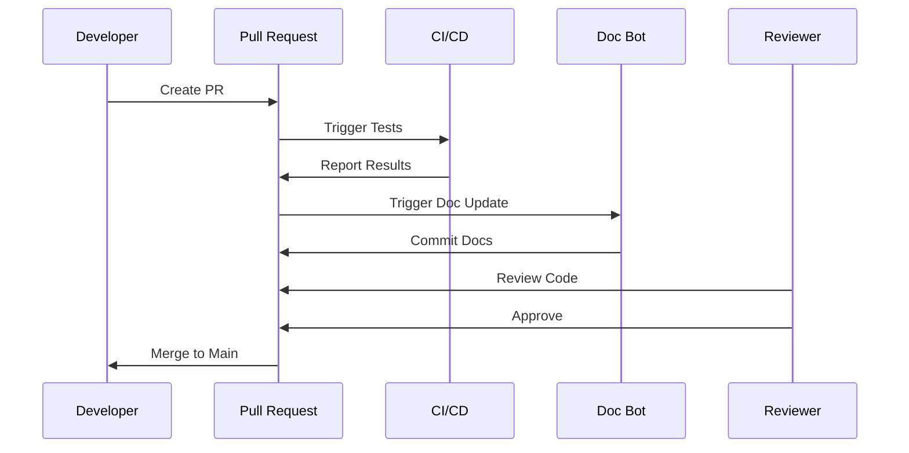
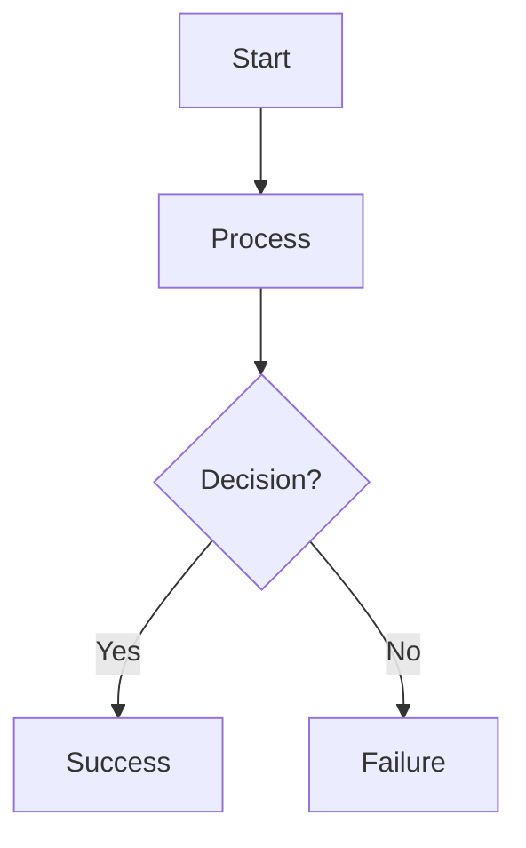

# Contributing to Alexi

Thank you for your interest in contributing to Alexi! This document provides guidelines and best practices for contributing to the project.

## Table of Contents

- [Code of Conduct](#code-of-conduct)
- [Getting Started](#getting-started)
- [Development Workflow](#development-workflow)
- [Coding Standards](#coding-standards)
- [Testing Guidelines](#testing-guidelines)
- [Pull Request Process](#pull-request-process)
- [Autonomous Sync System](#autonomous-sync-system)
- [Documentation](#documentation)

## Code of Conduct

We are committed to providing a welcoming and inclusive environment. Please be respectful and professional in all interactions.

## Getting Started

### Prerequisites

- Node.js 22 or higher
- npm or pnpm package manager
- Git
- SAP AI Core account (for integration testing)
- TypeScript knowledge

### Fork and Clone

```bash
# Fork the repository on GitHub
# Then clone your fork
git clone git@github.com:YOUR_USERNAME/sap-bot-orchestrator.git
cd sap-bot-orchestrator

# Add upstream remote
git remote add upstream git@github.com:ausardcompany/sap-bot-orchestrator.git
```

### Install Dependencies

```bash
npm install
```

### Configure Environment

Create a `.env` file with your SAP AI Core credentials:

```bash
# SAP AI Core Configuration
AICORE_SERVICE_KEY='{"clientid":"...","clientsecret":"...",...}'
AICORE_RESOURCE_GROUP='default'
```

### Build and Test

```bash
# Build the project
npm run build

# Run tests
npm test

# Run tests in watch mode
npm run test:watch

# Run with coverage
npm run test:coverage
```

## Development Workflow

```mermaid
graph LR
    Fork[Fork Repository] --> Clone[Clone Fork]
    Clone --> Branch[Create Branch]
    Branch --> Code[Write Code]
    Code --> Test[Run Tests]
    Test --> Commit[Commit Changes]
    Commit --> Push[Push to Fork]
    Push --> PR[Create Pull Request]
    PR --> Review[Code Review]
    Review --> Merge[Merge to Main]
    
    style Code fill:#4CAF50
    style Test fill:#2196F3
    style PR fill:#FF9800
```



### Create a Feature Branch

```bash
# Update your fork
git fetch upstream
git checkout main
git merge upstream/main

# Create a feature branch
git checkout -b feature/your-feature-name
```

### Make Changes

1. Write code following our coding standards
2. Add tests for new functionality
3. Update documentation as needed
4. Run linting and tests locally

### Commit Changes

We follow conventional commit format:

```bash
# Feature
git commit -m "feat: add new routing rule type"

# Bug fix
git commit -m "fix: resolve path handling in write tool"

# Documentation
git commit -m "docs: update API documentation"

# Tests
git commit -m "test: add unit tests for glob tool"

# Refactoring
git commit -m "refactor: simplify router logic"

# Chore
git commit -m "chore: update dependencies"
```

### Commit Message Format

```
<type>(<scope>): <subject>

<body>

<footer>
```

**Types:**
- `feat`: New feature
- `fix`: Bug fix
- `docs`: Documentation changes
- `test`: Adding or updating tests
- `refactor`: Code refactoring
- `chore`: Maintenance tasks
- `style`: Code style changes
- `perf`: Performance improvements

## Coding Standards

### TypeScript Best Practices

#### Use Strict Type Checking

```typescript
// Good
function processMessage(message: string): Promise<Response> {
  return apiClient.send(message);
}

// Bad
function processMessage(message: any): any {
  return apiClient.send(message);
}
```

#### Define Interfaces for Complex Types

```typescript
// Good
interface ToolContext {
  workdir: string;
  signal?: AbortSignal;
  sessionId?: string;
}

function executeTool(params: ToolParams, context: ToolContext): Promise<ToolResult> {
  // ...
}

// Bad
function executeTool(params: any, context: any): Promise<any> {
  // ...
}
```

#### Use Async/Await Over Promises

```typescript
// Good
async function readFile(path: string): Promise<string> {
  try {
    const content = await fs.readFile(path, 'utf-8');
    return content;
  } catch (error) {
    throw new Error(`Failed to read file: ${error.message}`);
  }
}

// Bad
function readFile(path: string): Promise<string> {
  return fs.readFile(path, 'utf-8')
    .then(content => content)
    .catch(error => {
      throw new Error(`Failed to read file: ${error.message}`);
    });
}
```

#### Prefer Const Over Let

```typescript
// Good
const maxRetries = 3;
const config = loadConfig();

// Bad
let maxRetries = 3;
let config = loadConfig();
```

#### Use Descriptive Variable Names

```typescript
// Good
const userMessage = 'Hello, AI!';
const selectedModel = 'claude-4-sonnet';
const hasPermission = await checkPermission();

// Bad
const msg = 'Hello, AI!';
const m = 'claude-4-sonnet';
const p = await checkPermission();
```

### Code Organization

#### File Structure

```
src/
├── cli/           # CLI commands and entry points
├── core/          # Core orchestration logic
├── providers/     # LLM provider implementations
├── router/        # Auto-routing system
├── tool/          # Tool system
│   ├── index.ts   # Tool definitions and registry
│   └── tools/     # Individual tool implementations
├── permission/    # Permission management
├── session/       # Session management
└── bus/           # Event bus
```

#### Module Exports

```typescript
// index.ts - Export public API
export { defineTool, registerTool, type Tool, type ToolContext } from './core.js';
export { readTool } from './tools/read.js';
export { writeTool } from './tools/write.js';
```

### Error Handling

#### Use Custom Error Types

```typescript
// Good
class ToolExecutionError extends Error {
  constructor(
    public toolName: string,
    public originalError: Error
  ) {
    super(`Tool ${toolName} failed: ${originalError.message}`);
    this.name = 'ToolExecutionError';
  }
}

throw new ToolExecutionError('read', error);

// Bad
throw new Error('Tool failed');
```

#### Handle Errors Gracefully

```typescript
// Good
async function executeTool(tool: Tool, params: unknown): Promise<ToolResult> {
  try {
    return await tool.execute(params, context);
  } catch (error) {
    return {
      success: false,
      error: error instanceof Error ? error.message : String(error)
    };
  }
}

// Bad
async function executeTool(tool: Tool, params: unknown): Promise<ToolResult> {
  return await tool.execute(params, context); // May throw unhandled errors
}
```

### Documentation Comments

Use JSDoc for public APIs:

```typescript
/**
 * Execute a tool with the given parameters
 * 
 * @param tool - The tool to execute
 * @param params - Tool-specific parameters
 * @param context - Execution context with workdir and signal
 * @returns Promise resolving to tool execution result
 * @throws {ToolExecutionError} If tool execution fails
 * 
 * @example
 * ```typescript
 * const result = await executeTool(readTool, { filePath: 'test.txt' }, context);
 * if (result.success) {
 *   console.log(result.data);
 * }
 * ```
 */
export async function executeTool<T>(
  tool: Tool<T>,
  params: T,
  context: ToolContext
): Promise<ToolResult> {
  // ...
}
```

## Testing Guidelines

### Test Structure

Follow the AAA pattern: Arrange, Act, Assert

```typescript
describe('Write Tool', () => {
  let tempDir: string;
  let context: ToolContext;

  beforeEach(async () => {
    // Arrange: Set up test environment
    tempDir = await fs.mkdtemp(path.join(os.tmpdir(), 'write-tool-test-'));
    context = { workdir: tempDir };
  });

  afterEach(async () => {
    // Cleanup
    await fs.rm(tempDir, { recursive: true, force: true });
  });

  it('should create a new file with content', async () => {
    // Arrange
    const filePath = path.join(tempDir, 'new-file.txt');
    const content = 'Hello, World!';

    // Act
    const result = await writeTool.execute({ filePath, content }, context);

    // Assert
    expect(result.success).toBe(true);
    expect(result.data?.created).toBe(true);
    
    // Verify actual file system change
    const actualContent = await fs.readFile(filePath, 'utf-8');
    expect(actualContent).toBe(content);
  });
});
```

### Test Coverage Requirements

- Unit tests: 80%+ coverage for new code
- Integration tests: Cover main user workflows
- Tool tests: Test all file operations, error cases, edge cases
- Provider tests: Test message formatting, streaming, error handling

### Mocking

Use Vitest mocking for external dependencies:

```typescript
// Mock permission system
vi.mock('../../../src/tool/index.js', async () => {
  const actual = await vi.importActual('../../../src/tool/index.js');
  return {
    ...actual,
    defineTool: (def: any) => ({
      ...def,
      execute: def.execute,
      executeUnsafe: def.execute,
    }),
  };
});
```

### Test Naming

Use descriptive test names:

```typescript
// Good
it('should create parent directories if they do not exist', async () => {
  // ...
});

it('should handle relative paths using workdir', async () => {
  // ...
});

// Bad
it('test write', async () => {
  // ...
});
```

## Pull Request Process

### Before Submitting

1. **Run all tests**: `npm test`
2. **Check linting**: `npm run lint`
3. **Build project**: `npm run build`
4. **Update documentation**: Update relevant docs
5. **Add tests**: Ensure new code has tests
6. **Update CHANGELOG**: Add entry to Unreleased section

### PR Title Format

Use conventional commit format:

```
feat: add support for custom routing rules
fix: resolve memory leak in session manager
docs: update API documentation for tools
test: add integration tests for providers
```

### PR Description Template

```markdown
## Description
Brief description of changes

## Type of Change
- [ ] Bug fix
- [ ] New feature
- [ ] Breaking change
- [ ] Documentation update

## Testing
- [ ] Unit tests added/updated
- [ ] Integration tests added/updated
- [ ] Manual testing completed

## Checklist
- [ ] Code follows project style guidelines
- [ ] Self-review completed
- [ ] Comments added for complex logic
- [ ] Documentation updated
- [ ] Tests pass locally
- [ ] CHANGELOG.md updated
```

### Review Process

1. **Automated Checks**: CI/CD runs tests and linting
2. **Documentation**: Bot generates updated documentation
3. **Code Review**: Maintainer reviews code
4. **Approval**: Changes approved
5. **Merge**: PR merged to main



## Autonomous Sync System

Alexi includes an autonomous sync system that synchronizes changes from upstream repositories:

- **kilocode** (Kilo-Org/kilocode)
- **opencode** (anomalyco/opencode)
- **claude-code** (anthropics/claude-code)

### How It Works

1. **Daily Schedule**: Runs at 06:00 UTC
2. **Change Detection**: Compares commits with last sync state
3. **AI Analysis**: Claude 4.5 Opus creates update plan
4. **Execution**: Claude 4.5 Sonnet applies changes
5. **Auto-Commit**: Changes committed directly to main

### Contributing to Sync Logic

If you're modifying the sync workflow:

1. Test with `dry_run=true` first
2. Review generated plans in `.github/reports/`
3. Verify SAP AI Core compatibility
4. Update workflow documentation

### File Mapping

When upstream changes affect these areas:

- Tool system → `src/tool/`
- Agent system → `src/agent/`
- Permission system → `src/permission/`
- Event bus → `src/bus/`
- Core orchestration → `src/core/`
- Providers → `src/providers/`
- Router → `src/router/`
- CLI → `src/cli/`

## Documentation

### When to Update Documentation

Update documentation when:

- Adding new features
- Changing APIs or interfaces
- Modifying CLI commands
- Updating workflows
- Adding configuration options

### Documentation Files

| File | Purpose |
|------|---------|
| `README.md` | Project overview and quick start |
| `docs/API.md` | CLI commands and TypeScript APIs |
| `docs/ARCHITECTURE.md` | System architecture and design |
| `docs/TESTING.md` | Testing guide and best practices |
| `docs/AUTOMATION.md` | Workflow and CI/CD documentation |
| `docs/CONTRIBUTING.md` | This file |
| `CHANGELOG.md` | Version history and changes |

### Documentation Style

- Use clear, concise language
- Include code examples
- Add diagrams for complex concepts
- Use Mermaid for flowcharts and diagrams
- Follow existing documentation structure

### Mermaid Diagrams

Include diagrams to illustrate complex flows:



## Getting Help

- **Issues**: Open an issue on GitHub
- **Discussions**: Use GitHub Discussions for questions
- **Documentation**: Check existing documentation
- **Code Review**: Ask for clarification in PR comments

## License

By contributing to Alexi, you agree that your contributions will be licensed under the project's license.

Thank you for contributing to Alexi!
