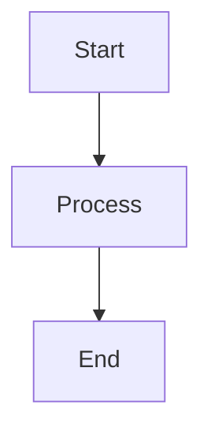

# Contributing to Alexi

Thank you for your interest in contributing to Alexi! This document provides guidelines and instructions for contributing to the project.

## Table of Contents

- [Code of Conduct](#code-of-conduct)
- [Getting Started](#getting-started)
- [Development Workflow](#development-workflow)
- [Coding Standards](#coding-standards)
- [Testing Guidelines](#testing-guidelines)
- [Pull Request Process](#pull-request-process)
- [Documentation](#documentation)
- [Automation System](#automation-system)

## Code of Conduct

This project follows a professional code of conduct. We expect all contributors to:

- Be respectful and inclusive
- Provide constructive feedback
- Focus on technical merit
- Maintain professional communication

## Getting Started

### Prerequisites

- Node.js 22 or higher
- npm or yarn package manager
- Git
- SAP AI Core account with valid credentials
- TypeScript knowledge

### Initial Setup

1. Fork the repository on GitHub
2. Clone your fork locally:
   ```bash
   git clone git@github.com:YOUR_USERNAME/alexi.git
   cd alexi
   ```

3. Install dependencies:
   ```bash
   npm install
   ```

4. Configure environment variables:
   ```bash
   cp .env.example .env
   # Edit .env with your SAP AI Core credentials
   ```

5. Build the project:
   ```bash
   npm run build
   ```

6. Verify the setup:
   ```bash
   node dist/cli/program.js --help
   ```

### Environment Configuration

Create a `.env` file (never commit this file) with:

```bash
# Proxy configuration (for OpenAI-compatible models)
SAP_PROXY_BASE_URL=http://127.0.0.1:3001/v1
SAP_PROXY_API_KEY=your_secret_key
SAP_PROXY_MODEL=gpt-4o

# Native SAP AI Core (for Claude models)
AICORE_SERVICE_KEY='{"clientid":"...","clientsecret":"...","url":"...","serviceurls":{"AI_API_URL":"..."}}'
AICORE_RESOURCE_GROUP=your-resource-group-id
```

## Development Workflow

### Branch Strategy

- `main`: Production-ready code
- `feature/*`: New features
- `fix/*`: Bug fixes
- `docs/*`: Documentation updates
- `refactor/*`: Code refactoring

### Development Process


1. Create a feature branch:
   ```bash
   git checkout -b feature/your-feature-name
   ```

2. Make your changes following coding standards

3. Write or update tests for your changes

4. Run tests locally:
   ```bash
   npm test
   ```

5. Build and verify:
   ```bash
   npm run build
   npm run lint
   ```

6. Commit your changes with descriptive messages:
   ```bash
   git add .
   git commit -m "feat: add new feature description"
   ```

7. Push to your fork:
   ```bash
   git push origin feature/your-feature-name
   ```

8. Create a pull request on GitHub

## Coding Standards

### TypeScript Guidelines

1. **Type Safety**: Always use explicit types, avoid `any`
   ```typescript
   // Good
   function processMessage(message: string): Promise<Response> {
     // ...
   }
   
   // Bad
   function processMessage(message: any): any {
     // ...
   }
   ```

2. **Interfaces over Types**: Prefer interfaces for object shapes
   ```typescript
   // Good
   interface ToolContext {
     workdir: string;
     signal?: AbortSignal;
   }
   
   // Acceptable for unions/intersections
   type PermissionAction = 'read' | 'write' | 'execute';
   ```

3. **Async/Await**: Use async/await over raw promises
   ```typescript
   // Good
   async function fetchData(): Promise<Data> {
     const response = await fetch(url);
     return await response.json();
   }
   
   // Avoid
   function fetchData(): Promise<Data> {
     return fetch(url).then(r => r.json());
   }
   ```

4. **Error Handling**: Always handle errors appropriately
   ```typescript
   try {
     const result = await riskyOperation();
     return { success: true, data: result };
   } catch (err) {
     const message = err instanceof Error ? err.message : String(err);
     return { success: false, error: message };
   }
   ```

5. **Null Safety**: Use optional chaining and nullish coalescing
   ```typescript
   // Good
   const value = context?.workdir ?? process.cwd();
   
   // Avoid
   const value = context && context.workdir ? context.workdir : process.cwd();
   ```

6. **Module Patterns**: Prefer const objects over namespaces for utility modules
   ```typescript
   // Good - ES Module friendly with better tree-shaking
   function addAll(rules: Set<string>, parts: string[], text: string): void {
     // implementation
   }
   
   function matches(command: string, rules: Set<string>): boolean {
     // implementation
   }
   
   export const BashHierarchy = { addAll, matches } as const;
   
   // Avoid - TypeScript namespaces are less compatible with ES Modules
   export namespace BashHierarchy {
     export function addAll(rules: Set<string>, parts: string[], text: string): void {
       // implementation
     }
     
     export function matches(command: string, rules: Set<string>): boolean {
       // implementation
     }
   }
   ```

7. **Import Hygiene**: Remove unused imports to reduce bundle size
   ```typescript
   // Good - only import what you use
   import { AgentSwitched } from '../bus/index.js';
   import { getAgentPrompt } from './system.js';
   
   // Bad - unused imports
   import * as path from 'path';
   import * as fs from 'fs/promises';
   import { AgentSwitched } from '../bus/index.js';
   import { getAgentPrompt } from './system.js';
   ```

### File Organization

```
src/
├── cli/              # CLI-related code
│   ├── program.ts    # Main CLI entry point
│   └── commands/     # Individual CLI commands
├── core/             # Core orchestration logic
│   ├── orchestrator.ts
│   ├── router.ts
│   └── agenticChat.ts
├── providers/        # LLM provider implementations
│   ├── openai/
│   ├── bedrock/
│   └── anthropic/
├── tool/             # Tool system
│   ├── index.ts      # Tool framework
│   ├── tools/        # Individual tool implementations
│   └── bash-hierarchy.ts  # Hierarchical bash command permission rules
├── permission/       # Permission system
│   └── index.ts
├── session/          # Session management
└── bus/              # Event bus system
```

### Naming Conventions

- **Files**: camelCase for TypeScript files (`orchestrator.ts`)
- **Classes**: PascalCase (`class ToolRegistry`)
- **Functions**: camelCase (`function defineTool()`)
- **Constants**: UPPER_SNAKE_CASE (`const MAX_LINES = 2000`)
- **Interfaces**: PascalCase (`interface ToolContext`)
- **Types**: PascalCase (`type PermissionAction`)

### Code Style

- Use 2 spaces for indentation
- Maximum line length: 100 characters (flexible for readability)
- Use single quotes for strings
- Include trailing commas in multi-line objects/arrays
- Use semicolons

### Documentation Comments

Use JSDoc for functions and classes:

```typescript
/**
 * Define a new tool with lazy initialization
 * 
 * @param definition - Tool definition with parameters and execution logic
 * @returns Tool instance with execution methods
 */
export function defineTool<TParams extends z.ZodType, TResult>(
  definition: ToolDefinition<TParams, TResult>
): Tool<TParams, TResult> {
  // ...
}
```

## Testing Guidelines

### Test Structure

- Place tests next to the code they test: `tool.test.ts` next to `tool.ts`
- Use descriptive test names
- Follow Arrange-Act-Assert pattern

```typescript
describe('defineTool', () => {
  it('should create tool with permission checks', async () => {
    // Arrange
    const definition = {
      name: 'test-tool',
      description: 'Test tool',
      parameters: z.object({ path: z.string() }),
      permission: {
        action: 'write' as const,
        getResource: (params) => params.path,
      },
      execute: async () => ({ success: true }),
    };
    
    // Act
    const tool = defineTool(definition);
    
    // Assert
    expect(tool.name).toBe('test-tool');
    expect(tool.toFunctionSchema()).toBeDefined();
  });
});
```

### Running Tests

```bash
# Run all tests
npm test

# Run specific test file
npm test -- tool.test.ts

# Run with coverage
npm test -- --coverage

# Watch mode
npm test -- --watch
```

## Pull Request Process

### Before Submitting

1. Ensure all tests pass
2. Update relevant documentation
3. Add entries to CHANGELOG.md if needed
4. Verify build succeeds
5. Run linter and fix issues

### PR Title Format

Use conventional commit format:

- `feat: add new feature`
- `fix: resolve bug in tool system`
- `docs: update API documentation`
- `refactor: simplify orchestrator logic`
- `test: add tests for permission system`
- `chore: update dependencies`

### PR Description

Include:

1. **Summary**: Brief description of changes
2. **Motivation**: Why this change is needed
3. **Changes**: List of specific changes made
4. **Testing**: How changes were tested
5. **Screenshots**: If UI changes (not applicable for CLI)

Example:

```markdown
## Summary
Enhanced write and edit tools with relative path resolution for permission checks.

## Motivation
In CI environments, the agentic system needs to resolve relative paths correctly
for permission checks to work with the workdir context.

## Changes
- Modified `getResource` in write.ts to accept ToolContext parameter
- Modified `getResource` in edit.ts to accept ToolContext parameter
- Updated tool index to pass context to getResource functions
- Added path resolution logic using workdir

## Testing
- Added unit tests for relative path resolution
- Verified in CI environment with documentation-update workflow
- Tested locally with various path configurations
```

### Automated Checks

Pull requests trigger automated workflows:

1. **CI**: Runs tests, linting, and build verification
2. **Documentation Update**: AI-powered documentation generation
   - Analyzes code changes
   - Updates relevant documentation files
   - Generates Mermaid diagrams
   - Updates CHANGELOG.md

The documentation update workflow will automatically:
- Detect which documentation files need updating based on changed code
- Generate accurate technical documentation using Claude AI
- Commit documentation changes to your PR branch
- Ensure documentation stays in sync with code

### Code Review

All PRs require:
- At least one approval from a maintainer
- Passing CI checks
- Passing documentation generation
- No merge conflicts

Reviewers will check:
- Code quality and style
- Test coverage
- Documentation accuracy
- Performance implications
- Security considerations

## Documentation

### Documentation Files

| File | Purpose |
|------|---------|
| `README.md` | Project overview and quick start |
| `docs/ARCHITECTURE.md` | System architecture and design |
| `docs/API.md` | API reference and usage examples |
| `docs/ROUTING.md` | Routing system documentation |
| `docs/PROVIDERS.md` | Provider integration guide |
| `docs/CONFIGURATION.md` | Configuration options |
| `docs/TESTING.md` | Testing guide |
| `docs/AUTOMATION.md` | CI/CD and automation |
| `docs/CONTRIBUTING.md` | This file |
| `CHANGELOG.md` | Version history |

### Documentation Standards

1. Use clear, technical language
2. Include code examples from actual codebase
3. Add Mermaid diagrams for complex concepts
4. Keep examples up-to-date with code changes
5. Use proper markdown formatting

### Mermaid Diagrams

Include at least 3 Mermaid diagrams in major documentation:



Supported diagram types:
- Flowcharts (`graph`)
- Sequence diagrams (`sequenceDiagram`)
- Class diagrams (`classDiagram`)
- State diagrams (`stateDiagram`)

## Automation System

### Autonomous Sync

Alexi includes an autonomous upstream synchronization system:


The system:
- Runs daily at 06:00 UTC
- Syncs from kilocode, opencode, and claude-code repositories
- Uses AI to analyze and apply relevant changes
- Creates PRs with detailed change descriptions
- Auto-merges after CI passes

### Agentic File Operations

The tool system supports autonomous file operations with:

**Automatic Permission Configuration**:
```typescript
// High-priority allow rules for agentic mode
{
  id: 'agentic-allow-write',
  priority: 200,
  actions: ['write'],
  paths: ['<workdir>/**'],
  decision: 'allow'
}
```

**Relative Path Resolution**:
```typescript
// Tools resolve relative paths using workdir context
getResource: (params, context) => {
  if (path.isAbsolute(params.filePath)) {
    return params.filePath;
  }
  return path.join(context?.workdir || process.cwd(), params.filePath);
}
```

### Contributing to Automation

When modifying workflows:

1. Test with manual dispatch first
2. Use dry-run mode for sync workflows
3. Update `docs/AUTOMATION.md`
4. Document new secrets or configuration
5. Ensure backward compatibility

## Getting Help

- Open an issue for bugs or feature requests
- Join discussions for questions
- Check existing issues before creating new ones
- Provide minimal reproducible examples for bugs

## License

By contributing, you agree that your contributions will be licensed under the same license as the project.

## Recognition

Contributors are recognized in:
- GitHub contributors page
- Release notes for significant contributions
- Project documentation when appropriate

Thank you for contributing to Alexi!
