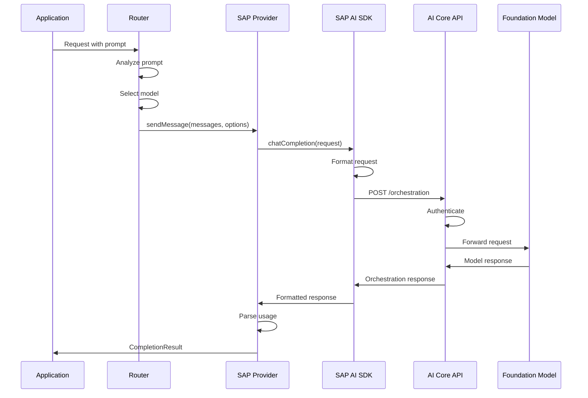
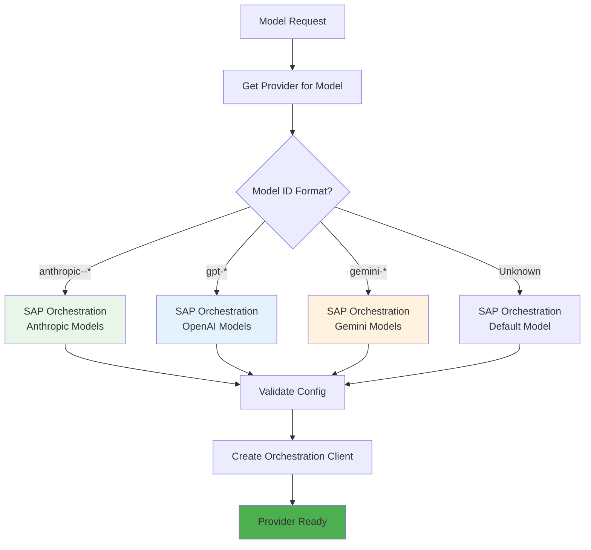

# Providers

This document describes the provider system in Alexi, focusing on the SAP AI Core Orchestration provider which is the exclusive LLM backend for the application.

## Table of Contents

- [Overview](#overview)
- [SAP AI Core Orchestration Provider](#sap-ai-core-orchestration-provider)
- [Provider Architecture](#provider-architecture)
- [Supported Models](#supported-models)
- [Configuration](#configuration)
- [Usage Examples](#usage-examples)

## Overview

Alexi uses a provider abstraction layer to communicate with LLM backends. Unlike multi-provider AI orchestrators, **Alexi exclusively uses SAP AI Core Orchestration API** as its LLM backend. This design decision ensures enterprise-grade security, compliance, and integration with SAP ecosystems.

### Provider Architecture

```mermaid
graph TB
    subgraph Application[\"Application Layer\"]
        CLI[CLI Commands]
        Core[Core Orchestrator]
        Agent[Agent System]
    end
    
    subgraph Provider[\"Provider Layer\"]
        Interface[Provider Interface]
        SAP[SAP Orchestration Provider]
    end
    
    subgraph Backend[\"SAP AI Core\"]
        Orch[Orchestration API]
        Models[Model Deployments]
        Auth[Authentication]
    end
    
    CLI --> Core
    Core --> Interface
    Agent --> Interface
    Interface --> SAP
    SAP --> Orch
    Orch --> Models
    SAP --> Auth
    
    style SAP fill:#4CAF50
    style Orch fill:#2196F3
    style Models fill:#FF9800
```

## SAP AI Core Orchestration Provider

The SAP Orchestration provider is implemented in `src/providers/sapOrchestration.ts` and uses the official `@sap-ai-sdk/orchestration` SDK.

### Features

- **Native Integration**: Direct integration with SAP AI Core using official SDK
- **Model Agnostic**: Supports multiple foundation models through unified API
- **Token Tracking**: Automatic usage tracking and cost estimation
- **Streaming Support**: Real-time streaming responses
- **Tool Calling**: Native function calling support for agentic workflows
- **Error Handling**: Comprehensive error handling with retry logic

### Provider Interface

```typescript
interface Provider {
  /**
   * Send a message to the LLM and get a response
   */
  sendMessage(
    messages: Message[],
    options: SendMessageOptions
  ): Promise<CompletionResult>;

  /**
   * Send a message with streaming response
   */
  sendMessageStream(
    messages: Message[],
    options: SendMessageOptions,
    onChunk: (chunk: string) => void
  ): Promise<CompletionResult>;

  /**
   * Get provider name
   */
  getName(): string;

  /**
   * Check if provider supports a model
   */
  supportsModel(modelId: string): boolean;
}
```

### Implementation Details

```typescript
// src/providers/sapOrchestration.ts
import { OrchestrationClient } from '@sap-ai-sdk/orchestration';

export class SAPOrchestrationProvider implements Provider {
  private client: OrchestrationClient;
  
  constructor(config: SAPOrchestrationConfig) {
    this.client = new OrchestrationClient({
      resourceGroup: config.resourceGroup,
      // Authentication handled by @sap-ai-sdk
    });
  }

  async sendMessage(
    messages: Message[],
    options: SendMessageOptions
  ): Promise<CompletionResult> {
    const response = await this.client.chatCompletion({
      messages: this.formatMessages(messages),
      model: options.model,
      temperature: options.temperature,
      maxTokens: options.maxTokens,
      tools: options.tools,
    });

    return {
      text: response.content,
      usage: response.usage,
      toolCalls: response.toolCalls,
      finishReason: response.finishReason,
    };
  }

  // ... streaming and other methods
}
```

## Provider Call Flow



## Supported Models

Alexi supports all foundation models available through SAP AI Core Orchestration API.

### Model Categories

#### Anthropic Claude Models

```typescript
const CLAUDE_MODELS = [
  'anthropic--claude-4.5-opus',
  'anthropic--claude-4.5-sonnet',
  'anthropic--claude-4-sonnet',
  'anthropic--claude-4-haiku',
];
```

**Characteristics**:
- Excellent code generation and analysis
- Strong reasoning capabilities
- Large context windows (200K+ tokens)
- Native tool calling support

#### OpenAI GPT Models

```typescript
const OPENAI_MODELS = [
  'gpt-4.1',
  'gpt-4o',
  'gpt-4o-mini',
  'gpt-4-turbo',
];
```

**Characteristics**:
- Extended reasoning with GPT-4.1
- Fast inference with GPT-4o
- Cost-effective with GPT-4o-mini
- Strong general-purpose capabilities

#### Google Gemini Models

```typescript
const GEMINI_MODELS = [
  'gemini-2.0-flash-thinking',
  'gemini-2.0-flash',
  'gemini-1.5-pro',
  'gemini-1.5-flash',
];
```

**Characteristics**:
- Multimodal capabilities
- Fast inference with Flash models
- Thinking mode for complex reasoning
- Large context windows

### Model Selection

Models are selected through:

1. **Explicit Override**: `--model` flag in CLI commands
2. **Auto-Routing**: Automatic selection based on prompt analysis
3. **User Default**: Persistent default model in ~/.alexi/config.json
4. **Environment Variable**: AICORE_MODEL environment variable
5. **System Default**: Fallback to anthropic--claude-4-sonnet

### Model Capabilities

```typescript
interface ModelCapability {
  id: string;
  name: string;
  provider: 'anthropic' | 'openai' | 'google';
  tier: 'cheap' | 'balanced' | 'expensive';
  strengths: string[];
  contextWindow: number;
  supportsTools: boolean;
  supportsStreaming: boolean;
  supportsReasoning: boolean;
}
```

## Configuration

### Environment Variables

#### Required

```bash
# SAP AI Core service key (JSON format)
export AICORE_SERVICE_KEY='{
  "clientid": "your-client-id",
  "clientsecret": "your-client-secret",
  "url": "https://your-auth-url",
  "serviceurls": {
    "AI_API_URL": "https://your-ai-api-url"
  }
}'
```

#### Optional

```bash
# Resource group (default: "default")
export AICORE_RESOURCE_GROUP=production

# Default model
export AICORE_MODEL=gpt-4o
```

### Service Key Format

The SAP AI Core service key contains:

- **clientid**: OAuth2 client ID
- **clientsecret**: OAuth2 client secret
- **url**: Authentication server URL
- **serviceurls.AI_API_URL**: AI Core API base URL

### Obtaining a Service Key

1. Log in to SAP BTP Cockpit
2. Navigate to your SAP AI Core instance
3. Create a new service key
4. Copy the JSON credentials
5. Set as AICORE_SERVICE_KEY environment variable

### Resource Groups

Resource groups organize AI Core resources:

```bash
# List deployments in a resource group
alexi models --resource-group production

# Use different resource group
export AICORE_RESOURCE_GROUP=development
alexi chat -m "Hello"
```

## Usage Examples

### Basic Chat

```typescript
import { getProviderForModel } from './providers/index.js';

const provider = getProviderForModel('anthropic--claude-4-sonnet');

const result = await provider.sendMessage(
  [{ role: 'user', content: 'Hello, world!' }],
  {
    model: 'anthropic--claude-4-sonnet',
    temperature: 0.7,
    maxTokens: 1000,
  }
);

console.log(result.text);
console.log(`Tokens used: ${result.usage.total_tokens}`);
```

### Streaming Response

```typescript
const provider = getProviderForModel('gpt-4o');

await provider.sendMessageStream(
  [{ role: 'user', content: 'Write a story' }],
  {
    model: 'gpt-4o',
    temperature: 0.8,
  },
  (chunk) => {
    process.stdout.write(chunk);
  }
);
```

### Tool Calling

```typescript
const provider = getProviderForModel('anthropic--claude-4-sonnet');

const result = await provider.sendMessage(
  [{ role: 'user', content: 'Read the file README.md' }],
  {
    model: 'anthropic--claude-4-sonnet',
    tools: [
      {
        name: 'read',
        description: 'Read a file',
        parameters: {
          type: 'object',
          properties: {
            filePath: { type: 'string' },
          },
          required: ['filePath'],
        },
      },
    ],
  }
);

if (result.toolCalls && result.toolCalls.length > 0) {
  console.log('Tool calls requested:', result.toolCalls);
}
```

### List Available Models

```bash
# List all deployments
alexi models

# Filter by status
alexi models --status RUNNING

# JSON output
alexi models --json

# Specific resource group
alexi models --resource-group production
```

### Query Deployments Programmatically

```typescript
import { DeploymentApi } from '@sap-ai-sdk/ai-api';

const response = await DeploymentApi.deploymentQuery(
  {},
  { 'AI-Resource-Group': 'default' }
).execute();

const deployments = response.resources || [];
const running = deployments.filter(d => d.status === 'RUNNING');

console.log(`Found ${running.length} running deployments`);
```

## Provider Resolution

The provider resolution flow determines which provider to use for a given model:



### Provider Selection Logic

```typescript
// src/providers/index.ts
export function getProviderForModel(modelId: string): Provider {
  // All models use SAP Orchestration provider
  return new SAPOrchestrationProvider({
    resourceGroup: process.env.AICORE_RESOURCE_GROUP || 'default',
    model: modelId,
  });
}

export function getDefaultModel(): string {
  // Priority: user config > env var > system default
  return (
    getConfigDefaultModel() ||
    process.env.AICORE_MODEL ||
    'anthropic--claude-4-sonnet'
  );
}
```

## Error Handling

### Common Errors

#### Authentication Errors

```typescript
{
  success: false,
  error: 'Authentication failed: Invalid client credentials'
}
```

**Solution**: Verify AICORE_SERVICE_KEY is correctly formatted

#### Model Not Found

```typescript
{
  success: false,
  error: 'Model not found: invalid-model-id'
}
```

**Solution**: Use `alexi models` to list available models

#### Rate Limiting

```typescript
{
  success: false,
  error: 'Rate limit exceeded. Please try again later.'
}
```

**Solution**: Implement exponential backoff or reduce request frequency

#### Quota Exceeded

```typescript
{
  success: false,
  error: 'Resource quota exceeded for resource group'
}
```

**Solution**: Check SAP AI Core quotas or use different resource group

## Performance Considerations

### Token Optimization

- Use cheaper models for simple tasks (gpt-4o-mini)
- Implement context compaction for long conversations
- Monitor token usage with `/tokens` command

### Response Time

- Use streaming for better perceived performance
- Select geographically closer resource groups
- Consider model inference speed (Flash models are faster)

### Cost Management

- Enable auto-routing with `--prefer-cheap` flag
- Set up routing rules to prefer cost-effective models
- Monitor usage with `/cost` command

## Security

### Credential Management

- Never commit AICORE_SERVICE_KEY to version control
- Use environment variables or secure secret management
- Rotate credentials regularly
- Use separate service keys for different environments

### Network Security

- All communication uses HTTPS
- OAuth2 authentication with client credentials
- Support for corporate proxy configurations

### Data Privacy

- All data processed through SAP AI Core
- Compliance with enterprise data governance
- No data sent to third-party services

## Troubleshooting

### Provider Initialization Fails

1. Check AICORE_SERVICE_KEY format (must be valid JSON)
2. Verify network connectivity to SAP AI Core
3. Confirm resource group exists
4. Check service key permissions

### Model Not Available

1. List available models: `alexi models`
2. Check deployment status
3. Verify resource group access
4. Confirm model is deployed in your region

### Slow Response Times

1. Check network latency to AI Core
2. Consider using faster models (Flash variants)
3. Reduce context window size
4. Enable streaming for better UX

## Related Documentation

- [Architecture](ARCHITECTURE.md) - System architecture and design
- [Configuration](CONFIGURATION.md) - Configuration options
- [API Documentation](API.md) - CLI commands and TypeScript APIs
