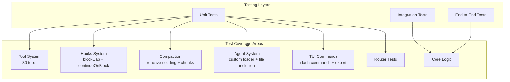
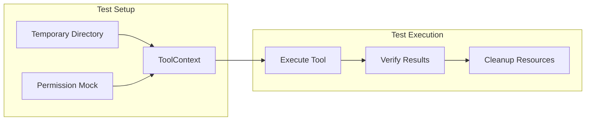
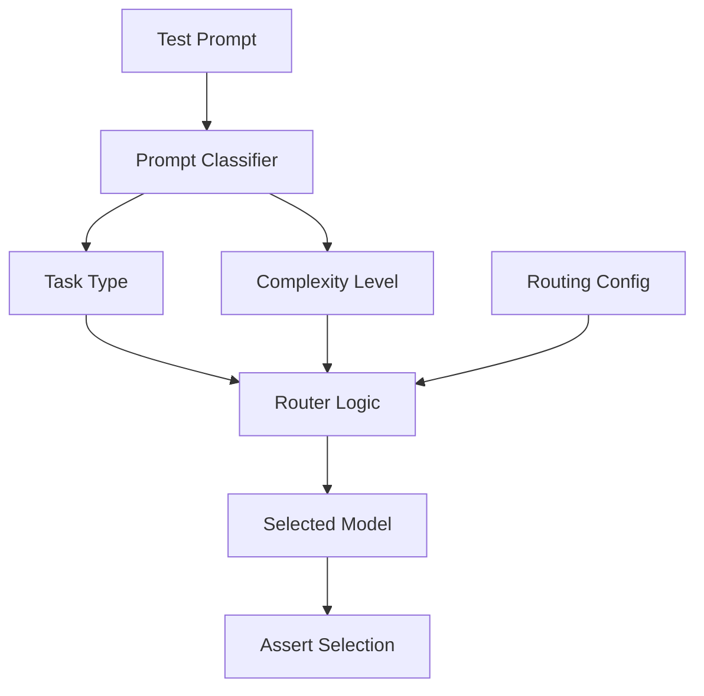

# Testing Guide

This document provides comprehensive testing guidelines for Alexi, including testing strategies, test commands, coverage expectations, and best practices.

## Table of Contents

- [Testing Strategy](#testing-strategy)
- [Test Commands](#test-commands)
- [Test Configuration](#test-configuration)
- [Test Coverage](#test-coverage)
- [Testing Tool System](#testing-tool-system)
- [Testing Minify-Safe Telemetry Detection](#testing-minify-safe-telemetry-detection)
- [Testing Hooks](#testing-hooks)
- [Testing Compaction](#testing-compaction)
- [Testing TUI Commands](#testing-tui-commands)
- [Testing Background Tasks](#testing-background-tasks)
- [Testing Routing](#testing-routing)
- [Testing Rewind Command](#testing-rewind-command)
- [Testing with SAP AI Core](#testing-with-sap-ai-core)
- [Best Practices](#best-practices)

## Testing Strategy

Alexi employs a multi-layered testing strategy:



### Testing Layers

1. **Unit Tests**: Test individual functions and modules in isolation
   - Tool implementations (30 tools)
   - Routing logic and prompt classification
   - Compaction strategies (truncate, summarize, sliding, smart)
   - Hook execution (command, HTTP, script types)
   - Agent loader with file inclusions
   - Permission management and doom loop detection

2. **Integration Tests**: Test interactions between components
   - Agentic chat with tool execution loop
   - Context overflow detection and reactive compaction
   - Hook integration in agentic execution
   - MCP client/server connections

3. **End-to-End Tests**: Test complete user workflows
   - CLI command execution
   - Multi-turn conversations with session persistence
   - Auto-routing decisions

## Test Commands

### Run All Tests

```bash
npm test
```

### Run Tests in Watch Mode

```bash
npm run test:watch
```

### Run Tests with Coverage

```bash
npm run test:coverage
```

### Run Specific Test Files

```bash
# Run a single test file
npm test -- tests/tool/tools/write.test.ts

# Run tests in a directory
npm test -- tests/tool/tools/

# Run tests matching a pattern
npm test -- --grep "write tool"

# Run hook tests
npm test -- tests/hooks/

# Run compaction tests
npm test -- tests/compaction/

# Run agent tests
npm test -- tests/agent/
```

## Test Configuration

Alexi uses **Vitest** with the following configuration (`vitest.config.ts`):

```typescript
import { defineConfig } from 'vitest/config';
import react from '@vitejs/plugin-react';

export default defineConfig({
  plugins: [react()],
  test: {
    environment: 'node',
    coverage: {
      provider: 'v8',
      reporter: ['text', 'html', 'lcov'],
      thresholds: {
        lines: 15,
        functions: 15,
        branches: 15,
        statements: 15,
      },
    },
  },
});
```

Key configuration:
- **Environment**: Node.js (not jsdom)
- **React Plugin**: Enabled for Ink TUI component testing
- **Coverage Provider**: V8
- **Coverage Threshold**: 15% minimum (increasing as coverage improves)

## Test Coverage

### Coverage Expectations

| Component | Target | Description |
|-----------|--------|-------------|
| Tool System | 90%+ | File operations, permissions, error handling |
| Hooks | 85%+ | blockCap, continueOnBlock, execution types |
| Compaction | 85%+ | All strategies, reactive seeding, chunked |
| Agent Loader | 80%+ | Custom agents, file inclusions |
| Core Logic | 85%+ | Orchestrator, router, session |
| TUI | 70%+ | Slash commands, context hooks |

### Generating Coverage Reports

```bash
npm run test:coverage

# View HTML report
open coverage/index.html
```

### Testing the dynamic model catalog

`src/providers/modelCatalog.ts` maintains a module-level cache and a background refresh timer. Tests MUST reset that state in `beforeEach` / `afterEach` to stay parallel-safe:

```typescript
import { invalidateCatalog, refreshModelCatalog, getCatalogStatus } from '../../src/providers/modelCatalog.js';
import { vi, beforeEach, afterEach } from 'vitest';

vi.mock('@sap-ai-sdk/ai-api', () => ({
  DeploymentApi: {
    deploymentQuery: vi.fn(() => ({
      execute: vi.fn().mockResolvedValue({
        resources: [{ id: 'dep-1', configurationName: 'gpt-4o' }],
      }),
    })),
  },
}));

beforeEach(() => invalidateCatalog());
afterEach(() => invalidateCatalog());

it('transitions idle → loading → ready', async () => {
  expect(getCatalogStatus()).toBe('idle');
  await refreshModelCatalog();
  expect(getCatalogStatus()).toBe('ready');
});
```

`invalidateCatalog()` clears the pending refresh timer, aborts any in-flight fetch tracking flag, and resets `entries` to the static seed. Without it a test that flips the catalog to `ready` leaks state into subsequent tests via the module singleton. The refresh timer uses `.unref()` so Node exits cleanly even if a test forgets to call `invalidateCatalog()`, but the cache pollution will still cause assertion drift.

### Testing quoted `@file` mentions

`src/utils/file-mention.ts:parseFileMentions` is a pure function — no mocking needed. Test both parser cases and the command-template integration in `src/command/index.ts` (which wraps `@$N` positional args in quotes when the argument contains whitespace):

```typescript
import { parseFileMentions, quoteFilePath } from '../../src/utils/file-mention.js';

it('parses double-quoted paths with spaces', () => {
  const mentions = parseFileMentions('See @"My Documents/report.txt" for details');
  expect(mentions).toEqual([
    { fullMatch: '@"My Documents/report.txt"', path: 'My Documents/report.txt', index: 4 },
  ]);
});

it('quotes shell-special paths for downstream parsers', () => {
  expect(quoteFilePath('src/foo.ts')).toBe('src/foo.ts');
  expect(quoteFilePath('docs/user guide.md')).toBe('"docs/user guide.md"');
  expect(quoteFilePath('path with "quote".ts')).toBe('"path with \\"quote\\".ts"');
});
```

Reference tests: `tests/utils/file-mention.test.ts` and `tests/command/fileMention.test.ts`.

## Testing Tool System

### Tool Test Architecture



### Standard Tool Test Pattern

```typescript
import { describe, it, expect, vi, beforeEach, afterEach } from 'vitest';
import * as fs from 'fs/promises';
import * as path from 'path';
import os from 'os';

// Mock tool index to bypass permission checks
vi.mock('../../../src/tool/index.js', async () => {
  const actual = await vi.importActual('../../../src/tool/index.js');
  return {
    ...actual,
    defineTool: (def: any) => ({
      ...def,
      execute: def.execute,
      executeUnsafe: def.execute,
      toFunctionSchema: () => ({
        name: def.name,
        description: def.description,
        parameters: {},
      }),
    }),
  };
});

import { writeTool } from '../../../src/tool/tools/write.js';
import type { ToolContext } from '../../../src/tool/index.js';

describe('Write Tool', () => {
  let tempDir: string;
  let context: ToolContext;

  beforeEach(async () => {
    tempDir = await fs.mkdtemp(path.join(os.tmpdir(), 'write-tool-test-'));
    context = { workdir: tempDir };
  });

  afterEach(async () => {
    await fs.rm(tempDir, { recursive: true, force: true });
  });

  it('should create a new file with content', async () => {
    const filePath = path.join(tempDir, 'new-file.txt');
    const content = 'Hello, World!';

    const result = await writeTool.execute({ filePath, content }, context);

    expect(result.success).toBe(true);
    expect(result.data?.created).toBe(true);

    // Verify actual file system change
    const actualContent = await fs.readFile(filePath, 'utf-8');
    expect(actualContent).toBe(content);
  });
});
```

### Tool Test Coverage

| Tool | Test File | Test Cases |
|------|-----------|------------|
| `read` | `tests/tool/tools/read.test.ts` | 20+ cases |
| `write` | `tests/tool/tools/write.test.ts` | 18+ cases |
| `edit` | `tests/tool/tools/edit.test.ts` | 15+ cases |
| `glob` | `tests/tool/tools/glob.test.ts`, `tests/tool/tools/glob-timeout.test.ts` | 16+ cases + bounded-deadline regression suite |
| `grep` | `tests/tool/tools/grep.test.ts` | 20+ cases |
| `bash` | `tests/tool/tools/bash.test.ts` | 13+ cases (includes shell-type reporting) |
| `task` | `tests/tool/tools/background-tasks.test.ts` | 8+ cases |
| `task_status` | `tests/tool/tools/background-tasks.test.ts` | 3+ cases |
| `skill` (description guard) | `src/tool/skill.test.ts` | 1 case |

### Testing Bash Tool Shell-Type Reporting

The `bash` tool records the detected shell type on every result via
`ShellInfo.type` produced by `src/tool/tools/shell/id.ts`. Detection reads
`process.env.SHELL` on POSIX and `process.env.COMSPEC` on Windows, mapping the
resolved binary name to one of `'bash' | 'zsh' | 'fish' | 'powershell' | 'cmd' | 'unknown'`.
The result field is optional (`shellType?: string` on `BashResult` in
`src/tool/tools/bash.ts:54`) and is emitted from the success path, the
detach-timeout path, and the spawn-error path so debuggers always know which
shell interpreted the command.

The suite in `tests/tool/tools/bash.test.ts:41` is gated with
`describe.skipIf(isWindows)` because `process.env.SHELL` is a POSIX convention;
Windows detection is exercised indirectly through the shared `inferType`
matcher. Each test mutates `process.env.SHELL`, executes a trivial `echo hi`
command through `bashTool.executeUnsafe`, and asserts on
`result.data?.shellType`. The `afterEach` hook restores the original `SHELL`
value (deleting it when it was previously unset) so tests remain parallel-safe
and do not leak process state.

```typescript
import { describe, it, expect, afterEach } from 'vitest';
import { bashTool } from '../../../src/tool/tools/bash.js';
import type { ToolContext } from '../../../src/tool/index.js';

const isWindows = process.platform === 'win32';

describe.skipIf(isWindows)('bash tool - shell type reporting', () => {
  const context: ToolContext = {
    workdir: process.cwd(),
    sessionId: 'shell-type-test-session',
  };

  const originalShell = process.env.SHELL;

  afterEach(() => {
    if (originalShell === undefined) {
      delete process.env.SHELL;
    } else {
      process.env.SHELL = originalShell;
    }
  });

  it('reports the detected shell type in the result', async () => {
    process.env.SHELL = '/bin/bash';
    const result = await bashTool.executeUnsafe({ command: 'echo hi' }, context);
    expect(result.success).toBe(true);
    expect(result.data?.shellType).toBe('bash');
  });

  it('detects zsh when SHELL points at zsh', async () => {
    process.env.SHELL = '/bin/zsh';
    const result = await bashTool.executeUnsafe({ command: 'echo hi' }, context);
    expect(result.data?.shellType).toBe('zsh');
  });

  it('falls back to unknown for unrecognised shells', async () => {
    process.env.SHELL = '/opt/weird/mystery';
    const result = await bashTool.executeUnsafe({ command: 'echo hi' }, context);
    expect(result.data?.shellType).toBe('unknown');
  });
});
```

Key patterns:

1. **Use `executeUnsafe`** rather than `execute` — the shell-type field is
   populated regardless of permission gating, and `executeUnsafe` bypasses the
   permission audit so tests do not need to stub the permission layer.
2. **Snapshot `process.env.SHELL` in the closure**, not in `beforeEach`. The
   value is captured once at `describe` scope so a test that reassigns it
   mid-run still sees the original in `afterEach`.
3. **Assert on `result.data?.shellType`, not `result.data.shellType`**. The
   field is declared optional on `BashResult` and TypeScript will require the
   optional-chain form under strict mode.
4. **Do not assert the exact resolved path**. The `path` field on `ShellInfo`
   reflects the raw environment value and is stable across platforms, but the
   `type` classification is the invariant the tool guarantees to callers.

### Testing the Write Tool EOL Normalizer

The write tool applies platform-native line-ending normalization when creating new files and preserves the existing EOL style when overwriting existing files. Two test suites cover this contract: pure-function unit tests in `src/tool/eol-normalizer.test.ts` (co-located with the module) and end-to-end integration tests in `src/tool/tools/__tests__/write.eol.test.ts` that drive `writeTool.executeUnsafe` against a real temp directory.

#### Pure-function tests (`src/tool/eol-normalizer.test.ts`)

The normalizer module exposes four pure helpers — `detectLineEnding`, `normalizeNewFileLineEndings`, `preserveExistingLineEndings`, and `getPlatformEol` — all of which are trivially unit-testable without any I/O or mocking:

```typescript
import { describe, it, expect } from 'vitest';
import {
  detectLineEnding,
  normalizeNewFileLineEndings,
  preserveExistingLineEndings,
  getPlatformEol,
} from './eol-normalizer.js';

describe('detectLineEnding', () => {
  it('returns CRLF when any \\r\\n sequence is present', () => {
    expect(detectLineEnding('a\r\nb\r\n')).toBe('\r\n');
  });

  it('returns LF for content with only \\n', () => {
    expect(detectLineEnding('a\nb\n')).toBe('\n');
  });

  it('prefers CRLF for mixed line ending files', () => {
    // If any CRLF is found we treat the whole file as CRLF.
    expect(detectLineEnding('a\nb\r\nc\n')).toBe('\r\n');
  });
});

describe('normalizeNewFileLineEndings', () => {
  it('collapses pre-existing CRLF to LF before re-applying target EOL', () => {
    // Guard against double CR: input already has \r\n, target is \r\n.
    expect(normalizeNewFileLineEndings('a\r\nb\r\n', '\r\n')).toBe('a\r\nb\r\n');
  });

  it('is idempotent when re-applying the same target', () => {
    const once = normalizeNewFileLineEndings('a\nb\n', '\r\n');
    const twice = normalizeNewFileLineEndings(once, '\r\n');
    expect(twice).toBe(once);
  });
});
```

Key patterns:

1. **Co-located tests.** The unit tests live next to `src/tool/eol-normalizer.ts` because they cover only the module's exported surface and never touch the tool layer. Vitest's `src/**/*.test.ts` pattern picks them up alongside `tests/`.
2. **No mocks, no fixtures.** All four helpers are pure string transforms; every case can be expressed as `expect(fn(input)).toBe(expected)`.
3. **Guard against double-CR.** The `'a\r\nb\r\n'` → `'\r\n'` case verifies that `normalizeNewFileLineEndings` collapses CRLF to LF before re-applying the target, which is what prevents a `\r\r\n` sequence when the caller already passed CRLF content.
4. **Idempotence.** Assert that applying the same target twice is a no-op — this is the load-bearing property that lets callers apply normalization in any order without accumulating extra `\r` bytes.

#### Integration tests (`src/tool/tools/__tests__/write.eol.test.ts`)

The integration suite drives `writeTool.executeUnsafe` against a real temp directory to verify the tool's branching between `normalizeNewFileLineEndings` (new file) and `preserveExistingLineEndings` (existing file). Every case follows the standard tool-test pattern of `fs.mkdtemp` in `beforeEach` and `fs.rmSync(..., { recursive: true, force: true })` in `afterEach`:

```typescript
import { describe, it, expect, beforeEach, afterEach, vi } from 'vitest';
import * as fs from 'fs';
import * as os from 'os';
import * as path from 'path';
import type { ToolContext } from '../../index.js';

describe('write tool - platform-native line endings', () => {
  let workdir: string;

  beforeEach(() => {
    workdir = fs.realpathSync(fs.mkdtempSync(path.join(os.tmpdir(), 'write-eol-')));
  });

  afterEach(() => {
    try {
      fs.rmSync(workdir, { recursive: true, force: true });
    } catch {
      // best-effort
    }
    vi.resetModules();
    vi.unstubAllGlobals();
  });

  it('preserves CRLF when overwriting an existing CRLF file', async () => {
    const { writeTool } = await import('../write.js');
    const target = path.join(workdir, 'crlf.txt');
    fs.writeFileSync(target, 'old\r\ncontent\r\n');

    const context: ToolContext = { workdir };
    const result = await writeTool.executeUnsafe(
      { filePath: target, content: 'new\nvalue\n' },
      context
    );
    expect(result.success).toBe(true);

    const written = fs.readFileSync(target, 'utf-8');
    expect(written).toBe('new\r\nvalue\r\n');
  });

  it('preserves LF when overwriting an existing LF file', async () => {
    const { writeTool } = await import('../write.js');
    const target = path.join(workdir, 'lf.txt');
    fs.writeFileSync(target, 'old\ncontent\n');

    const context: ToolContext = { workdir };
    const result = await writeTool.executeUnsafe(
      { filePath: target, content: 'new\r\nvalue\r\n' },
      context
    );
    expect(result.success).toBe(true);
    expect(fs.readFileSync(target, 'utf-8')).toBe('new\nvalue\n');
  });
});
```

#### Simulating Windows on a Linux CI runner

CI runs on Linux where `os.EOL === '\n'`, so the CRLF-on-new-file branch cannot be observed directly. The suite covers it by mocking `getPlatformEol` and `normalizeNewFileLineEndings` from the normalizer module, then re-importing `writeTool` so the tool picks up the mocked helpers:

```typescript
describe('write tool - simulated Windows platform (CRLF)', () => {
  let workdir: string;

  beforeEach(() => {
    workdir = fs.realpathSync(fs.mkdtempSync(path.join(os.tmpdir(), 'write-eol-win-')));
    vi.resetModules();
  });

  afterEach(() => {
    try {
      fs.rmSync(workdir, { recursive: true, force: true });
    } catch {
      // best-effort
    }
    vi.doUnmock('../../eol-normalizer.js');
    vi.resetModules();
  });

  it('creates new files with CRLF when the platform reports CRLF', async () => {
    vi.doMock('../../eol-normalizer.js', async () => {
      const actual =
        await vi.importActual<typeof import('../../eol-normalizer.js')>('../../eol-normalizer.js');
      return {
        ...actual,
        getPlatformEol: () => '\r\n' as const,
        normalizeNewFileLineEndings: (content: string) =>
          content.replace(/\r\n/g, '\n').replace(/\n/g, '\r\n'),
      };
    });

    const { writeTool } = await import('../write.js');
    const target = path.join(workdir, 'new-crlf.txt');
    const context: ToolContext = { workdir };

    const result = await writeTool.executeUnsafe(
      { filePath: target, content: 'alpha\nbeta\ngamma\n' },
      context
    );
    expect(result.success).toBe(true);

    const written = fs.readFileSync(target, 'utf-8');
    expect(written).toBe('alpha\r\nbeta\r\ngamma\r\n');
    // Bytes written should reflect CRLF (3 extra bytes for 3 line endings).
    expect(result.data?.bytesWritten).toBe(Buffer.byteLength(written, 'utf-8'));
  });
});
```

Key patterns:

1. **`vi.doMock` + `vi.resetModules` + dynamic import.** `vi.doMock` (unlike `vi.mock`) is NOT hoisted, so the mock declaration must be immediately followed by `vi.resetModules()` (already done in `beforeEach`) and a dynamic `await import('../write.js')` so the tool picks up the mocked normalizer instead of the cached copy. `vi.doUnmock` in `afterEach` restores the real module for subsequent tests.
2. **Import `vi.importActual` inside the mock factory.** Only `getPlatformEol` and `normalizeNewFileLineEndings` need to change; the rest of the module (`detectLineEnding`, `preserveExistingLineEndings`, the `LineEnding` type) is imported from the actual module so the overwrite-existing-file branch keeps working correctly.
3. **`fs.realpathSync(fs.mkdtempSync(...))`.** On macOS the tmp directory is symlinked (`/var/folders/...` vs `/private/var/folders/...`); `realpathSync` resolves the symlink so path comparisons in the tool (e.g. `path.isAbsolute` checks and `resolve` calls) do not observe a different value than the one passed in.
4. **Assert on `bytesWritten` too.** The tool's `WriteResult` reports the byte length of the encoded buffer, not the string length. In CRLF mode the byte count includes the extra `\r` bytes — asserting on it catches regressions where the tool would write CRLF but report the LF byte count.

### Testing the apply_patch Line-Ending Preservation

The `apply_patch` tool preserves the target file's dominant line-ending style across a patch application by detecting the style up front, normalizing both the file and the incoming patch to LF for the hunk parser, then re-encoding the output back to the original style before `fs.writeFile`. The public surface exported from `src/tool/tools/apply-patch.ts` — `detectLineEndingStyle`, `normalizeToLf`, and `applyLineEndingStyle` — is directly unit-testable, and the tool's `execute` method is covered by end-to-end integration cases in `tests/tool/tools/apply-patch.test.ts`.

#### Pure-function tests (`describe('line ending helpers')`)

```typescript
import {
  detectLineEndingStyle,
  normalizeToLf,
  applyLineEndingStyle,
} from '../../../src/tool/tools/apply-patch.js';

describe('line ending helpers', () => {
  it('detects predominantly CRLF content as crlf', () => {
    expect(detectLineEndingStyle('a\r\nb\r\nc\r\n')).toBe('crlf');
  });

  it('detects predominantly LF content as lf', () => {
    expect(detectLineEndingStyle('a\nb\nc\n')).toBe('lf');
  });

  it('returns the majority style for mixed content (CRLF wins)', () => {
    expect(detectLineEndingStyle('a\r\nb\r\nc\r\nd\n')).toBe('crlf');
  });

  it('normalizeToLf converts CRLF to LF and leaves LF alone', () => {
    expect(normalizeToLf('a\r\nb\r\nc')).toBe('a\nb\nc');
    expect(normalizeToLf('a\nb\nc')).toBe('a\nb\nc');
  });

  it('applyLineEndingStyle converts LF-only content to CRLF when requested', () => {
    expect(applyLineEndingStyle('a\nb\nc', 'crlf')).toBe('a\r\nb\r\nc');
    expect(applyLineEndingStyle('a\nb\nc', 'lf')).toBe('a\nb\nc');
  });
});
```

Key patterns:

1. **Count-based majority, not first-match.** `detectLineEndingStyle` walks the string once and counts CRLF vs bare LF, then compares with strict `>`. A tie (equal counts, degenerate but possible for hand-crafted content) resolves to `'lf'` because `crlf > lf` is false. Tests should cover CRLF-majority, LF-majority, both mixed directions, and the empty / no-line-ending fallback that resolves to `os.EOL`.
2. **Round-trip only, no I/O.** All three helpers are pure string transforms; no `fs.mkdtemp`, no mocks, and no dependence on the platform's `os.EOL` (except the empty-content edge case, which is unavoidable and worth an explicit note in the test comment).
3. **Idempotence.** `normalizeToLf(normalizeToLf(x)) === normalizeToLf(x)` and `applyLineEndingStyle(x, 'lf') === x` for any LF-only `x`. These are the load-bearing properties that make the tool's pipeline (`normalizeToLf` → parse → `applyLineEndingStyle`) safe to re-run — do not remove the sanity assertions without a strong reason.

#### Testing the shared `src/utils/line-ending.ts` helpers

The 8 KiB sample fast path added in the `apply_patch` tool delegates to the shared, pure `detectLineEnding` / `detectLineEndingFromString` helpers exported from `src/utils/line-ending.ts`. Tests for the shared module live in `tests/utils/line-ending.test.ts` and cover both the pure-string helper and the file-path helper. The file-path helper is the only one that touches disk, so its suite follows the standard temp-directory pattern:

```typescript
import { describe, it, expect, beforeEach, afterEach } from 'vitest';
import { promises as fs } from 'fs';
import * as path from 'path';
import * as os from 'os';

import {
  detectLineEnding,
  detectLineEndingFromString,
  LINE_ENDING_SAMPLE_BYTES,
} from '../../src/utils/line-ending.js';

describe('detectLineEndingFromString', () => {
  it('classifies pure CRLF content as CRLF', () => {
    expect(detectLineEndingFromString('a\r\nb\r\nc\r\n')).toBe('CRLF');
  });

  it('classifies mixed CRLF + LF content as mixed', () => {
    expect(detectLineEndingFromString('a\r\nb\nc\r\n')).toBe('mixed');
  });

  it('does not confuse a lone \\r with a line ending', () => {
    // Bare CR (old Mac style) is treated as no line ending — the helper
    // only reports LF/CRLF/mixed, and a bare `\r` is neither.
    expect(detectLineEndingFromString('a\rb\rc')).toBe('LF');
  });
});

describe('detectLineEnding (file path)', () => {
  let tempDir: string;

  beforeEach(async () => {
    tempDir = await fs.mkdtemp(path.join(os.tmpdir(), 'line-ending-test-'));
  });

  afterEach(async () => {
    await fs.rm(tempDir, { recursive: true, force: true });
  });

  it('only inspects the first 8 KiB of the file', async () => {
    // Fill the first 8 KiB with pure LF content and place a CRLF block
    // AFTER the sample window. The sample-based detector must report LF
    // (it never reads the trailing region) — exactly the property the
    // helper's docstring claims.
    const filePath = path.join(tempDir, 'huge.txt');
    const head = 'a\n'.repeat(Math.ceil(LINE_ENDING_SAMPLE_BYTES / 2) + 1);
    const tail = '\r\n\r\n\r\n';
    await fs.writeFile(filePath, head + tail, 'utf-8');
    await expect(detectLineEnding(filePath)).resolves.toBe('LF');
  });

  it('rejects when the file does not exist', async () => {
    const filePath = path.join(tempDir, 'missing.txt');
    await expect(detectLineEnding(filePath)).rejects.toThrow(/ENOENT/);
  });
});
```

Key patterns:

1. **Assert the three-value union, not a boolean.** The public API returns `'LF' | 'CRLF' | 'mixed'`. Tests must cover the `'mixed'` return explicitly (both `CRLF-first` and `LF-first` orderings) — a regression that collapses the `'mixed'` case to whichever style appears first would still pass a boolean-shaped assertion.
2. **Cover the sample-window boundary explicitly.** The `LINE_ENDING_SAMPLE_BYTES` constant is exported precisely so tests can construct a file whose first 8 KiB is pure LF and whose tail is pure CRLF. The detector must return `LF` — asserting this pins the fast-path contract that callers (currently `apply_patch`) rely on to avoid reading gigabyte-scale files just to pick a re-encoding style.
3. **Cover the lone `\r` case.** Old-MacOS-style bare CR files are treated as no line endings (return value `'LF'` per the safe-default rule). A regression that started counting bare `\r` as `CRLF` would flip every previously-classified LF file to `mixed`.
4. **Assert `ENOENT` rejection, don't try/catch.** `detectLineEnding` opens the file via `fs.open` which rejects with an `ENOENT`-shaped error for missing files. Use `await expect(...).rejects.toThrow(/ENOENT/)` to pin the shape without swallowing unrelated failures.
5. **No mocking.** Both helpers are self-contained: `detectLineEndingFromString` is pure, and `detectLineEnding` uses only `fs.open` + `handle.read` + `TextDecoder`. Tests should stay direct — mocking `fs` here would break the sample-boundary case (which depends on the real read semantics) without buying anything.

#### Integration tests (`describe('line ending preservation')`)

Each case creates a real file in a `fs.mkdtemp` temp directory, invokes `applyPatchTool.execute` with a plain-string patch, and reads the on-disk result:

```typescript
import { applyPatchTool } from '../../../src/tool/tools/apply-patch.js';
import type { ToolContext } from '../../../src/tool/index.js';

describe('line ending preservation', () => {
  let tempDir: string;
  let context: ToolContext;

  beforeEach(async () => {
    tempDir = await fs.mkdtemp(path.join(os.tmpdir(), 'apply-patch-'));
    context = { workdir: tempDir };
  });

  afterEach(async () => {
    await fs.rm(tempDir, { recursive: true, force: true });
  });

  it('preserves CRLF line endings when applying an LF patch to a CRLF file', async () => {
    const filePath = path.join(tempDir, 'crlf.txt');
    const original = ['line one', 'line two', 'line three'].join('\r\n');
    await fs.writeFile(filePath, original, 'utf-8');

    const patch = ['@@ -1,3 +1,3 @@', ' line one', '-line two', '+line TWO', ' line three'].join(
      '\n'
    );

    const result = await applyPatchTool.execute({ path: filePath, patch }, context);
    expect(result.success).toBe(true);

    const updated = await fs.readFile(filePath, 'utf-8');
    expect(updated).toBe(['line one', 'line TWO', 'line three'].join('\r\n'));
    // Sanity: no bare LF anywhere in the output.
    expect(/(?:^|[^\r])\n/.test(updated)).toBe(false);
  });
});
```

Key patterns:

1. **Feed the patch in the OPPOSITE style of the file.** A CRLF file receives an LF patch and vice versa; this exercises the `normalizeToLf(params.patch)` call directly and proves the parser never sees a stray `\r` on context or deletion lines. Without normalization the CRLF-file case would fail with a `PatchHunkError` (`expected "line two", got "line two\r"`) before the file is ever written.
2. **Assert on the presence AND the absence of the other style.** The positive assertion (`.toBe([...].join('\r\n'))`) pins the exact output; the negative assertion (`/(?:^|[^\r])\n/.test(updated) === false` for CRLF, `updated.includes('\r\n') === false` for LF) catches regressions where the tool would emit a mixed-ending output that happens to contain the expected substring.
3. **Cover the mixed-ending majority case.** The `preserves the majority style when the original file has mixed line endings (CRLF wins)` case constructs a `3 × CRLF + 1 × LF` file, applies a patch, and asserts the output is uniformly CRLF — this is the load-bearing behaviour that makes the tool's output stable under repeated round-trips (a partial-CRLF file does not degrade toward LF just because the model happened to emit LF).
4. **Regex escaping in the negative assertion.** The `/(?:^|[^\r])\n/` regex looks for a `\n` NOT preceded by a `\r` (i.e. a bare LF anywhere in the output). The `(?:^|[^\r])` alternation handles the edge case where the file starts with an LF; a naive `/[^\r]\n/` would false-negative on that position.

### Testing the apply_patch ADD operation

Introduced by commit `00962f1c` (`feat(tools): support ADD operations in apply_patch [alexi-bot]`). The tool now classifies each incoming patch as `'ADD'` (file creation, marked by a `--- /dev/null` header) or `'UPDATE'` (in-place mutation, every other case) and branches file-existence handling on the classification. Two new exported helpers back the split — `detectPatchOperation(patch)` and `stripPatchHeaders(patch)` from `src/tool/tools/apply-patch.ts` — and both are directly unit-testable. The tool's `execute` method is covered by end-to-end integration cases in `tests/tool/tools/apply-patch.test.ts`.

#### Pure-function tests (`describe('detectPatchOperation')` and `describe('stripPatchHeaders')`)

```typescript
import {
  detectPatchOperation,
  stripPatchHeaders,
} from '../../../src/tool/tools/apply-patch.js';

describe('detectPatchOperation', () => {
  it('detects ADD when the old-file header is /dev/null', () => {
    const patch = ['--- /dev/null', '+++ b/newfile.txt', '@@ -0,0 +1,1 @@', '+hello'].join('\n');
    expect(detectPatchOperation(patch)).toBe('ADD');
  });

  it('detects ADD when /dev/null is followed by a timestamp', () => {
    const patch = [
      '--- /dev/null\t2026-09-05 10:00:00',
      '+++ b/newfile.txt',
      '@@ -0,0 +1,1 @@',
      '+hello',
    ].join('\n');
    expect(detectPatchOperation(patch)).toBe('ADD');
  });

  it('detects UPDATE for a normal `--- a/foo` header', () => {
    const patch = ['--- a/foo.txt', '+++ b/foo.txt', '@@ -1,1 +1,1 @@', '-old', '+new'].join('\n');
    expect(detectPatchOperation(patch)).toBe('UPDATE');
  });

  it('defaults to UPDATE for hunk-only patches without a `---` header', () => {
    const patch = ['@@ -1,1 +1,1 @@', '-old', '+new'].join('\n');
    expect(detectPatchOperation(patch)).toBe('UPDATE');
  });

  it('does NOT match a random line starting with `---` inside a hunk body', () => {
    // The first `---`-prefixed line is the file header, not the hunk body,
    // so classification is UPDATE even when a later hunk deletion line
    // legitimately starts with `--`.
    const patch = ['--- a/foo.md', '+++ b/foo.md', '@@ -1,1 +1,1 @@', '--- old', '+++ new'].join(
      '\n'
    );
    expect(detectPatchOperation(patch)).toBe('UPDATE');
  });
});

describe('stripPatchHeaders', () => {
  it('removes pre-hunk `diff --git`, `index`, `---`, and `+++` headers', () => {
    const patch = [
      'diff --git a/foo b/foo',
      'index 1234abc..5678def 100644',
      '--- a/foo',
      '+++ b/foo',
      '@@ -1,1 +1,1 @@',
      '-old',
      '+new',
    ].join('\n');
    expect(stripPatchHeaders(patch)).toBe(['@@ -1,1 +1,1 @@', '-old', '+new'].join('\n'));
  });

  it('preserves `-` or `+` lines inside a hunk body', () => {
    const patch = [
      '--- a/foo',
      '+++ b/foo',
      '@@ -1,2 +1,2 @@',
      '-- dash line',
      '++ plus line',
    ].join('\n');
    expect(stripPatchHeaders(patch)).toBe(
      ['@@ -1,2 +1,2 @@', '-- dash line', '++ plus line'].join('\n')
    );
  });
});
```

Key patterns:

1. **Pin the five `detectPatchOperation` classification rules explicitly.** The `/dev/null` marker is detected via the regex `/\/dev\/null(\s|$)/` so it must tolerate a trailing timestamp (`--- /dev/null\t<date>`, some `diff` implementations emit that). A test that only covers the bare `--- /dev/null` form would false-negative on a real `diff -u -N` invocation.
2. **Assert that only the FIRST `---` header drives classification.** The `does NOT match a random line starting with '---' inside a hunk body` case is the regression guard: a hunk deletion line whose payload begins with `--` (say a Markdown separator line being removed) must not be mistaken for a `/dev/null` marker. The current implementation short-circuits on the first `---`-prefixed line, which is enough for single-file patches; if multi-file patch support ever lands the invariant needs to be restated.
3. **`stripPatchHeaders` must preserve `-` / `+` inside hunks.** The `-- dash line` / `++ plus line` case documents the boundary: file-level headers appear BEFORE the first `@@` hunk marker and are dropped, but everything after the first `@@` — including lines that begin with `-` or `+` — is a hunk body line and must be kept verbatim. Without this, deletion lines whose content starts with `-` would be swallowed and the file would be corrupted.

#### Integration tests (`describe('ADD semantics')` and `describe('UPDATE semantics')`)

Each case creates a real temp directory via `fs.mkdtemp`, invokes `applyPatchTool.execute` with a plain-string patch, and asserts on the file system state:

```typescript
import { applyPatchTool } from '../../../src/tool/tools/apply-patch.js';
import type { ToolContext } from '../../../src/tool/index.js';

describe('ADD semantics', () => {
  let tempDir: string;
  let context: ToolContext;

  beforeEach(async () => {
    tempDir = await fs.mkdtemp(path.join(os.tmpdir(), 'apply-patch-'));
    context = { workdir: tempDir };
  });

  afterEach(async () => {
    await fs.rm(tempDir, { recursive: true, force: true });
  });

  it('ADD patch to a missing file creates the file with the patch content', async () => {
    const filePath = path.join(tempDir, 'newfile.txt');
    const patch = [
      '--- /dev/null',
      '+++ b/newfile.txt',
      '@@ -0,0 +1,2 @@',
      '+line 1',
      '+line 2',
    ].join('\n');

    const result = await applyPatchTool.execute({ path: filePath, patch }, context);
    expect(result.success).toBe(true);

    const written = await fs.readFile(filePath, 'utf-8');
    expect(written).toContain('line 1');
    expect(written).toContain('line 2');
    expect(written.startsWith('line 1')).toBe(true);
  });

  it('ADD patch to an existing file rejects with a clear "already exists" error', async () => {
    const filePath = path.join(tempDir, 'existing.txt');
    await fs.writeFile(filePath, 'existing content', 'utf-8');

    const patch = ['--- /dev/null', '+++ b/existing.txt', '@@ -0,0 +1,1 @@', '+brand new'].join(
      '\n'
    );

    const result = await applyPatchTool.execute({ path: filePath, patch }, context);
    expect(result.success).toBe(false);
    expect(result.error).toContain('already exists');

    // The on-disk file must be preserved untouched.
    const onDisk = await fs.readFile(filePath, 'utf-8');
    expect(onDisk).toBe('existing content');
  });

  it('ADD patch to a missing file in a missing directory creates parent directories', async () => {
    const filePath = path.join(tempDir, 'nested', 'deeply', 'newfile.txt');
    const patch = [
      '--- /dev/null',
      '+++ b/nested/deeply/newfile.txt',
      '@@ -0,0 +1,1 @@',
      '+hello',
    ].join('\n');

    const result = await applyPatchTool.execute({ path: filePath, patch }, context);
    expect(result.success).toBe(true);
    const written = await fs.readFile(filePath, 'utf-8');
    expect(written).toContain('hello');
  });
});

describe('UPDATE semantics', () => {
  it('UPDATE patch to a missing file rejects with "File not found"', async () => {
    const filePath = path.join(tempDir, 'does-not-exist.txt');
    const patch = ['@@ -1,1 +1,1 @@', '-old', '+new'].join('\n');

    const result = await applyPatchTool.execute({ path: filePath, patch }, context);
    expect(result.success).toBe(false);
    expect(result.error).toContain('File not found');
  });

  it('UPDATE patch with `---`/`+++` file headers strips them and applies correctly', async () => {
    const filePath = path.join(tempDir, 'update-with-headers.txt');
    await fs.writeFile(filePath, ['line one', 'line two', 'line three'].join('\n'), 'utf-8');

    const patch = [
      '--- a/update-with-headers.txt',
      '+++ b/update-with-headers.txt',
      '@@ -1,3 +1,3 @@',
      ' line one',
      '-line two',
      '+line TWO',
      ' line three',
    ].join('\n');

    const result = await applyPatchTool.execute({ path: filePath, patch }, context);
    expect(result.success).toBe(true);

    const updated = await fs.readFile(filePath, 'utf-8');
    expect(updated).toBe(['line one', 'line TWO', 'line three'].join('\n'));
  });
});
```

Key patterns:

1. **Assert BOTH the successful ADD path and the "already exists" collision path.** A regression that flipped the collision guard into a silent overwrite would still pass a happy-path-only suite (the collision case is exactly the Cline #13835 regression this feature guards against). The collision case must also assert that the pre-existing on-disk content is preserved — an implementation that returned `success: false` but had already truncated the file would pass a naive `error` assertion.
2. **Exercise the `fs.mkdir(..., { recursive: true })` parent-creation path.** ADD to a nested path that does not yet exist is the observable difference between "the tool creates the file" and "the tool creates the file and its containing directory chain". A tool that only handles a flat path would `ENOENT` at `fs.writeFile` time on the nested case.
3. **Test UPDATE with real `---`/`+++` headers, not just naked hunks.** LLM-emitted patches almost always include the `diff --git` / `index` / `--- a/foo` / `+++ b/foo` preamble. Historically this preamble broke the line-based hunk parser (it would treat `--- a/foo` as a deletion of `-- a/foo`), and this test pins the `stripPatchHeaders` call inside `execute` so a regression that dropped the strip step trips loudly.
4. **Do NOT assert on encoding or line-ending fields in the ADD case.** ADD seeds the encoder with a canonical `{ encoding: 'utf-8', confidence: 1, hasBOM: false }` and picks the platform default line ending (`os.EOL === '\r\n' ? 'crlf' : 'lf'`), which means the exact byte-level output for ADD on a mixed-CI matrix (Linux + macOS + Windows) will differ. Assert on `.toContain('line 1')` / `startsWith('line 1')` rather than an exact `.toBe(...)` string so the case does not flake on Windows runners.

### Testing the `open_plan` tool

`src/tool/tools/__tests__/open-plan.test.ts` pins four contract properties for `openPlanTool` (`src/tool/tools/open-plan.ts`): relative-path resolution against `context.workdir`, `plan.opened` event emission, `title` defaulting to the file basename, and the two error paths (missing file, non-markdown extension). Each case creates an isolated temp workdir via `fs.mkdtemp` in `beforeEach` and tears it down in `afterEach` so parallel test runs never collide on shared plan files.

```typescript
import { describe, it, expect, afterEach, beforeEach } from 'vitest';
import * as fs from 'node:fs/promises';
import * as os from 'node:os';
import * as path from 'node:path';
import { openPlanTool, PlanOpened } from '../open-plan.js';

describe('openPlanTool', () => {
  let tempDir: string;

  beforeEach(async () => {
    tempDir = await fs.mkdtemp(path.join(os.tmpdir(), 'alexi-plan-'));
  });

  afterEach(async () => {
    await fs.rm(tempDir, { recursive: true, force: true });
  });

  it('resolves relative paths against workdir and emits plan.opened', async () => {
    const planPath = path.join(tempDir, 'plan.md');
    await fs.writeFile(planPath, '# plan');

    const events: unknown[] = [];
    const unsubscribe = PlanOpened.subscribe((payload) => {
      events.push(payload);
    });

    try {
      const result = await openPlanTool.executeUnsafe(
        { path: 'plan.md', title: 'Test' },
        { workdir: tempDir, sessionId: 's1' }
      );

      expect(result.success).toBe(true);
      expect(result.data?.path).toBe(planPath);
      expect(result.data?.title).toBe('Test');
      expect(events.length).toBe(1);
      expect(events[0]).toMatchObject({ sessionId: 's1', path: planPath, title: 'Test' });
    } finally {
      unsubscribe();
    }
  });
});
```

Key patterns:

1. **Always call `unsubscribe()` inside a `try/finally`.** The `PlanOpened.subscribe(handler)` registration outlives the current test if it throws or fails an assertion, and a leaked subscriber will accumulate events from every subsequent test in the same file. Wrapping the assertions in `try/finally` around the returned `unsubscribe` reference is the load-bearing pattern for every `defineEvent` subscriber test in the repo.
2. **Assert on the resolved absolute path, not the relative input.** The tool resolves relative paths against `context.workdir` and emits the absolute form on the bus. A test that asserts `result.data?.path === 'plan.md'` will pass locally on a workdir that happens to be `''` and fail on CI.
3. **Cover both error paths with `toMatch(...)` on the error string.** The rejection messages are `Plan file not found: <resolved>` (missing / non-file target) and `Plan must be a markdown file: <resolved>` (wrong extension). Using `toMatch(/not found/)` / `toMatch(/markdown/)` keeps the assertions stable if the exact prefix ever changes but the classification stays.
4. **Do NOT assert on event count across the whole suite.** `PlanOpened` is a module-level singleton — a shared subscribers Set — so counting events must happen inside a scoped `subscribe()` / `unsubscribe()` window per test. A global counter would double-count if two tests emit events with overlapping lifetimes.

### Testing Bash Streaming Output

The bash tool publishes `BashOutputChunk` events on the event bus as `stdout` / `stderr` chunks arrive from the underlying process. Test suites at `tests/tool/tools/bash-streaming.test.ts` cover the command-log registry contract (PID-reuse defence, retention window, byte-cap eviction, chunk correlation) without spawning real long-running commands.

```typescript
import { describe, it, expect, beforeEach, afterEach } from 'vitest';
import {
  registerCommandLog,
  appendCommandLog,
  markCommandLogFinished,
  getCommandLog,
  getCommandLogByPid,
  cleanupCommandLog,
  cleanupCompletedLogs,
  _resetStreamingStateForTests,
  MAX_LOG_BYTES,
  COMPLETED_LOG_RETENTION_MS,
} from '../../../src/tool/tools/bash-streaming.js';

describe('bash-streaming', () => {
  beforeEach(() => {
    _resetStreamingStateForTests();
  });

  it('correlates chunks by logId, not PID', () => {
    const id = registerCommandLog({ pid: 42, command: 'npm test', startedAt: 100 });
    appendCommandLog(id, 'hello');
    expect(getCommandLog(id)?.buffer).toBe('hello');

    // A later process reusing PID 42 has a different startedAt.
    expect(getCommandLogByPid(42, 999)).toBeUndefined();
    expect(getCommandLogByPid(42, 100)?.id).toBe(id);
  });

  it('retains finished logs for COMPLETED_LOG_RETENTION_MS', () => {
    const id = registerCommandLog({ pid: 1, command: 'ls', startedAt: 0 });
    appendCommandLog(id, 'output');
    markCommandLogFinished(id);
    expect(getCommandLog(id)?.buffer).toBe('output');

    // Simulate retention window expiry.
    const now = Date.now() + COMPLETED_LOG_RETENTION_MS + 1;
    cleanupCompletedLogs(now);
    expect(getCommandLog(id)).toBeUndefined();
  });

  it('evicts oldest bytes past MAX_LOG_BYTES and inserts a truncation marker', () => {
    const id = registerCommandLog({ pid: 2, command: 'stream', startedAt: 0 });
    // Push over the cap in one shot.
    appendCommandLog(id, 'x'.repeat(MAX_LOG_BYTES + 1024) + '\nDONE\n');
    const snap = getCommandLog(id);
    expect(snap?.truncated).toBe(true);
    expect(snap?.buffer.startsWith('\n[... older output evicted')).toBe(true);
    expect(snap?.buffer.endsWith('DONE\n')).toBe(true);
  });

  it('cleanupCommandLog reaps unconditionally', () => {
    const id = registerCommandLog({ pid: 3, command: 'x', startedAt: 0 });
    cleanupCommandLog(id);
    expect(getCommandLog(id)).toBeUndefined();
  });
});
```

Key patterns:

1. **Call `_resetStreamingStateForTests()` in `beforeEach`.** The registry is process-local and survives across bash invocations by design; without this reset, tests interfere with each other.
2. **PID-reuse assertions.** Always vary `startedAt` when testing PID-reuse defence — a matching PID alone must NOT surface the earlier entry.
3. **Retention window.** Pass an explicit `now` to `cleanupCompletedLogs(now)` rather than using `vi.useFakeTimers()`; the helper accepts a timestamp so tests can be deterministic without touching the global clock.
4. **Byte cap eviction.** Assert on the `[... older output evicted from streaming buffer ...]` marker literally — that string is part of the observable contract for reconnecting TUI clients.

### Testing Native Notifications

Tests at `tests/core/notifications.test.ts` and `tests/core/streamingOrchestrator.notifications.test.ts` cover the notification dispatch and its integration with the streaming orchestrator. `tests/tool/tools/bash-notifications.test.ts` covers the bash-tool completion trigger.

Three concerns dominate the notification test suite: (1) never touch the real user `~/.alexi/config.json`, (2) never dispatch to a real desktop notifier, and (3) exercise the interactive / non-interactive branches deterministically.

```typescript
import { describe, it, expect, beforeEach, afterEach, vi } from 'vitest';
import fs from 'node:fs';
import os from 'node:os';
import path from 'node:path';

let tmpHome: string;
let originalHome: string | undefined;
let originalCi: string | undefined;
let originalDisable: string | undefined;

beforeEach(() => {
  // Redirect HOME to a temp dir so tests never touch a real user config.
  tmpHome = fs.mkdtempSync(path.join(os.tmpdir(), 'alexi-notifications-'));
  originalHome = process.env.HOME;
  originalCi = process.env.CI;
  originalDisable = process.env.ALEXI_NO_NOTIFICATIONS;
  process.env.HOME = tmpHome;
  delete process.env.CI;
  delete process.env.ALEXI_NO_NOTIFICATIONS;
});

afterEach(() => {
  // Restore every mutated env var (delete when it was previously unset).
  if (originalHome === undefined) delete process.env.HOME;
  else process.env.HOME = originalHome;
  // ...same pattern for CI and ALEXI_NO_NOTIFICATIONS...
  fs.rmSync(tmpHome, { recursive: true, force: true });
  vi.restoreAllMocks();
});

async function freshImport() {
  vi.resetModules();
  return import('../../src/core/notifications.js');
}

describe('notifications', () => {
  it('exports the documented 30s long-running threshold', async () => {
    const mod = await freshImport();
    expect(mod.LONG_RUNNING_THRESHOLD_MS).toBe(30_000);
  });

  it('dispatches to the injected notifier on allow', async () => {
    const mod = await freshImport();
    mod.setNotificationDecision('allow');
    const notifier = { notify: vi.fn((_opts, cb) => cb?.(null)) };
    const ok = await mod.sendNotification('t', 'm', { __notifierOverride: notifier });
    expect(ok).toBe(true);
    expect(notifier.notify).toHaveBeenCalledWith(
      expect.objectContaining({ title: 't', message: 'm' }),
      expect.any(Function)
    );
  });

  it('resolves false without throwing when the notifier throws synchronously', async () => {
    const mod = await freshImport();
    mod.setNotificationDecision('allow');
    const notifier = { notify: vi.fn(() => { throw new Error('boom'); }) };
    const ok = await mod.sendNotification('t', 'm', { __notifierOverride: notifier });
    expect(ok).toBe(false);
  });
});
```

Key patterns:

1. **Redirect `HOME` per-test.** `~/.alexi/config.json` lives under `HOME` and the notifications module reads it on every call. Redirect via `process.env.HOME = tmpHome` in `beforeEach` and restore in `afterEach` (delete if previously unset) so parallel tests do not race on the real user config.
2. **`vi.resetModules()` + dynamic import.** The notifications module caches the loaded `node-notifier` handle across calls. `resetModules()` + `await import(...)` gives every test a fresh cache so ordering is not observable.
3. **Use `__notifierOverride` / `__askOverride`.** These test-only escape hatches are the supported API for driving dispatch without touching a real desktop or a real inquirer prompt. Never stub `@inquirer/prompts` or `node-notifier` directly.
4. **Test the `ask -> interactive` gate with `process.stdin.isTTY` mocks.** `isInteractiveEnv()` inspects `process.stdin.isTTY` and `process.stdout.isTTY`; use `Object.defineProperty(process.stdin, 'isTTY', { value: true, configurable: true })` inside the test and restore in `afterEach`.
5. **Assert `false` for every non-interactive short-circuit.** `CI=1`, `ALEXI_NO_NOTIFICATIONS=1`, and TTY-absent must all resolve `false` without persisting a decision — a subsequent interactive run must still see `'ask'`.
6. **Assert the orchestrator gate.** `tests/core/streamingOrchestrator.notifications.test.ts` asserts that `streamChat` fires `notifyInBackground` only on `completedCleanly`, not on abort or provider error. Use a fake provider that yields chunks and then either resolves (clean) or rejects (error).
7. **Assert the bash gate.** `tests/tool/tools/bash-notifications.test.ts` uses a fake clock (`vi.useFakeTimers()` with `vi.advanceTimersByTime`) to push a foreground command's elapsed time past `LONG_RUNNING_THRESHOLD_MS` and assert on the resulting notification. Short commands (< 30 s) must NOT fire.

### Testing PowerShell fail-fast bootstrap

`tests/tool/tools/shell/powershell-fail-fast.test.ts` end-to-end drives a real `pwsh` (or `powershell.exe` on Windows) to regression-guard the `shellSpawnArgs` PowerShell branch. The suite self-skips when no PowerShell binary is on PATH, so POSIX CI runners without pwsh installed stay green.

```typescript
import { describe, it, expect } from 'vitest';
import { spawnSync } from 'node:child_process';
import { shellSpawnArgs } from '../../../../src/tool/tools/shell/id.js';

function findPowerShell(): string | undefined {
  for (const cmd of ['pwsh', 'powershell.exe', 'powershell']) {
    const probe = spawnSync(cmd, ['-NoProfile', '-Command', 'Write-Output ok'], {
      encoding: 'utf8',
    });
    if (probe.status === 0 && probe.stdout.trim() === 'ok') return cmd;
  }
  return undefined;
}

const pwshCmd = findPowerShell();
const describePwsh = pwshCmd ? describe : describe.skip;

function runViaShellSpawnArgs(userCommand: string) {
  const { prefixArgs, suffixArgs = [] } = shellSpawnArgs({
    type: 'powershell',
    path: pwshCmd as string,
  });
  return spawnSync(pwshCmd as string, [...prefixArgs, userCommand, ...suffixArgs], {
    encoding: 'utf8',
  });
}

describePwsh('shellSpawnArgs powershell fail-fast', () => {
  it('exits non-zero on the FIRST non-terminating error', () => {
    const result = runViaShellSpawnArgs('Get-Item /nonexistent/path/xyzzy');
    expect(result.status).not.toBe(0);
  });

  it('opt-out with -ErrorAction Continue restores partial-result behaviour', () => {
    const result = runViaShellSpawnArgs(
      'Get-Item /nonexistent/xyzzy -ErrorAction Continue; Write-Output done'
    );
    expect(result.status).toBe(0);
    expect(result.stdout).toContain('done');
  });

  it('scripts starting with param(...) still work', () => {
    const result = runViaShellSpawnArgs('param($x = 5) Write-Output "x=$x"');
    expect(result.status).toBe(0);
    expect(result.stdout.trim()).toBe('x=5');
  });
});
```

Key patterns:

1. **Self-skip when pwsh is unavailable.** Use `describePwsh = pwshCmd ? describe : describe.skip` so the file compiles and imports on every platform but only asserts when there is a real shell to drive.
2. **Reuse `shellSpawnArgs` exactly as bash.ts does.** Destructure `prefixArgs` and `suffixArgs = []` and spawn `[...prefixArgs, userCommand, ...suffixArgs]` — asserting on the return value directly guarantees the tests catch any drift between the tool code and the shell binding.
3. **Assert the four contract properties.** Fail-fast exit code, bounded stderr (single error record), successful commands still succeed, per-cmdlet `-ErrorAction` opt-out, and `param(...)` compatibility. The shape-only assertions on `shellSpawnArgs` (no shell spawn required) live in `tests/tool/tools/shell-detect.test.ts`.

### Testing the PowerShell 7 resolver

`tests/core/powershell.test.ts` (added in 1.22.1) unit-tests the pure resolver in `src/core/powershell.ts`. Because the tests run on Linux CI, none of the Windows install locations exist — the suite is written so that shape assertions pass on every platform and the "is anything installed?" question is asserted only through explicit env-injection:

```typescript
import { describe, expect, it } from 'vitest';
import { PowerShell, args, locations, probe, pwsh } from '../../src/core/powershell.js';

describe('core/powershell', () => {
  it('args() returns the expected pwsh invocation flags', () => {
    expect(args('Get-Date')).toEqual([
      '-NoLogo',
      '-NoProfile',
      '-NonInteractive',
      '-Command',
      'Get-Date',
    ]);
  });

  it('locations() derives candidates from the provided env map', () => {
    const env = {
      ProgramFiles: 'C:\\Program Files',
      'ProgramFiles(x86)': 'C:\\Program Files (x86)',
      LOCALAPPDATA: 'C:\\Users\\test\\AppData\\Local',
    } as NodeJS.ProcessEnv;
    const locs = locations(env);
    expect(locs).toHaveLength(3);
    for (const p of locs) expect(p.endsWith('pwsh.exe')).toBe(true);
  });

  it('probe() returns an array (may be empty on non-Windows CI)', () => {
    expect(Array.isArray(probe({}))).toBe(true);
  });

  it('pwsh() returns undefined when no pwsh is installed and env is empty', () => {
    expect(pwsh({} as NodeJS.ProcessEnv)).toBeUndefined();
  });
});
```

Patterns worth carrying forward for similar filesystem-touching helpers:

1. **Inject an env map instead of mutating `process.env`.** Every env-reading helper on `PowerShell` accepts a `NodeJS.ProcessEnv` argument. Tests supply synthetic env objects (including the deliberately-empty `{}` for the "no pwsh anywhere" case) without cross-test contamination.
2. **Assert `Array.isArray(...)` for filesystem probes.** On CI runners where the target files never exist, the probe returns `[]`. Asserting the return type without asserting a specific length keeps the test green on every platform while still catching regressions that would make the probe throw or return `undefined`.
3. **Assert the namespace bundling.** `expect(PowerShell.pwsh).toBe(pwsh)` catches regressions where a re-export was accidentally rewrapped in a bound function (breaks reference equality).

### Testing the process tree walker

`tests/core/pty-termination.test.ts` (added in 1.22.1) is a smoke test on the module in `src/core/pty/termination.ts`:

```typescript
import { describe, expect, it } from 'vitest';
import { tree } from '../../src/core/pty/termination.js';

describe('core/pty/termination.tree', () => {
  it('returns a non-empty process list on any Node platform', async () => {
    const rows = await tree();
    expect(rows.length).toBeGreaterThan(0);
    const self = rows.find((r) => r.pid === process.pid);
    expect(self).toBeDefined();
    expect(typeof self?.parent).toBe('number');
  });

  it('tolerates vanished /proc entries without throwing', async () => {
    // The `aadded4a3` fix guarantees any race between readdir and readFile
    // is silently dropped. We cannot easily force the race in a unit test,
    // but five back-to-back walks under normal fork pressure would have
    // caught the original crash regression.
    for (let i = 0; i < 5; i++) {
      const rows = await tree();
      expect(rows.length).toBeGreaterThan(0);
    }
  });
});
```

The test intentionally uses the current process as the ground-truth pid it expects to find in the returned list — this is portable across the Linux `/proc` fast path and the macOS `ps` fallback and does not require mocking either backend.

### Testing rules file discovery

`tests/rulesDiscovery.test.ts` and the `Rules discovery integration` describe block in `src/agent/system.test.ts` cover the expanded rules-file discovery module in `src/config/rulesDiscovery.ts`. The discovery module walks up to nine directories per invocation (six default project directories, the user-level `~/.alexi/rules`, plus zero-or-more custom `rulesPath` entries from project and global `.alexi/config.json`) and resolves basename conflicts with first-seen-wins semantics. Tests must isolate against the real user `HOME` and the real repository config to stay hermetic.

Key patterns for the unit suite (`tests/rulesDiscovery.test.ts`):

```typescript
import { describe, it, expect, beforeEach, afterEach } from 'vitest';
import * as fs from 'fs';
import * as os from 'os';
import * as path from 'path';
import { discoverRules, normalizeRulesPathValue } from '../src/config/rulesDiscovery.js';

describe('discoverRules precedence', () => {
  let root: string;
  let workdir: string;
  let home: string;

  beforeEach(() => {
    root = fs.mkdtempSync(path.join(os.tmpdir(), 'alexi-rules-'));
    workdir = path.join(root, 'project');
    home = path.join(root, 'home');
    fs.mkdirSync(workdir, { recursive: true });
    fs.mkdirSync(home, { recursive: true });
  });

  afterEach(() => {
    fs.rmSync(root, { recursive: true, force: true });
  });

  it('custom rulesPath wins over default .alexi/rules on conflict', () => {
    fs.mkdirSync(path.join(workdir, '.alexi'), { recursive: true });
    fs.writeFileSync(
      path.join(workdir, '.alexi', 'config.json'),
      JSON.stringify({ rulesPath: 'custom' })
    );
    fs.mkdirSync(path.join(workdir, 'custom'), { recursive: true });
    fs.mkdirSync(path.join(workdir, '.alexi', 'rules'), { recursive: true });
    fs.writeFileSync(path.join(workdir, 'custom', 'style.md'), 'CUSTOM');
    fs.writeFileSync(path.join(workdir, '.alexi', 'rules', 'style.md'), 'DEFAULT');

    const result = discoverRules({ workdir, homedir: home, silent: true });
    expect(result.rules).toHaveLength(1);
    expect(result.rules[0].content).toBe('CUSTOM');
    expect(result.conflicts).toHaveLength(1);
    expect(result.conflicts[0].ruleKey).toBe('style');
  });
});
```

Key patterns:

1. **Inject `workdir` and `homedir`.** `discoverRules` accepts explicit `workdir` and `homedir` in the options bag. Use them instead of mutating `process.cwd()` or `process.env.HOME` so parallel test workers do not race on the real user config. Both `resolveCustomRulesPaths` and `discoverRules` honor the injected values consistently.
2. **Pass `silent: true` in unit tests.** The default code path emits INFO logs for every winning rule and WARN logs for every shadowed duplicate via `logger.info` / `logger.warn`. Suppress them in tests that do not specifically assert on log output.
3. **Assert on both `rules` and `conflicts`.** A regression that silently dropped the conflict-detection path could still emit the correct winning file — assert on `conflicts` explicitly to pin the shadow-reporting contract.
4. **Cover the malformed-config resilience.** `normalizeRulesPathValue` accepts a single string or an array of strings; every other JSON shape (number, `null`, object, empty string, whitespace-only) must yield `[]` so a broken user config never crashes prompt assembly. Test each branch.
5. **Cover `~` expansion.** A `rulesPath` entry starting with `~/` (or `~` alone) must expand against the injected `homedir`, not the real user home. Write a test that sets `rulesPath: '~/team-rules'` and asserts the resolved directory lives under the test's `home` temp dir.

Integration tests via `buildAssembledSystemPrompt` (in `src/agent/system.test.ts`) must additionally reset the module-level `loggedWorkdirs` cache between cases:

```typescript
import { buildAssembledSystemPrompt, resetRulesDiscoveryLogCache } from './system.js';

beforeEach(() => {
  tmpRoot = fs.mkdtempSync(path.join(os.tmpdir(), 'alexi-rules-integ-'));
  tmpHome = path.join(tmpRoot, 'home');
  tmpProject = path.join(tmpRoot, 'project');
  fs.mkdirSync(tmpHome, { recursive: true });
  fs.mkdirSync(tmpProject, { recursive: true });

  originalHome = process.env.HOME;
  process.env.HOME = tmpHome;
  process.env.USERPROFILE = tmpHome;

  resetRulesDiscoveryLogCache();
});

it('honors rulesPath from project .alexi/config.json', () => {
  fs.mkdirSync(path.join(tmpProject, '.alexi'), { recursive: true });
  fs.writeFileSync(
    path.join(tmpProject, '.alexi', 'config.json'),
    JSON.stringify({ rulesPath: ['team-rules'] })
  );
  const customRule = path.join(tmpProject, 'team-rules', 'company.md');
  fs.mkdirSync(path.dirname(customRule), { recursive: true });
  fs.writeFileSync(customRule, 'COMPANY_STANDARD_TOKEN');

  const prompt = buildAssembledSystemPrompt({ workdir: tmpProject, skipEnv: true });
  expect(prompt).toContain('<rule file="company.md">');
  expect(prompt).toContain('COMPANY_STANDARD_TOKEN');
});
```

Additional integration-test invariants:

1. **`resetRulesDiscoveryLogCache()` in `beforeEach`.** The prompt assembler suppresses repeat log output per workdir per process; without the reset, a test that asserts the log summary would only see it once across the whole file.
2. **Redirect both `HOME` and `USERPROFILE`.** `os.homedir()` prefers `HOME` on POSIX and `USERPROFILE` on Windows; setting both keeps the test cross-platform. Restore both in `afterEach`, deleting when previously unset.
3. **Assert on the `<rule file="...">` wrapper shape.** The prompt assembler emits `<rule file="<basename>">\n<content>\n</rule>` for every winning rule. Assert on both the wrapper and the content token so a regression that silently drops the wrapper (breaking downstream consumers that parse `<rule file>` blocks) is caught.
4. **Cover multiple alternative directories in one prompt.** Write rules into all six default project directories with distinct tokens and assert every token appears — this pins the guarantee that the expanded discovery paths land in the same prompt without any single directory shadowing the others when basenames differ.

### Testing session response classifier and output budget

`tests/session/upstream-ports.test.ts` (added in 1.22.1) covers the three pure helpers ported from upstream (`evaluateCompleteness`, `usableOutputBudget`, `preserveCompletionLimit`):

```typescript
import { describe, expect, it } from 'vitest';
import {
  evaluateCompleteness,
  isReasoningOnly,
  type MessagePart,
} from '../../src/core/session/processor.js';
import { usableOutputBudget } from '../../src/core/session/overflow.js';
import { preserveCompletionLimit } from '../../src/providers/transform.js';

describe('session/processor.evaluateCompleteness', () => {
  it('signals retry when only reasoning parts are present and finishReason != stop', () => {
    const parts: MessagePart[] = [
      { type: 'reasoning', text: 'thinking' },
      { type: 'thinking', text: 'more thinking' },
    ];
    expect(evaluateCompleteness({ parts, finishReason: 'length' })).toEqual({
      status: 'retry',
      reason: 'reasoning-only',
    });
  });

  it('is complete when finishReason is stop, even if reasoning-only', () => {
    const parts: MessagePart[] = [{ type: 'reasoning', text: 'r' }];
    expect(evaluateCompleteness({ parts, finishReason: 'stop' })).toEqual({ status: 'complete' });
  });

  it('is complete when a visible text part is present', () => {
    const parts: MessagePart[] = [
      { type: 'reasoning', text: 'r' },
      { type: 'text', text: 'hello' },
    ];
    expect(evaluateCompleteness({ parts, finishReason: 'length' })).toEqual({
      status: 'complete',
    });
  });

  it('isReasoningOnly returns false for an empty parts list', () => {
    expect(isReasoningOnly([])).toBe(false);
  });
});

describe('session/overflow.usableOutputBudget', () => {
  it('subtracts only visible output tokens', () => {
    expect(usableOutputBudget(1000, { output: 200, reasoningEncrypted: 500 })).toBe(800);
  });

  it('clamps to zero on overshoot', () => {
    expect(usableOutputBudget(100, { output: 300 })).toBe(0);
  });
});

describe('providers/transform.preserveCompletionLimit', () => {
  it('caps at the provider hard limit when computed is higher (cerebras)', () => {
    expect(preserveCompletionLimit('cerebras', 100_000)).toBe(8192);
  });

  it('returns computed when below the provider cap', () => {
    expect(preserveCompletionLimit('cerebras', 1024)).toBe(1024);
  });

  it('passes through unchanged for providers with no declared cap', () => {
    expect(preserveCompletionLimit('sap-ai-core', 32_000)).toBe(32_000);
  });

  it('never returns a negative limit', () => {
    expect(preserveCompletionLimit('unknown', -5)).toBe(0);
  });
});
```

All three helpers are pure functions of their inputs — no mocks needed, no filesystem access. This is the preferred shape for upstream ports: land the algorithm as a pure helper and let it be exercised without touching provider state.

### Testing sub-agent blocker store fail-closed invariant

`tests/permission/agent-manager.test.ts` (added in 1.22.1) pins down the fail-closed contract of `isBlocked()` from `src/permission/agent-manager.ts`. The key pattern is that a throwing `BlockerStore` implementation is injected via `setBlockerStore(...)` and then `isBlocked(agentId)` is asserted to return `true` (not `false`, not throw):

```typescript
import { afterEach, describe, expect, it } from 'vitest';
import {
  _resetBlockerStoreForTests,
  answerQuestion,
  getBlocker,
  isBlocked,
  setBlocker,
  setBlockerStore,
  type Blocker,
  type BlockerStore,
} from '../../src/permission/agent-manager.js';

afterEach(() => {
  _resetBlockerStoreForTests();
});

describe('permission/agent-manager', () => {
  it('returns true when a question blocker is set', async () => {
    await setBlocker('agent-1', { kind: 'question', prompt: 'proceed?' });
    expect(await isBlocked('agent-1')).toBe(true);
  });

  it('answerQuestion clears the pending blocker', async () => {
    await setBlocker('agent-2', { kind: 'question' });
    await answerQuestion('agent-2', 'yes');
    expect(await isBlocked('agent-2')).toBe(false);
    expect(await getBlocker('agent-2')).toBeUndefined();
  });

  it('fails closed (returns true) when the store throws', async () => {
    const throwing: BlockerStore = {
      async get(): Promise<Blocker | undefined> {
        throw new Error('backing store unavailable');
      },
      async set(): Promise<void> {
        throw new Error('backing store unavailable');
      },
      async clear(): Promise<void> {
        throw new Error('backing store unavailable');
      },
    };
    setBlockerStore(throwing);
    // The invariant upstream 98559c9d6 pinned down: a lookup error MUST
    // NOT be treated as "not blocked". Doing so would let a caller
    // silently bypass a real blocker on transient IO failure.
    expect(await isBlocked('any-agent')).toBe(true);
  });
});
```

Reusable patterns:

1. **Use `afterEach(_resetBlockerStoreForTests)`** so a test that swaps in a throwing store does not poison subsequent tests. Test hooks named `_resetXForTests` / `_setXForTests` are a repo convention — production code paths must never call them.
2. **Prefer a hand-rolled minimal stub over `vi.mock`** for injectable stores. The test constructs a `BlockerStore` object literal with three async throwing methods — this is easier to read than a hoisted `vi.mock` and keeps the fail-closed assertion adjacent to the injection.
3. **The negative assertion is the contract.** A test that asserts `isBlocked` returns `false` on a store error would be actively wrong — it would encode the exact bug the upstream fix removed. Always assert `true` in the fail-closed branch.

### Testing TUI Chat Reducer for Streaming

The `ChatContext` reducer (`src/cli/tui/context/ChatContext.tsx`) exposes `APPEND_TOOL_CALL_OUTPUT` for live-appending bash / shell chunks to active tool rows. Tests at `tests/cli/tui/ChatContext.test.tsx` cover the reducer branches and the `useToolEvents` wiring at `tests/cli/tui/useToolEvents.test.tsx` covers the bus-to-reducer dispatch:

```typescript
import { render } from 'ink-testing-library';
import { ChatProvider, useChat } from '../../../src/cli/tui/context/ChatContext.js';
import { BashOutputChunk, ToolExecutionStarted } from '../../../src/bus/index.js';

it('appends BashOutputChunk chunks to the active row', () => {
  // ...render ChatProvider + a test consumer that reads activeToolCalls
  ToolExecutionStarted.publish({ toolId: 't1', toolName: 'bash', /* ... */ });
  BashOutputChunk.publish({ toolId: 't1', logId: 'l1', stream: 'stdout', chunk: 'hello', timestamp: 0 });
  BashOutputChunk.publish({ toolId: 't1', logId: 'l1', stream: 'stdout', chunk: ' world', timestamp: 1 });
  // Assert row.output === 'hello world'
});

it('drops chunks for tools that already completed', () => {
  // Publish ToolExecutionCompleted before the chunk; assert the chunk is silently dropped.
});
```

Assertion invariants:

1. Empty chunks (`chunk === ''`) are no-ops at the reducer level and MUST NOT create an `output` property on the row.
2. `APPEND_TOOL_CALL_OUTPUT` only touches `activeToolCalls`; a chunk for a completed row is silently dropped.
3. On `ToolExecutionCompleted`, the aggregated `result.data.stdout` / `result.data.stderr` replaces the streamed `output` — this is expected because the final payload may be truncated / normalised (carriage-return collapsing, head-and-tail elision) differently from raw chunks.

### Testing TUI Boot with the Smoke-Render Harness

The `tests/tui/smoke-render.test.tsx` module exports a `render()` helper that boots any Ink component under `ink-testing-library` and classifies the resulting frame against three regression modes: blank output, React error-boundary panic banners, and unresponsive command palette. Ports the upstream kilocode 2026-08 PTY smoke-test hardening (`5e02825c8..ab143253a`) — kilocode uses `node-pty` for a real raw-mode boot; Alexi's Ink surface is thin enough that ink-testing-library catches the same regressions with much lower flake.

**Panic markers checked in every frame:**

```typescript
const PANIC_MARKERS = [
  'Error boundary caught',
  'The above error occurred',
  'Consider adding an error boundary',
  'Uncaught (in promise)',
  'TypeError:',
  'ReferenceError:',
  'panic:',
];
```

**Using the harness:**

```typescript
import { render } from './smoke-render.test.js';
import { MyDialog } from '../../src/cli/tui/dialogs/MyDialog.js';

it('boots without a blank screen or panic banner', async () => {
  const report = await render(<MyDialog />, { settleMs: 50 });
  expect(report.isBlank).toBe(false);
  expect(report.panicMarker).toBeNull();
});

it('command palette responds to a keypress', async () => {
  const report = await render(<MyPage />, { probeKey: '?' });
  expect(report.paletteResponsive).toBe(true);
});
```

**`RenderReport` shape:**

```typescript
export interface RenderReport {
  frame: string;                       // final rendered frame
  isBlank: boolean;                    // true when whitespace-only
  panicMarker: string | null;          // first matching panic string
  paletteResponsive: boolean | null;   // null when probeKey omitted
}
```

The helper guarantees `unmount()` is called before returning so timers and effects do not leak between tests. Test environment is `node` (not `jsdom`) — Ink renders directly to a captured string, no DOM shim needed.

### Testing Per-Task Model Selection

The `experimental.task_model_selection` flag gates the `task`, `agent_manager`, and `agent_manager_models` tools. Tests that exercise resolution paths should snapshot the flag, mutate it, and restore afterwards so per-test state does not leak. The recommended pattern:

```typescript
import { describe, it, expect, beforeEach, afterEach, vi } from 'vitest';
import * as userConfig from '../../src/config/userConfig.js';

describe('task tool per-task model selection', () => {
  let flagSpy: ReturnType<typeof vi.spyOn>;

  beforeEach(() => {
    flagSpy = vi.spyOn(userConfig, 'getConfigTaskModelSelection');
  });

  afterEach(() => {
    flagSpy.mockRestore();
  });

  it('rejects model when flag is off', async () => {
    flagSpy.mockReturnValue(false);
    const result = await taskTool.execute(
      { prompt: 'p', description: 'd', model: 'gpt-4o' },
      makeContext()
    );
    expect(result.success).toBe(false);
    expect(result.error).toMatch(/experimental\.task_model_selection/);
  });

  it('rejects provider without model when flag is on', async () => {
    flagSpy.mockReturnValue(true);
    const result = await taskTool.execute(
      { prompt: 'p', description: 'd', provider: 'sap-ai-core' },
      makeContext()
    );
    expect(result.success).toBe(false);
    expect(result.error).toBe('task.provider requires task.model to be set');
  });
});
```

Resolution helpers in `src/tool/model-selection.ts` are pure and can be tested without any config mocking:

```typescript
import { selectModel, isSelectModelError } from '../../src/tool/model-selection.js';

it('returns SelectModelError for unknown model', () => {
  const result = selectModel({ model: 'does-not-exist' });
  expect(isSelectModelError(result)).toBe(true);
});
```

### Testing the Shared Agent Board

Introduced 2026-09-03 (`1.22.10`). The `experimental.sharedAgentBoard` flag gates registration of `kilo_board_read` / `kilo_board_write`. Tests that exercise the board should follow three patterns:

**Pattern 1 — Spy on the config flag and reset the store between cases.** The `BoardStore` module-level singleton persists to `~/.alexi/board.db`, so tests MUST call `BoardStore.__resetForTests()` and `BoardContext.__resetForTests()` in `beforeEach` to avoid cross-test contamination. Do not call these helpers from production code.

```typescript
import { describe, it, expect, beforeEach, afterEach, vi } from 'vitest';
import * as userConfig from '../../src/config/userConfig.js';
import { BoardStore } from '../../src/core/database/boardStore.js';
import { BoardContext } from '../../src/core/database/boardContext.js';

describe('shared agent board', () => {
  let flagSpy: ReturnType<typeof vi.spyOn>;

  beforeEach(() => {
    BoardStore.__resetForTests();
    BoardContext.__resetForTests();
    flagSpy = vi.spyOn(userConfig, 'getConfigSharedAgentBoard');
  });

  afterEach(() => {
    flagSpy.mockRestore();
  });

  it('read tool returns empty + hint when no board is attached', async () => {
    flagSpy.mockReturnValue(true);
    const result = await boardReadTool.execute({}, makeContext());
    expect(result.success).toBe(true);
    expect(result.data.messages).toEqual([]);
    expect(result.hint).toMatch(/No shared board/);
  });

  it('write tool errors when no board is attached', async () => {
    flagSpy.mockReturnValue(true);
    const result = await boardWriteTool.execute({ content: 'hello' }, makeContext());
    expect(result.success).toBe(false);
    expect(result.error).toMatch(/cannot post/);
  });
});
```

**Pattern 2 — Attach a board, then exercise the round-trip.** Attach `sessionID` → `boardId` via `BoardContext.attach`, ensure the board row exists via `BoardStore.ensure`, then round-trip through `write` / `read`.

```typescript
it('read after write returns the posted message', async () => {
  const sessionID = 'sess-1';
  const boardId = 'board-1';
  BoardContext.attach(sessionID, boardId);
  await BoardStore.ensure(boardId, 'task-1');
  await BoardStore.write(boardId, { sessionID, author: 'agent-a', content: 'hi' });
  const messages = await BoardStore.read(boardId);
  expect(messages).toHaveLength(1);
  expect(messages[0].content).toBe('hi');
});
```

**Pattern 3 — Verify acknowledge suppresses re-reads.** Upstream fix `162e30d23` — the `kilo_board_read` tool acknowledges every returned message so the same content does not re-surface. Assert against `BoardStore.acknowledgeReads` behaviour directly rather than the tool wrapper when checking the acknowledgement contract.

```typescript
it('acknowledge is idempotent for duplicate message ids', async () => {
  const boardId = 'b1';
  await BoardStore.ensure(boardId, 't1');
  const msg = await BoardStore.write(boardId, {
    sessionID: 's1',
    author: 'a',
    content: 'x',
  });
  await BoardStore.acknowledgeReads(boardId, 's1', [msg.id]);
  // Second call is a no-op via ON CONFLICT DO NOTHING — must not throw.
  await expect(
    BoardStore.acknowledgeReads(boardId, 's1', [msg.id])
  ).resolves.toBeUndefined();
});
```

Environments without a working `better-sqlite3` binding should exercise the graceful-degradation path: `read` returns `[]`, `write` returns the message shape without persistence, `acknowledgeReads` and `reset` are no-ops, `getClearedSeq` returns the epoch. Tests that assert against persistence MUST skip on systems where `nodeRequire('better-sqlite3')` throws, or set up a fresh temp `HOME` via `vi.spyOn(os, 'homedir')` (or by redirecting `process.env.HOME` / `process.env.USERPROFILE` to an `fs.mkdtempSync` directory) so the DB file is created inside the test's temp directory.

**Pattern 4 — Verify reset hides pre-reset rows without deleting them.** Introduced 2026-09-10 (`1.22.17`, ports upstream kilocode `migration/20260903104806_kilocode_board_reset.ts`). `BoardStore.reset(boardId)` persists a new `cleared_seq` marker so subsequent reads filter to `created_at > cleared_seq`. Physical rows remain in `kilo_board_message` — assert against `BoardStore.getClearedSeq(boardId)` to prove the hidden reads are caused by the reset marker rather than a physical delete. Insert a small `setTimeout` between pre-reset writes and the `reset()` call so post-reset timestamps are unambiguously greater on sub-millisecond systems. Reference regression suite: `tests/database/boardStore.reset.test.ts` (3 cases, native-binding-gated via `nodeRequire.resolve('better-sqlite3')` with `describe.skip` when missing).

```typescript
import { describe, it, expect, beforeEach, afterEach } from 'vitest';
import fs from 'fs';
import os from 'os';
import path from 'path';
import { createRequire } from 'module';
import { BoardStore } from '../../src/core/database/boardStore.js';

const nodeRequire = createRequire(import.meta.url);
let nativeAvailable = true;
try {
  nodeRequire.resolve('better-sqlite3');
} catch {
  nativeAvailable = false;
}
const describeIfNative = nativeAvailable ? describe : describe.skip;

describeIfNative('BoardStore reset semantics', () => {
  let tmpHome: string;
  let originalHome: string | undefined;

  beforeEach(() => {
    tmpHome = fs.mkdtempSync(path.join(os.tmpdir(), 'alexi-board-'));
    originalHome = process.env.HOME;
    process.env.HOME = tmpHome;
    process.env.USERPROFILE = tmpHome;
    BoardStore.__resetForTests();
  });

  afterEach(() => {
    BoardStore.__resetForTests();
    if (originalHome !== undefined) {
      process.env.HOME = originalHome;
    } else {
      delete process.env.HOME;
    }
    try {
      fs.rmSync(tmpHome, { recursive: true, force: true });
    } catch {
      // best effort
    }
  });

  it('hides pre-reset messages from subsequent reads', async () => {
    const boardId = 'test-board-1';
    await BoardStore.ensure(boardId, 'task-1');
    await BoardStore.write(boardId, { sessionID: 's1', author: 'a', content: 'pre-1' });
    await BoardStore.write(boardId, { sessionID: 's1', author: 'a', content: 'pre-2' });
    expect(await BoardStore.read(boardId)).toHaveLength(2);

    // Ensure a strictly greater timestamp for post-reset writes.
    await new Promise((r) => setTimeout(r, 5));
    const clearedAt = await BoardStore.reset(boardId);
    expect(clearedAt).not.toBe('1970-01-01T00:00:00.000Z');
    await new Promise((r) => setTimeout(r, 5));

    expect(await BoardStore.read(boardId)).toHaveLength(0);

    await BoardStore.write(boardId, { sessionID: 's1', author: 'a', content: 'post-1' });
    const after = await BoardStore.read(boardId);
    expect(after).toHaveLength(1);
    expect(after[0]?.content).toBe('post-1');
  });

  it('getClearedSeq returns epoch for boards that have never been reset', async () => {
    const boardId = 'test-board-2';
    await BoardStore.ensure(boardId, 'task-2');
    expect(await BoardStore.getClearedSeq(boardId)).toBe('1970-01-01T00:00:00.000Z');
  });
});
```

**Pattern 5 — Aborted-session warning on `kilo_board_write`** (added 1.22.17). When `context.signal?.aborted === true`, `boardWriteTool` still writes the row but returns a warning `hint` and `metadata.aborted === true`. Assert against both branches of the abort signal to guarantee no regression:

```typescript
it('surfaces an aborted warning when the calling session is already aborted', async () => {
  BoardContext.attach('s1', 'b1');
  await BoardStore.ensure('b1', 't1');
  const controller = new AbortController();
  controller.abort();
  const result = await boardWriteTool.execute(
    { content: 'still recorded' },
    { sessionId: 's1', workdir: process.cwd(), signal: controller.signal }
  );
  expect(result.success).toBe(true);
  expect(result.metadata?.aborted).toBe(true);
  expect(result.hint).toMatch(/aborted/);
  // Physical row is still written so audit history is preserved.
  expect(await BoardStore.read('b1')).toHaveLength(1);
});
```

### Testing JSON-encoded Tool Params Tolerance

Introduced 2026-09-01 (`1.22.8`, ports upstream kilocode `02df76976`). Some LLM providers (Anthropic in particular) over-encode structured tool-call parameters as JSON strings rather than the native object shape. The `agent_manager` tool now decodes JSON-encoded `config` strings transparently via the `decodeJsonIfString` Zod preprocessor in `src/tool/tools/agent-manager.ts`. Tests should exercise both shapes to guarantee no regression across providers.

Reference regression suite: `src/tool/tools/__tests__/agent-manager.json-config.test.ts` (3 cases, 64 lines). The pattern:

```typescript
import { describe, it, expect } from 'vitest';
import type { ToolContext } from '../../index.js';

describe('agent-manager tool — JSON-encoded config tolerance', () => {
  it('accepts a JSON-encoded config string on create', async () => {
    const { agentManagerTool } = await import('../agent-manager.js');
    const context: ToolContext = { workdir: process.cwd() };

    const result = await agentManagerTool.executeUnsafe(
      // Intentionally pass `config` as a JSON string — some models
      // over-encode structured params this way. The preprocessor should
      // decode it before Zod validation.
      {
        action: 'create',
        config: JSON.stringify({ excludeLocalState: true }) as unknown as {
          excludeLocalState?: boolean;
        },
      },
      context
    );

    expect(result.success).toBe(true);
  });

  it('accepts a native config object on create (regression)', async () => {
    const { agentManagerTool } = await import('../agent-manager.js');
    const context: ToolContext = { workdir: process.cwd() };

    const result = await agentManagerTool.executeUnsafe(
      { action: 'create', config: { excludeLocalState: false } },
      context
    );

    expect(result.success).toBe(true);
  });

  it('accepts a missing / null config on list', async () => {
    const { agentManagerTool } = await import('../agent-manager.js');
    const context: ToolContext = { workdir: process.cwd() };

    const missing = await agentManagerTool.executeUnsafe({ action: 'list' }, context);
    expect(missing.success).toBe(true);

    const nulled = await agentManagerTool.executeUnsafe(
      { action: 'list', config: null as unknown as undefined },
      context
    );
    expect(nulled.success).toBe(true);
  });
});
```

Key coverage points for new tools that adopt the same preprocessor pattern:

1. Cover the JSON-encoded string path with a valid `JSON.stringify(...)` input.
2. Cover the native object path so the pass-through case remains asserted.
3. Cover `null` and missing fields — providers that strictly follow structured-output schemas may emit `null` for omitted optionals rather than dropping the key entirely.

The cast to `as unknown as { ... }` is required because the tool's TypeScript surface still declares the native shape; the preprocessor's runtime tolerance is not (yet) reflected in the exported schema type. Tests deliberately go through `executeUnsafe` — which bypasses permission gating — to isolate the schema-decode path from permission behaviour.

### Testing `agent_manager` `worktreeId` schema and capability gating

Introduced 2026-09-07 (`1.22.15`, ports upstream opencode 2026-09 `worktreeID` start parameter). The `agent_manager` tool schema gained an optional `worktreeId` parameter that must be a non-blank string, is only valid on `action: "create"`, and — because Alexi does not yet track managed worktrees in-process — currently surfaces a "not available in this build" error rather than silently falling through to the caller's cwd. The regression suite locks in three orthogonal layers: schema-level validation, cross-field validation, and runtime capability gating.

Reference regression suite: `src/tool/tools/__tests__/agent-manager.worktree-id.test.ts` (4 cases, 71 lines). The pattern:

```typescript
import { describe, it, expect } from 'vitest';
import type { ToolContext } from '../../index.js';

describe('agent-manager tool — worktreeId parameter', () => {
  it('accepts create without worktreeId (backward compat)', async () => {
    const { agentManagerTool } = await import('../agent-manager.js');
    const context: ToolContext = { workdir: process.cwd() };

    const result = await agentManagerTool.executeUnsafe({ action: 'create' }, context);

    expect(result.success).toBe(true);
    expect(result.data?.action).toBe('create');
  });

  it('rejects a blank worktreeId at the schema layer', async () => {
    const { agentManagerTool } = await import('../agent-manager.js');
    const context: ToolContext = { workdir: process.cwd() };

    const result = await agentManagerTool.executeUnsafe(
      { action: 'create', worktreeId: '   ' },
      context
    );

    expect(result.success).toBe(false);
    expect(result.error ?? '').toMatch(/Invalid parameters/i);
  });

  it('rejects worktreeId on non-create actions at the schema layer', async () => {
    const { agentManagerTool } = await import('../agent-manager.js');
    const context: ToolContext = { workdir: process.cwd() };

    const result = await agentManagerTool.executeUnsafe(
      { action: 'list', worktreeId: 'wt-abc' },
      context
    );

    expect(result.success).toBe(false);
    expect(result.error ?? '').toMatch(/Invalid parameters/i);
  });

  it('surfaces a capability error when create is called with a valid worktreeId', async () => {
    const { agentManagerTool } = await import('../agent-manager.js');
    const context: ToolContext = { workdir: process.cwd() };

    const result = await agentManagerTool.executeUnsafe(
      { action: 'create', worktreeId: 'wt-abc' },
      context
    );

    expect(result.success).toBe(false);
    expect(result.error ?? '').toMatch(/Managed worktrees are not available/i);
    expect(result.error ?? '').toContain('wt-abc');
  });
});
```

Key coverage points for future changes to `worktreeId` handling:

1. **Backward compatibility.** A `create` call with no `worktreeId` MUST still succeed. This case is the regression guard against a future schema change accidentally making the field required.
2. **Schema-level rejection of blank strings.** A whitespace-only `worktreeId` MUST be caught by the inner `.refine()` (`worktreeId must not be blank`) so the handler never sees garbage input. Test with `'   '` — a single-space or multi-space string — to exercise the `trim().length > 0` check specifically.
3. **Cross-field validation.** The outer `.refine()` restricts `worktreeId` to `action: 'create'`. Test at least one non-create action (`list`, `stop`, `status`, or `answer`) paired with a syntactically valid `worktreeId` to guarantee the cross-field rule fires; a schema-layer rejection surfaces as `Invalid parameters` in the tool result.
4. **Runtime capability gating.** When the field passes both schema layers, the handler MUST fail with the exact `Managed worktrees are not available in this build (worktreeId=<id>)` message AND echo the supplied ID back so operators can correlate the error to the failing call. Assert BOTH the message pattern (`toMatch(/Managed worktrees are not available/i)`) AND the ID substring (`toContain('wt-abc')`).

All cases route through `agentManagerTool.executeUnsafe` — which bypasses permission gating — to isolate the schema-decode path and the handler's capability check from permission behaviour. When the managed-worktree registry lands in a future release, the fourth case should be split into a happy-path assertion (successful directory resolution) and a not-found assertion (unknown `worktreeId` still fails loudly).

### Testing JSON-encodable Tool Result Payloads

Introduced 2026-09-01 (`1.22.8`, ports upstream kilocode `f7da00f`). The `apply_patch` tool's success payload is now constructed defensively so no field carries `undefined`. `JSON.stringify` silently drops keys whose value is `undefined`, which historically caused downstream permission metadata / event bus consumers to lose information they were told they would receive.

Reference regression suite: `src/tool/tools/__tests__/apply-patch.json-encoding.test.ts` (1 case, 68 lines). The pattern:

```typescript
import { describe, it, expect, beforeEach, afterEach } from 'vitest';
import * as fs from 'fs';
import * as os from 'os';
import * as path from 'path';
import type { ToolContext } from '../../index.js';

describe('apply_patch tool — JSON-encodable result', () => {
  let workdir: string;

  beforeEach(() => {
    workdir = fs.realpathSync(fs.mkdtempSync(path.join(os.tmpdir(), 'apply-patch-json-')));
  });

  afterEach(() => {
    try {
      fs.rmSync(workdir, { recursive: true, force: true });
    } catch {
      // best-effort
    }
  });

  it('produces a JSON-encodable success payload with no undefined fields', async () => {
    const { applyPatchTool } = await import('../apply-patch.js');
    const target = path.join(workdir, 'sample.txt');
    fs.writeFileSync(target, 'line1\nline2\nline3\n', 'utf-8');

    const patch = ['@@ -1,3 +1,3 @@', ' line1', '-line2', '+lineTWO', ' line3', ''].join('\n');
    const context: ToolContext = { workdir };
    const result = await applyPatchTool.executeUnsafe({ path: target, patch }, context);
    expect(result.success).toBe(true);

    const encoded = JSON.stringify(result);
    expect(() => JSON.parse(encoded)).not.toThrow();
    const decoded = JSON.parse(encoded) as typeof result;
    expect(decoded.data).toEqual(result.data);

    // A `movePath: undefined`-style regression would fail this loop
    // because JSON.stringify would silently strip the key.
    for (const [key, value] of Object.entries(result.data ?? {})) {
      expect(value, `field "${key}" must not be undefined`).not.toBeUndefined();
    }
  });
});
```

Key patterns to reuse for future tool payload guards:

1. Use `fs.mkdtempSync` + `fs.realpathSync` per test to isolate filesystem side effects; `afterEach` performs best-effort cleanup so a hang in one test does not poison the next.
2. Round-trip the whole `ToolResult` through `JSON.stringify` / `JSON.parse` and assert the pre- and post-encode `data` shapes are structurally equal.
3. Iterate every top-level key of `result.data` and assert `not.toBeUndefined()`. This is the assertion that catches the underlying regression class — `JSON.stringify({ foo: undefined })` returns `'{}'`, so a naive round-trip equality check would pass while silently losing data.
4. Import the tool via dynamic `import()` inside the test body so the module is loaded fresh per test — tests that mutate `process.cwd()` or process-level state via top-level imports become order-sensitive otherwise.

### Skill Tool Description Guard

The skill tool exposes a description string to the LLM that is rendered into the
agentic system prompt. To prevent an upstream-sync placeholder description from
leaking into the production tool catalogue, a single regression test asserts
that the registered skill tool description does not contain the placeholder
phrases `tool-skill` or `Skill for tool tests.`:

```ts
// src/tool/skill.test.ts
import { describe, expect, it } from 'vitest';
import { tool } from './registry';

describe('Skill Tool Test', () => {
  it('should not contain deprecated descriptions', () => {
    expect(tool.description).not.toContain('tool-skill');
    expect(tool.description).not.toContain('Skill for tool tests.');
  });
});
```

The canonical skill tool implementation is in `src/tool/tools/skill.ts`, which
exports `skillTool` (registered under the name `'skill'`). When extending or
maintaining the skill tool's description, run `npm test -- src/tool/skill.test.ts`
to verify the placeholder strings are not reintroduced.

> **Maintainer note**: As of version `0.5.13`, this test imports a `tool`
> binding from `./registry` that is not currently exported by `src/tool/registry.ts`.
> The test will fail at import-time with a `TypeError` until either the import
> is changed to `import { skillTool } from './tools/skill.js'` (and the
> assertions adjusted accordingly) or `registry.ts` is updated to re-export a
> `tool` symbol pointing at the registered skill tool. See the `Known issues`
> section in `CHANGELOG.md` for the autohealing follow-up.

## Testing `sanitizeApiKey` and auth-error rewriting

Two paired suites cover the config write-boundary hygiene helper
(`sanitizeApiKey`) and the interactive REPL's 401/403 rewrite path.
Both were added under issue #1625 (upstream Cline PR #13549) in commit
`6986454a`. See `docs/PROVIDERS.md#authentication-errors` for the
operator-facing writeup.

### Test files

- `tests/config/sanitization.test.ts` — 19 cases in two describe blocks.
  The first block pins the pure `sanitizeApiKey` contract; the second
  block wires the helper through `addMcpServer` and asserts the on-disk
  config shape via `loadMcpConfig`.
- `tests/cli/interactive.abort.test.ts` — the pre-existing REPL abort
  suite gained a new `auth error rewriting (issue #1625)` describe
  block (4 cases) covering the 401/403 rewrite branch in
  `handleStreamingError`.

### Testing `sanitizeApiKey` (pure contract)

`sanitizeApiKey` has four documented invariants: strip Unicode control
characters (`\p{Cc}`), strip Unicode formatting characters (`\p{Cf}`),
trim surrounding whitespace, and yield `''` for both non-string input
and whitespace-only / invisibles-only input. The pure block asserts
each invariant with a minimal fixture:

```typescript
import { describe, it, expect } from 'vitest';
import { sanitizeApiKey } from '../../src/providers/auth.js';

describe('sanitizeApiKey', () => {
  it('strips a trailing newline (LF)', () => {
    expect(sanitizeApiKey('key\n')).toBe('key');
  });

  it('strips embedded zero-width space (U+200B)', () => {
    expect(sanitizeApiKey('key\u200Bvalue')).toBe('keyvalue');
  });

  it('strips a leading BOM (U+FEFF)', () => {
    expect(sanitizeApiKey('\uFEFFsk-abc')).toBe('sk-abc');
  });

  it('returns empty string for whitespace-only input', () => {
    expect(sanitizeApiKey('   ')).toBe('');
    expect(sanitizeApiKey('\n\n\n')).toBe('');
  });

  it('returns empty string for non-string input', () => {
    expect(sanitizeApiKey(undefined)).toBe('');
    expect(sanitizeApiKey(null)).toBe('');
    expect(sanitizeApiKey(42 as unknown)).toBe('');
  });

  it('is idempotent — sanitizing a sanitized key returns the same value', () => {
    const dirty = '  \uFEFF sk-abc \u200B \n ';
    const once = sanitizeApiKey(dirty);
    expect(sanitizeApiKey(once)).toBe(once);
  });
});
```

Notes:

- Every documented code-point class gets at least one fixture — LF,
  CRLF, U+200B, U+FEFF, U+200C / U+200D joiners, U+202A / U+202C bidi
  marks, NUL bytes, tabs.
- The Unicode-letter preservation case (`sk-éclair-42` unchanged)
  guards against an over-broad regex change that would accidentally
  strip `\p{L}` along with `\p{Cc}` / `\p{Cf}`.
- Idempotence is asserted directly to catch a regression that would
  make sanitization order-dependent.

### Testing the `addMcpServer` write boundary

The wiring block seeds a temp directory as the fake `$HOME` via
`fs.mkdtempSync` + `vi.spyOn(os, 'homedir')`, saves an empty MCP
config, exercises `addMcpServer` with three fixtures, and asserts the
persisted shape via `loadMcpConfig`:

```typescript
import { addMcpServer, saveMcpConfig, loadMcpConfig } from '../../src/mcp/config.js';
import fs from 'fs';
import path from 'path';
import os from 'os';
import { beforeEach, afterEach, vi } from 'vitest';

describe('sanitizeApiKey wiring: addMcpServer write boundary', () => {
  let mockHomeDir: string;

  beforeEach(() => {
    mockHomeDir = fs.mkdtempSync(path.join(os.tmpdir(), 'sanitize-mcp-test-'));
    vi.spyOn(os, 'homedir').mockReturnValue(mockHomeDir);
  });

  afterEach(() => {
    vi.restoreAllMocks();
    fs.rmSync(mockHomeDir, { recursive: true, force: true });
  });

  it('sanitizes apiKey on addMcpServer', () => {
    saveMcpConfig({ version: '1.0.0', servers: [] });
    addMcpServer({
      name: 'test-server',
      transport: 'http',
      url: 'https://example.com',
      apiKey: '  sk-abc\u200B\n',
      enabled: true,
    });
    const cfg = loadMcpConfig();
    expect(cfg.servers.find((s) => s.name === 'test-server')?.apiKey).toBe('sk-abc');
  });

  it('clears apiKey when the pasted value is whitespace-only', () => {
    saveMcpConfig({ version: '1.0.0', servers: [] });
    addMcpServer({
      name: 'blank-key-server',
      transport: 'http',
      url: 'https://example.com',
      apiKey: '   \u200B\uFEFF   ',
      enabled: true,
    });
    // Whitespace-only cleared: the field is dropped entirely.
    expect(loadMcpConfig().servers.find((s) => s.name === 'blank-key-server')?.apiKey).toBeUndefined();
  });
});
```

The temp-directory setup pattern (`fs.mkdtempSync` + `vi.spyOn(os,
'homedir')` + teardown with `fs.rmSync({ recursive: true, force:
true })`) is the same shape used by other config-layer tests in
Alexi; follow it for any new config write-boundary tests to stay
parallel-safe and CI-portable.

### Testing the REPL 401/403 rewrite

The auth-rewrite branch in `handleStreamingError` is exercised with
four canonical shapes: a 401 whose message is a raw JSON body, a 403
using the alternate `statusCode` field name, a 500 that must fall
through to the generic fallback, and a plain `Error` whose message
mentions the word "unauthorized" in prose but carries no HTTP status
(must NOT be rewritten — classification is status-based). The test
uses the pre-existing `logs` capture / `exitSpy` guard from the
enclosing suite:

```typescript
describe('auth error rewriting (issue #1625)', () => {
  it('rewrites a 401 into actionable guidance and keeps raw response as diagnostic tail', () => {
    const err = Object.assign(new Error('{"detail":"Invalid API Key"}'), {
      status: 401,
    });

    handleStreamingError(err);

    expect(exitSpy).not.toHaveBeenCalled();
    expect(logs.some((l) => l.includes('Authentication failed'))).toBe(true);
    expect(logs.some((l) => l.includes('API key'))).toBe(true);
    // Raw provider message survives as a tail so operators can debug.
    expect(logs.some((l) => l.includes('Invalid API Key'))).toBe(true);
    // Must NOT render the generic "Error: ..." fallback for auth errors.
    expect(logs.some((l) => /^\s*Error: /.test(l))).toBe(false);
  });

  it('leaves non-auth errors untouched (e.g. 500 generic failure)', () => {
    const err = Object.assign(new Error('internal server error'), { status: 500 });
    handleStreamingError(err);
    expect(logs.some((l) => l.includes('Authentication failed'))).toBe(false);
    expect(logs.some((l) => l.includes('Error: internal server error'))).toBe(true);
  });

  it('does not treat a generic Error mentioning "unauthorized" in prose as auth', () => {
    const err = new Error('The operation is not unauthorized to run tools');
    handleStreamingError(err);
    expect(logs.some((l) => l.includes('Authentication failed'))).toBe(false);
    expect(logs.some((l) => l.includes('Error:'))).toBe(true);
  });
});
```

The last case is the important one: it locks in the invariant that
`classifyProviderError` is status-based, not string-based. A
regression that started grepping error messages for `unauthorized`
would trip this assertion. Both the `status` field name (used by most
provider adapters) and the alternate `statusCode` name (used by node
`undici` errors) are covered so a shape drift in either direction is
caught.

### Testing Session Abort Propagation

`SessionManager` propagates a parent `AbortSignal` to every delegated child session so cancelling a parent task (typically via Ctrl+C at the CLI) immediately stops every descendant subagent — otherwise runaway subagents continue to consume API quota after the user has already given up. The regression suite lives in `tests/core/sessionManager-abort.test.ts` (277 lines) and covers the four public methods that make up the abort contract.

**Fixture pattern.** Each case runs against a fresh `SessionManager` bound to a temp sessions directory:

```typescript
import * as fs from 'fs';
import * as os from 'os';
import * as path from 'path';
import { beforeEach, afterEach } from 'vitest';
import { SessionManager } from '../../src/core/sessionManager.js';

let tempDir: string;

beforeEach(() => {
  tempDir = fs.mkdtempSync(path.join(os.tmpdir(), 'session-abort-'));
});

afterEach(() => {
  fs.rmSync(tempDir, { recursive: true, force: true });
});
```

Compaction and `sessionClose` are stubbed via `vi.mock` so `addMessage`'s auto-compact path stays deterministic across abort assertions — the suite is intentionally scoped to abort semantics, not compaction behaviour.

**Assertion shape.** The suite pins the contract points documented in `docs/API.md#session-manager-abort-api`:

- `beginSessionRun` returns a fresh, un-aborted signal when no parent is supplied.
- When the parent is already aborted at `beginSessionRun` time, the returned signal is aborted synchronously (matches `AbortSignal.any`).
- A parent abort fires the child's controller exactly once — a second `parentSignal.dispatchEvent` cannot re-abort the child.
- `abortSession` walks descendants breadth-first via `getSessionChildren` and aborts every session with an active run.
- `endSessionRun` removes the parent-signal listener but leaves the controller intact (`signal.aborted === false`).

A parallel suite in `tests/tool/tools/task-abort-propagation.test.ts` (233 lines) exercises the `task` tool's session-materialisation path: when the parent is already aborted at spawn time, the tool must refuse to start the subagent (returning `{ success: false, error: 'Operation aborted', data: { status: 'cancelled' } }`) instead of paying the cost of a provider request whose result no consumer will read. The `finally`-block `releaseSession` call is asserted for both the happy path and the cancellation path.

## Testing Minify-Safe Telemetry Detection

The `src/utils/telemetry.ts` module exposes a structural detection surface (`isTelemetryService`, `telemetryInstance`, `TelemetryServiceLike`) designed to survive bundler minification. The regression suite at `tests/utils/telemetry-minify.test.ts` locks in the contract that class-name based checks (`obj.constructor.name === 'TelemetryService'`) must NEVER be relied on, and that the exported structural helpers keep working when the module is passed through a real minifier.

See `docs/ARCHITECTURE.md` under **Minify-Safe Patterns** for the design rationale; this section covers the test mechanics.

### Test file

- `tests/utils/telemetry-minify.test.ts` — Loads `src/utils/telemetry.ts` through `esbuild.transform` with `minify: true`, imports the result via a `data:text/javascript` URL, and asserts on both the minified and the unminified surfaces.

### Loading the minified module

The test uses `esbuild` (already in the toolchain via Vitest's dev dependencies — no new dependency added) to produce a real minified ESM module, then imports it dynamically through a `data:` URL. This gives every assertion an actually-minified live module rather than just a source string to grep:

```typescript
import { transform } from 'esbuild';
import { readFile } from 'node:fs/promises';

async function loadMinifiedTelemetry(): Promise<{ mod: MinifiedModule; minifiedSource: string }> {
  const source = await readFile(TELEMETRY_SRC, 'utf8');
  const result = await transform(source, {
    loader: 'ts',
    format: 'esm',
    minify: true,
    target: 'es2022',
    // Property names must NOT be mangled — the structural check depends on
    // `setEnabled` / `track` / `getEvents` / `clear` being preserved. Only
    // class *identifier* names should be lost, which is esbuild's default.
  });
  const dataUrl = `data:text/javascript;base64,${Buffer.from(result.code).toString('base64')}`;
  const mod = (await import(dataUrl)) as MinifiedModule;
  return { mod, minifiedSource: result.code };
}
```

### Contract asserted by the suite

Eight cases in the suite pin the following invariants:

1. **The minifier actually renamed the local class.** The suite reads the raw minified source string and asserts `expect(minifiedSource).not.toMatch(/class\s+TelemetryService\b/)`. If esbuild ever changes defaults to preserve class names, the whole test is meaningless — this guard makes such a regression loud rather than silent.
2. **`isTelemetryService` and `telemetryInstance` are still exported after minification.** A regression that renamed one of the two exports to a short internal identifier would break every consumer.
3. **`isTelemetryService(telemetryInstance)` returns `true` against the minified singleton.** This is the core assertion: structural detection survives class-name mangling because it duck-types the object rather than reading `constructor.name`.
4. **`isTelemetryService` rejects `null`, `undefined`, `{}`, strings, and partial shapes (`{ track: fn }` alone).** The guard requires the full four-method surface so unrelated event emitters carrying only `track` are not false-positives.
5. **`isTelemetryService` accepts hand-rolled duck-typed shapes.** Any object with all four methods — regardless of prototype chain — must pass. This is the escape hatch consumers rely on to inject test doubles.
6. **`constructor.name` of the minified instance is NOT `'TelemetryService'`.** This case documents *why* the structural approach is required. If it ever starts equalling `'TelemetryService'`, esbuild has changed behaviour and the whole minify-survival scenario needs re-evaluation.
7. **The `Telemetry` facade round-trips `setEnabled` + `track` + `getEvents` + `clear` after minification.** Guards against minifier regressions that would break the facade's re-binding of the singleton's methods.
8. **Cross-boundary duck-typing works both ways.** The unminified `isTelemetryService` imported by the test accepts an instance produced by the minified build, and the minified `isTelemetryService` accepts the unminified singleton. This is the realistic production scenario: a compiled consumer imports a minified vendor library, or vice versa.

### Key patterns to reuse for future instrumentation modules

When adding a new telemetry / instrumentation integration (OpenTelemetry, Sentry, Datadog, Langfuse), copy the structural pattern in `src/utils/telemetry.ts` and add a sibling `<module>-minify.test.ts` following this template:

1. **Export a structural interface (`FooLike`)**, not the concrete class. Consumers type-check against method surface, not class identity.
2. **Export an `isFoo(obj: unknown): obj is FooLike` guard** that duck-types on the full method surface. Never weaken it to a single-method probe — unrelated shapes will slip through.
3. **Export the singleton reference (`fooInstance`)** so consumers that need identity-level detection can do `obj === fooInstance` instead of any name-based check.
4. **Verify with esbuild.** Feed the module through `esbuild.transform` with `minify: true`, import the result via a `data:` URL, and assert the invariants above.
5. **Assert on the negative case (`class Foo` gone from the minified source).** This is what proves the risk is real; without it, a passing test could just mean the minifier never ran.

Never assert on `obj.constructor.name` in production code paths — this test exists precisely to prevent that pattern from being reintroduced.

## Testing Hooks

### Hook Test Files

- `tests/hooks/blockCap.test.ts` -- Tests consecutive Stop hook rejection cap
- `tests/hooks/continueOnBlock.test.ts` -- Tests rejection feedback to model

### Testing Block Cap

```typescript
import { describe, it, expect, beforeEach, afterEach } from 'vitest';
import { executeHooks, createHookContext, getBlockCap } from '../../src/hooks/index.js';

describe('Hook Block Cap', () => {
  it('should cap consecutive Stop rejections', async () => {
    const hooks = [
      {
        event: 'Stop' as const,
        type: 'command' as const,
        command: 'exit 1', // Always rejects
        timeout: 5000,
      },
    ];

    const blockCap = getBlockCap();  // Default cap value
    let blocked = 0;

    for (let i = 0; i < blockCap + 5; i++) {
      const ctx = createHookContext({ event: 'Stop' });
      const results = await executeHooks(hooks, ctx);
      if (results[0]?.capped) {
        break;
      }
      if (!results[0]?.success) {
        blocked++;
      }
    }

    expect(blocked).toBeLessThanOrEqual(blockCap);
  });
});
```

### Testing continueOnBlock

```typescript
describe('continueOnBlock', () => {
  it('should feed rejection back to model', async () => {
    const hooks = [
      {
        event: 'PostToolUse' as const,
        type: 'command' as const,
        command: 'echo "BLOCKED: unsafe operation" && exit 1',
        continueOnBlock: true,
      },
    ];

    const ctx = createHookContext({
      event: 'PostToolUse',
      toolName: 'write',
    });

    const results = await executeHooks(hooks, ctx);

    expect(results[0]?.success).toBe(false);
    expect(results[0]?.continueOnBlock).toBe(true);
    expect(results[0]?.output).toContain('BLOCKED');
  });
});
```

## Testing Compaction

### Compaction Test Files

- `tests/compaction/reactive-seeding.test.ts` -- Tests overflow-triggered compaction with target sizing
- `tests/core/compaction-chunked.test.ts` -- Tests chunked compaction for large contexts

### Testing Reactive Seeding

```typescript
import { describe, it, expect } from 'vitest';
import { CompactionManager, type Message } from '../../src/compaction/index.js';

describe('Reactive Seeding', () => {
  it('should include target instruction when overflowTokens provided', async () => {
    let capturedPrompt = '';
    const manager = new CompactionManager({
      summarizeFn: async (prompt: string) => {
        capturedPrompt = prompt;
        return 'Summary of conversation';
      },
    });

    const messages: Message[] = [
      { role: 'user', content: 'Long message '.repeat(500) },
      { role: 'assistant', content: 'Long response '.repeat(500) },
      { role: 'user', content: 'Recent message' },
    ];

    await manager.compact(messages, {
      strategy: 'summarize',
      preserveRecent: 1,
      overflowTokens: 5000,
    });

    expect(capturedPrompt).toContain('Keep your summary under approximately');
    expect(capturedPrompt).toContain('tokens');
  });
});
```

### Testing Chunked Compaction

```typescript
import { describe, it, expect } from 'vitest';
import { splitForCompaction, compactInChunks } from '../../src/core/compaction-chunks.js';

describe('Chunked Compaction', () => {
  it('should split large content at natural boundaries', () => {
    const content = 'Line 1\nLine 2\nLine 3\n'.repeat(10000);
    const { chunks, totalSize } = splitForCompaction(content, 1000);

    expect(chunks.length).toBeGreaterThan(1);
    expect(totalSize).toBe(content.length);
    // Each chunk should end at a newline
    for (const chunk of chunks.slice(0, -1)) {
      expect(chunk.endsWith('\n')).toBe(true);
    }
  });

  it('should compact and merge chunks', async () => {
    const content = 'Content block.\n'.repeat(5000);
    const result = await compactInChunks(
      content,
      async (chunk) => `Summary of ${chunk.length} chars`,
      500
    );

    expect(result).toContain('Summary of');
    expect(result).toContain('---'); // Chunk separator
  });
});
```

## Testing TUI Commands

TUI slash commands are tested via the `useCommands` hook with React context mocking.

### Test File

- `tests/cli/tui/useCommands.test.tsx`

### Testing Pattern

```typescript
import { describe, it, expect, vi, beforeEach } from 'vitest';
import React from 'react';
import { render } from 'ink-testing-library';
import { Text } from 'ink';

// Mock contexts before importing hooks
const mockAddSystemMessage = vi.fn();

vi.mock('../../../src/cli/tui/context/AttachmentContext.js', () => ({
  useAttachments: () => ({
    pending: [],
    pasteFromClipboard: vi.fn().mockResolvedValue(undefined),
    addFromFile: vi.fn().mockResolvedValue(undefined),
    clearAll: vi.fn(),
  }),
}));

import { useCommands } from '../../../src/cli/tui/hooks/useCommands.js';

describe('/export command', () => {
  beforeEach(() => {
    vi.clearAllMocks();
  });

  it('should export session and show system message', async () => {
    let captured: any;
    function CommandCapture() {
      captured = useCommands({ addSystemMessage: mockAddSystemMessage });
      return <Text>ready</Text>;
    }

    render(<CommandCapture />);

    const handled = await captured.handleCommand('/export /tmp/test.json');
    expect(handled).toBe(true);
    expect(mockAddSystemMessage).toHaveBeenCalled();
  });
});
```

Key patterns:
1. **Mock Before Import**: All `vi.mock()` calls before hook imports
2. **addSystemMessage Callback**: The `useCommands` hook now accepts an `addSystemMessage` option
3. **Capture Hook Return**: Render a component that captures the hook value
4. **Test Command Dispatch**: Call `handleCommand()` and verify side effects

## Testing Background Tasks

Background tasks are gated behind the `ALEXI_EXPERIMENTAL_BACKGROUND_TASKS` feature flag.

### Test File

- `tests/tool/tools/background-tasks.test.ts`

### Pattern

```typescript
import { describe, it, expect, beforeEach, afterEach } from 'vitest';
import { taskTool, getTaskStore } from '../../../src/tool/tools/task.js';
import { taskStatusTool } from '../../../src/tool/tools/task_status.js';
import type { ToolContext } from '../../../src/tool/index.js';

describe('Background Tasks', () => {
  let context: ToolContext;
  let originalEnv: string | undefined;

  beforeEach(() => {
    context = { workdir: '/tmp/test', sessionId: 'test-session' };
    originalEnv = process.env.ALEXI_EXPERIMENTAL_BACKGROUND_TASKS;
  });

  afterEach(() => {
    if (originalEnv === undefined) {
      delete process.env.ALEXI_EXPERIMENTAL_BACKGROUND_TASKS;
    } else {
      process.env.ALEXI_EXPERIMENTAL_BACKGROUND_TASKS = originalEnv;
    }
    getTaskStore().clear();
  });

  it('should create background task when feature enabled', async () => {
    process.env.ALEXI_EXPERIMENTAL_BACKGROUND_TASKS = 'true';

    const result = await taskTool.execute({
      prompt: 'Test background task',
      description: 'Background test',
      subagent_type: 'explore',
      background: true,
    }, context);

    expect(result.success).toBe(true);
    expect(result.data?.status).toBe('queued');
    expect(result.data?.background).toBe(true);
  });

  it('should track task completion', async () => {
    process.env.ALEXI_EXPERIMENTAL_BACKGROUND_TASKS = 'true';

    const taskResult = await taskTool.execute(
      { prompt: 'Test', description: 'Test', background: true },
      context
    );

    const taskId = taskResult.data!.taskId;

    // Wait with generous margin for CI (stub: 100ms + 1000ms = ~1100ms)
    await new Promise((resolve) => setTimeout(resolve, 2000));

    const statusResult = await taskStatusTool.execute({ taskId }, context);
    expect(statusResult.data?.status).toBe('completed');
  });
});
```

Key testing patterns:
1. **Environment Variable Control**: Enable/disable via `ALEXI_EXPERIMENTAL_BACKGROUND_TASKS`
2. **Task Store Cleanup**: Always call `getTaskStore().clear()` in `afterEach`
3. **Generous Timeouts**: Use ~2x the expected duration for CI scheduling variability
4. **Non-null Assertions**: Use `taskResult.data!.taskId` (correct precedence)

## Testing Rewind Command

### Test File

- `tests/command/rewind.test.ts` -- Tests the `/rewind` command implementation

### Testing Pattern

The rewind command tests verify turn boundary detection, argument parsing, discard mode, and summarize mode:

```typescript
import { describe, it, expect, vi, beforeEach, afterEach } from 'vitest';
import type { Message } from '../../src/core/sessionManager.js';
import { setLLMSummarizeFn, type LLMSummarizeFn } from '../../src/core/compaction.js';
import {
  getTurnBoundaries,
  parseRewindArgs,
  validateTurnNumber,
  rewindDiscard,
  rewindSummarize,
  rewindList,
  executeRewind,
} from '../../src/command/rewind.js';

describe('Rewind Command', () => {
  let mockSummarizeFn: LLMSummarizeFn;

  beforeEach(() => {
    mockSummarizeFn = vi.fn().mockResolvedValue('Summary of earlier conversation');
    setLLMSummarizeFn(mockSummarizeFn);
  });

  afterEach(() => {
    setLLMSummarizeFn((() => Promise.resolve('')) as LLMSummarizeFn);
  });

  describe('getTurnBoundaries', () => {
    it('should identify user messages as turn boundaries', () => {
      const messages = createConversation();
      const boundaries = getTurnBoundaries(messages);
      expect(boundaries).toHaveLength(4);
    });

    it('should skip system messages when counting turns', () => {
      const messages = [
        createMessage('system', 'System prompt'),
        createMessage('user', 'First user message'),
        createMessage('assistant', 'Response'),
      ];
      const boundaries = getTurnBoundaries(messages);
      expect(boundaries).toHaveLength(1);
      expect(boundaries[0].turnNumber).toBe(1);
    });

    it('should truncate preview to 50 characters', () => {
      const longContent = 'a'.repeat(100);
      const messages = [createMessage('user', longContent)];
      const boundaries = getTurnBoundaries(messages);
      expect(boundaries[0].preview).toContain('...');
    });
  });

  describe('rewindDiscard', () => {
    it('should discard messages after specified turn', () => {
      const messages = createConversation();
      const result = rewindDiscard(messages, 2);
      expect(result.success).toBe(true);
      expect(result.discardedCount).toBeGreaterThan(0);
    });
  });

  describe('rewindSummarize', () => {
    it('should summarize messages before specified turn', async () => {
      const messages = createConversation();
      const result = await rewindSummarize(messages, 3);
      expect(result.success).toBe(true);
      expect(result.summarizedCount).toBeGreaterThan(0);
      expect(mockSummarizeFn).toHaveBeenCalled();
    });
  });
});
```

### Key Testing Patterns

1. **Mock LLM Summarize**: Use `setLLMSummarizeFn()` to inject a mock summarize function
2. **Reset After Each Test**: Always restore the summarize function in `afterEach`
3. **Helper Functions**: Use `createMessage()` and `createConversation()` helpers for test data
4. **Boundary Validation**: Test edge cases like empty messages, system-only messages, and out-of-range turns

### Test Coverage

| Function | Test Cases |
|----------|------------|
| `getTurnBoundaries` | 6 cases (empty, system-only, truncation, standard) |
| `parseRewindArgs` | 5 cases (number, flag, both, empty, non-numeric) |
| `validateTurnNumber` | 5 cases (zero, negative, out-of-range, valid, empty) |
| `rewindDiscard` | 5 cases (middle turn, first turn, last turn, invalid) |
| `rewindSummarize` | 6 cases (middle, preserve recent, summary message, first turn, invalid, LLM called) |
| `rewindList` | 3 cases (standard, empty, previews) |
| `executeRewind` | 4 cases (no args, turn only, summarize flag, flag ordering) |

## Testing Code Review Command

### Test Files

- `tests/command/codeReview.test.ts` -- Core executor tests (`executeCodeReview`, `pickModelForEffort`, `buildSystemPrompt`)
- `src/cli/commands/__tests__/codeReview.test.ts` -- Commander wiring smoke test for `alexi code-review`

### Testing the Core Executor

The core executor reads `git diff` via `child_process.execFile` and calls `sendChat`. Both must
be mocked to keep tests hermetic and parallel-safe. Order matters: `vi.mock` calls are hoisted
above imports, but stating the imports explicitly after the mocks keeps the file readable.

```typescript
import { describe, it, expect, vi, beforeEach } from 'vitest';

vi.mock('child_process', () => ({
  execFile: vi.fn(),
}));
vi.mock('../../src/core/orchestrator.js', () => ({
  sendChat: vi.fn(),
}));
vi.mock('../../src/providers/index.js', () => ({
  getDefaultModel: vi.fn(() => 'sap-ai-core/default'),
}));
vi.mock('../../src/config/routingConfig.js', () => ({
  loadRoutingConfig: vi.fn(),
}));

import { executeCodeReview, pickModelForEffort } from '../../src/command/codeReview.js';
import { execFile } from 'child_process';
import { sendChat } from '../../src/core/orchestrator.js';

describe('executeCodeReview', () => {
  beforeEach(() => {
    vi.clearAllMocks();
    vi.mocked(execFile).mockImplementation((_file, _args, _opts, cb: any) => {
      cb(null, 'diff --git a/x.ts b/x.ts\n', '');
      return {} as any;
    });
    vi.mocked(sendChat).mockResolvedValue({
      text: 'MUST FIX\n- nothing\n',
      modelUsed: 'sap-ai-core/default',
      usage: { total_tokens: 42 },
    } as any);
  });

  it('returns the empty-diff fast path without calling sendChat', async () => {
    vi.mocked(execFile).mockImplementation((_f, _a, _o, cb: any) => {
      cb(null, '', '');
      return {} as any;
    });
    const result = await executeCodeReview({ effort: 'medium' });
    expect(result.review).toBe('No changes to review.');
    expect(result.modelUsed).toBe('');
    expect(sendChat).not.toHaveBeenCalled();
  });

  it('respects --base by invoking git diff <base>...HEAD', async () => {
    await executeCodeReview({ target: { base: 'main' } });
    const args = vi.mocked(execFile).mock.calls[0][1];
    expect(args).toEqual(['diff', 'main...HEAD']);
  });

  it('aborts before invoking the model when signal is already aborted', async () => {
    const ctrl = new AbortController();
    ctrl.abort();
    await expect(executeCodeReview({ signal: ctrl.signal })).rejects.toThrow(/cancelled/);
  });
});
```

### Testing Commander Wiring

The `alexi code-review` subcommand is wired through `registerCodeReviewCommand`. The smoke test
mocks the core executor and uses `Command.exitOverride()` so Commander throws instead of calling
`process.exit`:

```typescript
import { Command } from 'commander';
import { registerCodeReviewCommand } from '../codeReview.js';
import { executeCodeReview } from '../../../command/codeReview.js';

vi.mock('../../../command/codeReview.js', () => ({
  executeCodeReview: vi.fn(),
}));

it('forwards --effort high and --base main', async () => {
  const program = new Command();
  program.exitOverride();
  registerCodeReviewCommand(program);

  await program.parseAsync([
    'node', 'alexi', 'code-review', '--effort', 'high', '--base', 'main',
  ]);

  const opts = vi.mocked(executeCodeReview).mock.calls[0][0];
  expect(opts?.effort).toBe('high');
  expect(opts?.target).toEqual({ base: 'main' });
});
```

### Testing Effort-Based Model Routing

`pickModelForEffort` is pure and easy to test by stubbing `loadRoutingConfig`:

```typescript
import { loadRoutingConfig } from '../../src/config/routingConfig.js';

it('picks a reasoning + expensive model for high effort', () => {
  vi.mocked(loadRoutingConfig).mockReturnValue({
    models: [
      { id: 'cheap', costTier: 'cheap', enabled: true },
      { id: 'expensive', costTier: 'expensive', enabled: true },
      { id: 'reasoning', costTier: 'expensive', reasoning: true, enabled: true },
    ],
  } as any);
  expect(pickModelForEffort('high')).toBe('reasoning');
});

it('picks a cheap model for low effort', () => {
  vi.mocked(loadRoutingConfig).mockReturnValue({
    models: [{ id: 'cheap', costTier: 'cheap', enabled: true }],
  } as any);
  expect(pickModelForEffort('low')).toBe('cheap');
});
```

### Key Testing Patterns

1. **Mock `child_process.execFile` directly**, not `util.promisify`. The executor wraps the
   raw callback signature so tests can stub the module without attaching a custom promisify symbol.
2. **Mock `sendChat` and `getDefaultModel`** to avoid network calls and keep tests deterministic.
3. **Use `Command.exitOverride()`** in Commander wiring tests so failures throw instead of
   killing the test process.
4. **Test the empty-diff fast path** explicitly -- it short-circuits before the LLM call and
   returns `modelUsed: ''`.
5. **Test cancellation** by aborting the `AbortSignal` before calling `executeCodeReview`; the
   executor checks the signal both before reading the diff and before invoking the model.

## Testing Routing

### Router Test Flow



### Example

```typescript
describe('Auto Router', () => {
  it('should select cheap model for simple prompts', async () => {
    const result = await router.selectModel({
      prompt: 'What is 2+2?',
      preferCheap: true
    });
    
    expect(result.model).toBe('gpt-4o-mini');
    expect(result.confidence).toBeGreaterThan(80);
  });
  
  it('should select reasoning model for complex tasks', async () => {
    const result = await router.selectModel({
      prompt: 'Analyze this distributed systems architecture...',
      preferCheap: false
    });
    
    expect(result.model).toMatch(/gpt-4|claude/);
  });
});
```

## Testing with SAP AI Core

### Local Development Testing

For local testing without SAP AI Core connectivity:

```bash
# Mock provider mode
export ALEXI_MOCK_PROVIDER=true
npm test
```

### Integration Testing

For real SAP AI Core integration tests:

```bash
export AICORE_SERVICE_KEY='{...}'
export AICORE_RESOURCE_GROUP='default'
npm run test:integration
```

### CI/CD Testing

GitHub Actions uses repository secrets:

```yaml
- name: Run Tests
  env:
    AICORE_SERVICE_KEY: ${​{ secrets.AICORE_SERVICE_KEY }}
    AICORE_RESOURCE_GROUP: ${​{ secrets.AICORE_RESOURCE_GROUP }}
  run: npm test
```

## Testing the Auto-CA Harvester

The `src/providers/ca.ts` harvester touches platform-specific I/O
(macOS `security` subprocess, Linux CA bundle files, `https.globalAgent`
mutation). Tests must never touch real system state, so every entry point
accepts injectable overrides. The canonical suite is
`tests/providers/ca.test.ts` — mirror its patterns when extending coverage.

### Test file

- `tests/providers/ca.test.ts` — Covers platform detection, PEM extraction,
  Linux / macOS harvesters, `NODE_EXTRA_CA_CERTS` reader, cache lifecycle, and
  the `installHarvestedCAs` merge contract.

### Injecting the fake filesystem and subprocess runner

Every harvester function has a matching parameter for its I/O boundary. Wire
the fakes explicitly instead of relying on `vi.mock` of `node:fs` /
`node:child_process`:

```typescript
import { describe, it, expect, beforeEach } from 'vitest';
import {
  harvestLinuxCAs,
  harvestMacosCAs,
  installHarvestedCAs,
  _resetHarvestedCAsCache,
} from '../../src/providers/ca.js';

beforeEach(() => {
  _resetHarvestedCAsCache();
});

it('reads the first existing Linux bundle path', () => {
  const files = new Map<string, string>([
    ['/etc/ssl/certs/ca-certificates.crt', CERT_A_PEM + '\n' + CERT_B_PEM],
  ]);
  const blocks = harvestLinuxCAs(
    ['/etc/ssl/certs/ca-certificates.crt', '/etc/ssl/cert.pem'],
    (p) => files.get(p) ?? '',
    (p) => files.has(p)
  );
  expect(blocks).toEqual([CERT_A_PEM, CERT_B_PEM]);
});

it('dedupes across macOS keychains', () => {
  const runner = (keychain: string): string =>
    keychain.endsWith('SystemRootCertificates.keychain') ? CERT_A_PEM : CERT_A_PEM;
  const blocks = harvestMacosCAs(
    ['/System/Library/Keychains/SystemRootCertificates.keychain', '/Library/Keychains/System.keychain'],
    runner
  );
  expect(blocks).toEqual([CERT_A_PEM]);
});
```

### Testing `installHarvestedCAs` without mutating `https.globalAgent`

Pass a throw-away `https.Agent` and inspect its `options.ca` list after the
call. The install merges Node defaults (`tls.rootCertificates`), any existing
`agent.options.ca`, extras from `NODE_EXTRA_CA_CERTS`, and harvested PEMs — in
that order, deduplicated by string identity:

```typescript
import * as https from 'node:https';
import * as tls from 'node:tls';

it('merges (rather than replaces) an existing ca list', () => {
  const agent = new https.Agent({ ca: [EXISTING_PEM] });
  const result = installHarvestedCAs({
    agent,
    platform: 'linux',
    linuxPaths: ['/fake/bundle.pem'],
    reader: () => HARVESTED_PEM,
    exists: () => true,
    env: {}, // no NODE_EXTRA_CA_CERTS
  });
  expect(result.disabled).toBe(false);
  expect(result.harvestedCount).toBe(1);
  const ca = (agent.options.ca as string[]) ?? [];
  expect(ca).toContain(EXISTING_PEM);
  expect(ca).toContain(HARVESTED_PEM);
  expect(ca.length).toBeGreaterThanOrEqual(tls.rootCertificates.length + 2);
});

it('is a no-op when ALEXI_DISABLE_CA_HARVEST is set', () => {
  const agent = new https.Agent();
  const result = installHarvestedCAs({
    agent,
    env: { ALEXI_DISABLE_CA_HARVEST: '1' },
  });
  expect(result).toEqual({
    disabled: true,
    harvestedCount: 0,
    extraCount: 0,
    totalCount: 0,
  });
});
```

### Cache-lifecycle pitfalls

`getHarvestedCAs` caches its result for the process lifetime. Any test that
mutates the harvest inputs mid-run must call `_resetHarvestedCAsCache()` in
`beforeEach` — otherwise the second test observes the first test's harvest
regardless of the injected overrides. The reset hook is `@internal` and only
exists to unblock unit tests; do not use it in production code.

## Testing InstanceWatcher and Debounce-Timer Cleanup

The `InstanceWatcher` class in `src/core/filesystem/watcher.ts` scopes filesystem watches to a single instance so two concurrent Alexi sessions (CLI plus daemon, or two side-by-side worktrees) cannot tear down each other's watches when one of them calls `dispose()`. Its regression suite at `tests/core/filesystem/instance-watcher.test.ts` locks in ten invariants; the ones most likely to break when refactoring the watcher module are:

1. **Two-instance state isolation** (`kilocode b8984e468`). Disposing instance `b` must not affect instance `a`'s watches or `size()`.
2. **Idempotent registration.** Calling `start(location, subscribe)` twice for the same `directory` must return the same disposer and invoke `subscribe` only once.
3. **`stop(directory)` returns `false` for unknown directories** and only tears down the requested entry, leaving every other watch on the instance intact.
4. **VCS guard.** `start({ vcs: false, ... })` returns `null` and does not increment `size()` — the watcher refuses to attach to non-VCS locations.
5. **Experimental flag gate.** With `ALEXI_EXPERIMENTAL_FILEWATCHER=0` or unset, `start()` returns `null` regardless of VCS status.
6. **`setDebounceTimer` clears the previous timer for the same directory** — and `dispose()` clears every remaining timer alongside the `watchers` map, so `size()` returns `0` after `dispose()`.

The last case (`tests/core/filesystem/instance-watcher.test.ts:137`) is worth calling out separately because it exercises two properties at once with a single 60-second timer. If the watcher stopped clearing debounce timers, the test would keep the Node event loop alive for a minute and time out; but the test _also_ asserts `expect(w.size()).toBe(0)` after `dispose()` so a regression that clears the timer but not the underlying `watchers` map is caught explicitly rather than silently.

Note the import path in the example below: because the test file lives three levels deep at `tests/core/filesystem/instance-watcher.test.ts`, the correct relative path to the runtime module is `../../../src/core/filesystem/watcher.js` — not `../../core/filesystem/watcher.js`, which would resolve to a nonexistent sibling of the test itself. A prior version of this file used the shorter (broken) prefix and was corrected by autohealing in commit `b4fcb19a` (`fix(tests): correct import path in instance-watcher test [autohealing]`, 2026-08-21); see the entry in `CHANGELOG.md` `[Unreleased] > Fixed`. The general rule is documented under **Test import-path depth** in `docs/CONTRIBUTING.md`.

```typescript
import { describe, it, expect, beforeEach, afterEach } from 'vitest';
import {
  InstanceWatcher,
  getDefaultWatcherInstance,
} from '../../../src/core/filesystem/watcher.js';

describe('InstanceWatcher', () => {
  beforeEach(() => {
    process.env.ALEXI_EXPERIMENTAL_FILEWATCHER = '1';
    getDefaultWatcherInstance().dispose();
  });

  afterEach(() => {
    getDefaultWatcherInstance().dispose();
  });

  it('setDebounceTimer clears the previous timer for the same directory', () => {
    const w = new InstanceWatcher();
    const first = setTimeout(() => {}, 60_000) as ReturnType<typeof setTimeout>;
    // Replace clearTimeout would be racy; instead observe indirectly by
    // scheduling two timers and calling dispose (which must clear them
    // without hanging the test).
    w.setDebounceTimer('/tmp/x', first);
    w.setDebounceTimer(
      '/tmp/x',
      setTimeout(() => {}, 60_000)
    );
    // If the previous timer weren't cleared, this test would keep the event
    // loop alive for 60s. dispose() must also clear the current timer.
    w.dispose();
    expect(w.size()).toBe(0);
  });
});
```

Key patterns to reuse when extending the suite:

1. **Reset the default instance in both `beforeEach` and `afterEach`.** The `getDefaultWatcherInstance()` singleton survives across cases and will leak watches from an earlier test into a later one. Always dispose it symmetrically, and restore `process.env.ALEXI_EXPERIMENTAL_FILEWATCHER` to its original value (delete when it was previously unset) so tests are parallel-safe.
2. **Prefer post-dispose observable assertions over "test does not hang" as the sole signal.** Asserting `w.size() === 0` after `w.dispose()` is cheap and catches the class of regressions where dispose clears the visible collection but leaves a hidden resource (a debounce timer, a subscriber ref) alive. A hang-based assertion alone would still pass a test that had the opposite regression — cleared the map but leaked the timer, or vice versa.
3. **Do not introduce tautological locals like `let flag = false; flag = true; expect(flag).toBe(true)`.** ESLint (`no-unused-vars` after the assignment) and the autohealing workflow will strip them, and they add no signal beyond what a direct assertion on the object under test already provides. See the 2026-08-21 fix logged in `CHANGELOG.md` for the concrete example.
4. **Never call `clearTimeout` directly to spy on cleanup.** The test above documents this: overriding `clearTimeout` at module scope is racy across Vitest workers. Observe cleanup indirectly through the object under test's own accessors (`size()`, `has(directory)`) or through the event-loop-liveness signal that a leaked 60s timer would produce.
5. **Use synthetic 60s timers rather than short ones.** A leaked short timer might fire between the `dispose()` call and the assertion; a leaked 60s timer is guaranteed to still be pending, so the assertion executes in a well-defined state.

The paired module-level shims — `startWatcher(location, subscribe)` and `getDefaultWatcherInstance()` — are covered by their own case (`'backwards-compatible startWatcher shim delegates to the default instance'`); when adding shims to the module, add a matching case there to lock in the delegation contract.

## Testing Agent Custom Loader

### Test Files

- `tests/agent/customAgentLoader.test.ts` -- Tests loading agents from markdown files
- `tests/agent/fileInclusion.test.ts` -- Tests `{file:path}` recursive inclusions

### Testing File Inclusions

```typescript
import { describe, it, expect } from 'vitest';
import { resolveFileInclusions } from '../../src/agent/customAgentLoader.js';
import * as fs from 'fs/promises';
import * as path from 'path';
import os from 'os';

describe('resolveFileInclusions', () => {
  let tempDir: string;

  beforeEach(async () => {
    tempDir = await fs.mkdtemp(path.join(os.tmpdir(), 'inclusion-test-'));
  });

  afterEach(async () => {
    await fs.rm(tempDir, { recursive: true, force: true });
  });

  it('should resolve file inclusions', async () => {
    await fs.writeFile(path.join(tempDir, 'preamble.md'), 'Preamble content');
    const content = 'Before {file:preamble.md} After';

    const result = await resolveFileInclusions(content, tempDir);

    expect(result).toBe('Before Preamble content After');
  });

  it('should cap recursion at MAX_INCLUSION_DEPTH (3)', async () => {
    // Create recursive chain
    await fs.writeFile(path.join(tempDir, 'a.md'), '{file:b.md}');
    await fs.writeFile(path.join(tempDir, 'b.md'), '{file:c.md}');
    await fs.writeFile(path.join(tempDir, 'c.md'), '{file:d.md}');
    await fs.writeFile(path.join(tempDir, 'd.md'), 'deep content');

    const result = await resolveFileInclusions('{file:a.md}', tempDir);

    expect(result).toContain('max inclusion depth reached');
  });

  it('should handle missing files gracefully', async () => {
    const content = 'Before {file:nonexistent.md} After';
    const result = await resolveFileInclusions(content, tempDir);

    expect(result).toContain('not found');
  });
});
```

## Testing MCP Client

### Test Files

- `tests/mcp/client.test.ts` — connection management, tool discovery, and reconnection behaviour
- `tests/mcp/client-timeout.test.ts` — `callTool` / handshake timeout budgets, precedence, and per-server independence (issue #1532)

The MCP client tests verify connection management, tool discovery, and reconnection behavior.

### Testing per-server timeout independence (issue #1532)

`McpClientManager.callTool` runs every request under a dedicated `AbortController` created inside `withRequestTimeout(serverName, 'callTool', run)` (`src/mcp/client.ts:537`). Each connected server therefore owns an independent budget — one slow peer must NOT delay a call on a fast peer, and every abort must name the exceeded bound plus the exact `mcp-servers.json` field to raise. The regression suite for this contract lives at `tests/mcp/client-timeout.test.ts` under the `per-server independence` describe block.

Two invariants are exercised:

1. **A slow server does not block a fast server.** With two connections whose configured `timeout` values are 5 s (`fast-server`) and 30 s (`slow-server`), both `callTool` invocations are fired concurrently. The mock `callTool` is shared across clients, so the test routes behaviour by the tool `name`: `fast-tool` resolves synchronously while `slow-tool` hangs until its own `AbortSignal` fires. The critical assertions are that the fast call resolves without advancing any timer (a microtask flush is sufficient) and that draining pending microtasks after the fast call does NOT observe the slow call resolving — its independent 30 s budget has not elapsed. Only after `vi.advanceTimersByTimeAsync(30000)` does the slow call abort, and its error matches `/^MCP callTool timed out after 30000ms /` and contains `(request timeout for server 'slow-server')`.
2. **Default fallback preserved.** When a server declares no `timeout` field, the manager falls through to the next precedence layer (`per-server > MCP_TOOL_TIMEOUT env > 60 s default`) and the pre-existing 60 s default remains observable — no breaking change. The test advances time to 59 s, drains microtasks, and asserts the promise is still pending; advancing the last second crosses the 60 s boundary and the error message contains `60000ms` and the server name.

```typescript
// Excerpt from tests/mcp/client-timeout.test.ts (describe 'per-server independence')
it('slow server times out independently without blocking fast server', async () => {
  const fastConfig: McpServerConfig = { ...stdioConfig, name: 'fast-server', timeout: 5000 };
  const slowConfig: McpServerConfig = { ...stdioConfig, name: 'slow-server', timeout: 30000 };
  await manager.connect(fastConfig);
  await manager.connect(slowConfig);

  mockClientCallTool.mockImplementation(
    (params: { name: string }, options?: { signal?: AbortSignal }) => {
      if (params.name === 'fast-tool') {
        return Promise.resolve({ content: [{ type: 'text', text: 'fast ok' }], isError: false });
      }
      return new Promise((_resolve, reject) => {
        options?.signal?.addEventListener('abort', () => {
          const error = new Error('The operation was aborted');
          error.name = 'AbortError';
          reject(error);
        });
      });
    }
  );

  const fastPromise = manager.callTool('fast-server', 'fast-tool', {});
  const slowPromise = manager.callTool('slow-server', 'slow-tool', {});

  // Fast call resolves without any timer advance.
  const fastResult = await fastPromise;
  expect(fastResult.success).toBe(true);
  expect(fastResult.result).toBe('fast ok');

  // Slow call is still pending: fast completion did not force early abort.
  let slowResolved = false;
  void slowPromise.then(() => { slowResolved = true; });
  await Promise.resolve();
  expect(slowResolved).toBe(false);

  // Advance past the slow server's independent 30 s budget.
  await vi.advanceTimersByTimeAsync(30000);
  const slowResult = await slowPromise;
  expect(slowResult.success).toBe(false);
  expect(slowResult.error).toMatch(/^MCP callTool timed out after 30000ms /);
  expect(slowResult.error).toContain("(request timeout for server 'slow-server')");
});
```

Key patterns to reuse when extending the MCP timeout suite:

1. **Use `vi.useFakeTimers()` in `beforeEach` and `vi.useRealTimers()` in `afterEach`.** Every case in `client-timeout.test.ts` relies on `vi.advanceTimersByTimeAsync(ms)` to cross budget boundaries deterministically. Real timers would make the 30 s / 60 s assertions unusably slow AND flaky under CI scheduling variability.
2. **Route by `params.name` when two connections share a mock.** The `@modelcontextprotocol/client` mock at the top of the file uses one shared `mockClientCallTool`, so distinguishing fast vs slow behaviour by tool name (rather than by connection identity) is the cleanest way to model per-server semantics without stubbing two separate `Client` classes.
3. **Assert on message shape, not just `success: false`.** The error message is the observable contract that tells operators which `mcp-servers.json` field to raise. Every timeout case asserts `/^MCP callTool timed out after <ms>ms /` for the numeric bound AND `(request timeout for server '<name>')` for the named source, mirroring the format built by `withRequestTimeout` in `src/mcp/client.ts`.
4. **Drain microtasks with `await Promise.resolve()` before asserting the pending-side of a concurrent call.** A newly-created promise is only observably unresolved after the current microtask queue drains. Skipping this step is the most common source of flakes in concurrent-timer tests.
5. **Preserve the abort-name convention (`AbortError`).** The manager's abort path branches on `err.name === 'AbortError'` to distinguish user-cancellation from a real transport error. Tests that reject with a plain `Error` (no `.name` assignment) will fall through the wrong branch and produce misleading diagnostics.

The three existing describe blocks (`callTool timeout`, `per-server independence`, `connect handshake timeout`) together cover the four-layer precedence chain (per-server config > global config > `MCP_TOOL_TIMEOUT` env > 60 s default for requests, 3 s default for connect handshake per the issue #1339 hung-server guard) plus the concurrency contract from issue #1532.

## Test File Formatting

Test files under `tests/` and co-located `src/**/*.test.ts` files are subject to
the same Prettier and ESLint policies as runtime source (see
`docs/CONTRIBUTING.md` under **Style Auto-Fix**). Two patterns recur in
CI-driven auto-fix passes on the test tree and are worth calling out so
contributors do not re-introduce them by hand:

1. **Do not add `// eslint-disable-next-line no-console` above `vi.spyOn(console, ...)`.**
   The `no-console` ESLint rule targets the `console.*` call surface, not
   `vi.spyOn(console, 'warn').mockImplementation(...)` which manipulates the
   `console` object via property reference. Spy-and-silence patterns like this
   need no eslint-disable pragma and Prettier's auto-fix pass will strip such
   comments. Canonical example in `tests/config/global-invalidation.test.ts:56`:

   ```typescript
   // Silence the console.warn emitted by the swallowed error.
   const warn = vi.spyOn(console, 'warn').mockImplementation(() => {});
   expect(() => invalidateGlobalConfig()).not.toThrow();
   ```

2. **Prefer single-line imports and single-line `await expect(...)` chains when
   the line fits within the 100-column `printWidth`.** Prettier will reflow
   multi-line imports and multi-line chained expressions to a single line
   whenever they fit; hand-authored multi-line breaks that could fit on one line
   are removed by the auto-fix. Two canonical worked examples:

   ```typescript
   // tests/providers/reasoning-variants.test.ts:9
   import { deriveReasoningVariants, mergeProviderModels } from '../../src/providers/transform.js';

   // tests/session/retry.test.ts:56
   await expect(withRetry(fn, () => true, { maxAttempts: 3, baseMs: 1 })).rejects.toBe(err);
   ```

   Only break these onto multiple lines when the resulting single line would
   exceed 100 columns. Running `npm run format` before committing avoids the
   `style(ci): auto-fix lint/format issues [alexi-bot]` follow-up commit.

3. **Keep the generic type argument of `vi.importActual<T>()` on the same line
   as the call.** Prettier's reflow policy applies to generic type-argument
   lists too. A hand-authored three-line break of the form

   ```typescript
   // Anti-pattern — will be reformatted by auto-fix
   const actual = await vi.importActual<
     typeof import('../../../src/tool/tools/warpgrep.js')
   >('../../../src/tool/tools/warpgrep.js');
   ```

   is collapsed by the CI auto-fix pass into the canonical two-line form the
   moment the resulting line fits under `printWidth: 100`. The canonical form
   keeps the `<...>` type argument on the same line as the identifier and only
   breaks after the `(` for the runtime argument:

   ```typescript
   // tests/tool/tools/warpgrep.test.ts:50 (canonical form after the
   // 2026-08-13 auto-fix pass in commit 2b2e5830)
   const actual = await vi.importActual<typeof import('../../../src/tool/tools/warpgrep.js')>(
     '../../../src/tool/tools/warpgrep.js'
   );
   ```

   The `typeof import('...')` type argument is preserved verbatim; only the
   line breaks around the `<>` delimiters change. Assertion semantics, mock
   scope, and the resolved type of `actual` are all identical.

4. **Collapse short fixture-array `.join('\n')` literals onto a single line
   when they fit under 100 columns.** Hand-authored diff-hunk fixtures and
   other line-oriented text fixtures are commonly written as a multi-line
   array literal followed by `.join('\n')` so the fixture reads like the
   underlying wire format. Prettier will collapse such array literals onto a
   single line whenever the resulting expression fits under `printWidth: 100`.
   The canonical worked example from the 2026-09-01 auto-fix pass (commit
   `755ce518`) is `src/tool/tools/__tests__/apply-patch.json-encoding.test.ts:38`,
   which feeds a six-element unified-diff hunk into `applyPatchTool.executeUnsafe`:

   ```typescript
   // Anti-pattern — will be reformatted by auto-fix (7 lines, only 30 columns wide)
   const patch = [
     '@@ -1,3 +1,3 @@',
     ' line1',
     '-line2',
     '+lineTWO',
     ' line3',
     '',
   ].join('\n');

   // Canonical form after auto-fix (single line, 78 columns)
   const patch = ['@@ -1,3 +1,3 @@', ' line1', '-line2', '+lineTWO', ' line3', ''].join('\n');
   ```

   The trailing empty-string element is preserved verbatim — it produces the
   final `\n` at the end of the joined hunk, which is what a real unified
   diff emits and what `applyPatchToContent` in `src/tool/tools/apply-patch.ts`
   expects. Only reach for the multi-line form when the resulting single line
   would exceed 100 columns; short fixtures (six or fewer short strings) should
   be inlined so `npm run format:check` stays green without an auto-fix
   follow-up commit.

5. **Collapse short `tool.executeUnsafe(params, context)` call sites onto a
   single line when they fit under 100 columns.** Tool tests routinely invoke
   `xxxTool.executeUnsafe(paramsObject, contextObject)` with two small object
   literals. Hand-authored three-line forms are collapsed by the CI auto-fix
   pass whenever the resulting single line fits under `printWidth: 100`. The
   canonical worked example is `src/tool/tools/__tests__/open-plan.test.ts:47`
   after the 2026-09-08 auto-fix pass in commit `834d1abf`:

   ```typescript
   // Anti-pattern — will be reformatted by auto-fix (four lines, ~57 columns)
   const result = await openPlanTool.executeUnsafe(
     { path: planPath },
     { workdir: tempDir }
   );

   // Canonical form after auto-fix (single line, 82 columns)
   const result = await openPlanTool.executeUnsafe({ path: planPath }, { workdir: tempDir });
   ```

   Assertion semantics are unchanged: the tool receives the same `TParams`
   payload and the same `ToolContext`, and the returned `ToolResult` is the
   same reference. Only break onto multiple lines when either object literal
   grows to the point that the combined line would exceed 100 columns — a
   fixture that spans four lines just because the author preferred one-arg-per-
   line will be re-collapsed on the next `prettier --write` pass and generate
   a spurious `style(ci): auto-fix lint/format issues [alexi-bot]` commit.
   Running `npm run format` before committing avoids the follow-up.

### Registry-contract pinning tests

Some tests exist solely to pin a public-surface contract that the codebase has
deliberately broken with an upstream migration and must NOT regress. The
canonical worked example is `tests/tool/tools/warpgrep.test.ts` (63 lines),
which pins the following three-part contract for the retired
`codebase_search` (WarpGrep) built-in tool:

1. `builtInTools` (from `src/tool/tools/index.js`) must NOT contain a tool
   named `'codebase_search'` when `@morphllm/morphsdk` is unavailable.
2. The `grep` tool description (both the static string and the dynamic
   `toFunctionSchema()` output) must still include the install hint
   `'Note: For semantic code search, install @morphllm/morphsdk'` so the
   agent can discover the migration path to the standalone
   `alexi-mcp-warpgrep` MCP server.
3. `builtInTools` must ALSO NOT contain `'codebase_search'` when the SDK is
   present — semantic search is deliberately migrated to
   `alexi-mcp-warpgrep` regardless of SDK availability.

The third assertion is the interesting one because it requires a partial mock
of the `isWarpgrepAvailable` predicate. The canonical pattern uses
`vi.doMock` inside the test body (not `vi.mock` at the top level) so it only
affects the fresh `await import(...)` that follows, and spreads the actual
module to preserve `WARPGREP_DESCRIPTION`, `warpgrepTool`, and other exports
verbatim:

```typescript
// tests/tool/tools/warpgrep.test.ts:49-57 (canonical form)
vi.doMock('../../../src/tool/tools/warpgrep.js', async () => {
  const actual = await vi.importActual<typeof import('../../../src/tool/tools/warpgrep.js')>(
    '../../../src/tool/tools/warpgrep.js'
  );
  return {
    ...actual,
    isWarpgrepAvailable: () => true,
  };
});

const { builtInTools } = await import('../../../src/tool/tools/index.js');
const toolNames = builtInTools.map((t) => t.name);
expect(toolNames).not.toContain('codebase_search');
```

Key patterns for this class of test:

1. **Use `vi.doMock` inside the test body**, paired with `vi.resetModules()`
   in `beforeEach` and `vi.restoreAllMocks()` in `afterEach`. `vi.mock` at the
   top level hoists above the imports and cannot be scoped to individual
   `it()` blocks — `vi.doMock` is the correct primitive for per-test module
   overrides.
2. **Spread `...actual` when overriding a single export** so the rest of the
   module surface (types, other functions, constants) is preserved verbatim.
   The `vi.importActual<typeof import(...)>()` form gives the returned object
   the exact type of the real module, so TypeScript still checks that the
   override key (`isWarpgrepAvailable`) exists on the module.
3. **Assert on tool NAMES, not tool objects**. The registry surface
   (`builtInTools`) is an array of tool objects that would produce noisy diffs
   on failure; mapping to `t.name` gives a small, readable failure message
   (`expected ["read", "write", ...] not to contain "codebase_search"`).
4. **Cover both branches of the SDK availability check** (`() => false`
   implicit via missing package, `() => true` via `vi.doMock`). A migration
   contract is only really pinned when the negative case fires under both
   conditions.

## Best Practices

### 1. Test Isolation

Always use temporary directories and clean up:

```typescript
beforeEach(async () => {
  tempDir = await fs.mkdtemp(path.join(os.tmpdir(), 'test-'));
  context = { workdir: tempDir };
});

afterEach(async () => {
  await fs.rm(tempDir, { recursive: true, force: true });
});
```

### 2. Mock External Dependencies

```typescript
vi.mock('../../../src/tool/index.js', async () => {
  const actual = await vi.importActual('../../../src/tool/index.js');
  return {
    ...actual,
    defineTool: (def: any) => ({
      ...def,
      execute: def.execute,
      executeUnsafe: def.execute,
    }),
  };
});
```

### 3. Test Both Success and Failure Cases

```typescript
it('should handle non-existent file', async () => {
  const result = await readTool.execute(
    { filePath: '/nonexistent.txt' },
    context
  );
  expect(result.success).toBe(false);
  expect(result.error).toContain('not found');
});
```

### 4. Verify Actual File System Changes

```typescript
it('should create file on disk', async () => {
  const result = await writeTool.execute({ filePath, content }, context);
  expect(result.success).toBe(true);

  // Verify file exists
  const actual = await fs.readFile(filePath, 'utf-8');
  expect(actual).toBe(content);
});
```

### 5. Test Edge Cases

```typescript
describe('edge cases', () => {
  it('should handle empty files', async () => { /* ... */ });
  it('should handle unicode content', async () => { /* ... */ });
  it('should handle files with spaces in name', async () => { /* ... */ });
  it('should handle deeply nested directories', async () => { /* ... */ });
  it('should handle line ending preservation (CRLF/LF)', async () => { /* ... */ });
});
```

### 6. Use Descriptive Test Names

```typescript
// Good
it('should create parent directories if they do not exist', async () => { });
it('should cap consecutive Stop rejections at blockCap limit', async () => { });

// Bad
it('test write', async () => { });
```

### 7. Feature-Flagged Tests

```typescript
let originalEnv: string | undefined;

beforeEach(() => {
  originalEnv = process.env.FEATURE_FLAG;
});

afterEach(() => {
  if (originalEnv === undefined) {
    delete process.env.FEATURE_FLAG;
  } else {
    process.env.FEATURE_FLAG = originalEnv;
  }
});
```

### 8. Async Timing in CI

When testing background operations, use generous margins:

```typescript
// Theoretical minimum: 1100ms (100ms + 1000ms)
// CI buffer: 2000ms (accounts for scheduling variability)
await new Promise((resolve) => setTimeout(resolve, 2000));
```

## Continuous Integration

Tests run automatically on:
- Pull requests to main/master
- Push to main/master
- Manual workflow dispatch


## Troubleshooting

### Common Test Issues

1. **"File not found" errors**: Ensure temp dirs created in `beforeEach`
2. **Permission errors**: Verify `defineTool` mock bypasses permission checks
3. **Timeout errors**: Increase timeout or use generous margins for async ops
4. **Flaky tests**: Use proper cleanup, unique temp dirs, and sufficient wait times
5. **React rendering errors**: Ensure `@vitejs/plugin-react` is configured in vitest.config.ts
6. **Module mock ordering**: `vi.mock()` must appear before module imports

## Contributing Tests

When contributing new features:

1. Write tests first (TDD approach)
2. Target 80%+ coverage for new code
3. Test both success and failure paths
4. Include edge cases
5. Follow the patterns documented above
6. Run full test suite before submitting: `npm test && npm run lint`

## Testing Patterns Added in 1.20.2

The 2026-08-12 sync introduces several new pure modules with unit-testable APIs. The tests added in this pass are worth calling out as reference patterns.

### Pure string helpers testable without Ink

`src/cli/tui/utils/formatToolOutput.ts` deliberately separates string transformation from React rendering so the helpers can be tested against `vitest` directly without booting an Ink render harness. See `tests/cli/tui/formatToolOutput.test.ts`:

```typescript
import {
  formatBashCommand,
  formatDuration,
  formatParamsPreview,
  guessLanguageFromPath,
  truncateOutput,
} from '../../../src/cli/tui/utils/formatToolOutput.js';
import { describe, it, expect } from 'vitest';

describe('formatBashCommand', () => {
  it('prefixes command with $ ', () => {
    expect(formatBashCommand('npm test')).toBe('$ npm test');
  });

  it('trims trailing whitespace', () => {
    expect(formatBashCommand('ls -la   ')).toBe('$ ls -la');
  });
});
```

Rule of thumb: any time you have logic in a TUI component that does not consume Ink primitives, factor it out into `src/cli/tui/utils/*.ts` and test it there. Reserve the ink-testing-library / render-tree tests for component-level assertions only.

### Component-level tests with `ink-testing-library`

`tests/cli/tui/ToolRow.test.tsx` renders `ToolRow` under `ink-testing-library` and asserts on the frame contents. This is the correct place to test row-level concerns:

- Auto-expansion on `failed` status
- Terminal-style `$ command` prefix for bash output
- Diff rendering with syntax highlighting
- Status-driven colors

### `withRetry` backoff assertions

`tests/session/retry.test.ts` covers `withRetry` from `src/core/session/retry.ts`. Prefer `jitter: false` in tests so the exponential curve is deterministic:

```typescript
import { computeDelay, withRetry } from '../../src/core/session/retry.js';

it('doubles the delay each attempt without jitter', () => {
  expect(computeDelay(0, { baseMs: 500, maxMs: 30_000, jitter: false })).toBe(500);
  expect(computeDelay(1, { baseMs: 500, maxMs: 30_000, jitter: false })).toBe(1_000);
  expect(computeDelay(2, { baseMs: 500, maxMs: 30_000, jitter: false })).toBe(2_000);
});
```

For assertions on the retry loop itself, provide a `shouldRetry` predicate and a `fn` that throws N transient errors before returning a value.

### Concurrent migration tests

`tests/core/database/migration-concurrent.test.ts` covers the primary-key-safe re-check inside the IMMEDIATE transaction. Build a minimal in-memory `MigrationDb` / `MigrationTx` mock that mirrors real SQL adapter semantics (the write lock is what makes the fix testable). Do not depend on `better-sqlite3` in unit tests — the interface is intentionally narrow so a plain JavaScript mock suffices.

### Config invalidation tests

`tests/config/global-invalidation.test.ts` covers `registerInstanceCache` / `invalidateGlobalConfig`. Use `_instanceCacheCount()` to assert on the registry size; cover the case where a disposer throws (the flush must continue for the remaining disposers, and `console.warn` should be invoked).

### Image-generation tool tests

`src/tool/tools/__tests__/image-gen.test.ts` covers the `image_gen` tool
(`src/tool/tools/image-gen.ts`) including its streaming, error-classification,
and inline base64 modes. Three patterns are worth calling out because they
repeat across any new streaming tool test:

1. **Fake provider stubs.** The provider is mocked at
   `src/providers/index.js` with two shapes: `makeProviderStub(chunks)` yields
   the given chunks and completes, while `makeThrowingProviderStub(chunks, err)`
   yields the chunks and then throws — the second shape drives the partial-
   success path where some images have already been persisted before the
   stream fails. Both return an object satisfying
   `ReturnType<typeof getProviderForModel>` with only the `streamComplete`
   async-generator method the tool actually calls, avoiding the need to
   construct a full provider implementation:

   ```typescript
   function makeThrowingProviderStub(chunks: FakeChunk[], err: Error) {
     return {
       streamComplete: async function* () {
         for (const c of chunks) {
           yield c;
         }
         throw err;
       },
     } as unknown as ReturnType<typeof getProviderForModel>;
   }
   ```

2. **Bus-event subscription is scoped per test.** `ImageGenerationChunk` is a
   process-global event, so tests that assert on delivery must
   `subscribe(...)` inside the test body and `unsub()` in a `finally` block.
   The pattern is the standard one for any `defineEvent`-produced surface:

   ```typescript
   const events: Array<{ index: number; kind: string; sizeBytes?: number }> = [];
   const unsub = ImageGenerationChunk.subscribe((payload) => {
     events.push({ index: payload.index, kind: payload.kind, sizeBytes: payload.sizeBytes });
   });
   try {
     await imageGenTool.executeUnsafe(/* ... */);
     expect(events).toHaveLength(2);
     expect(events[0]).toMatchObject({ index: 0, kind: 'url' });
   } finally {
     unsub();
   }
   ```

3. **Error classification is table-driven.** `classifyImageGenError` is a
   pure function exported for test use; cover the four buckets
   (`rate-limit` / `quota` / `model-unavailable` / `other`) with a
   `it.each` matrix rather than one test per case:

   ```typescript
   it.each([
     ['rate limit exceeded', 'rate-limit'],
     ['HTTP 429 Too Many Requests', 'rate-limit'],
     ['insufficient_quota', 'quota'],
     ['402 payment required', 'quota'],
     ['deployment_not_found', 'model-unavailable'],
     ['HTTP 404 not found', 'model-unavailable'],
     ['random weird thing', 'other'],
   ] as const)('classifies %s -> %s', (message, expected) => {
     expect(classifyImageGenError(message)).toBe(expected);
   });
   ```

Additional coverage worth mirroring in future streaming-tool tests:

- **Partial success on mid-stream failure.** After a throwing stub yields one
  image and then throws, assert `result.success === true`, `result.truncated
  === true`, `result.data?.images` has length 1, and `result.hint` matches
  both `/rate limit/i` and `/Partial result: 1 image/`. Callers that treat
  any error as fatal must inspect `truncated`; a test that only asserts on
  `success` will silently accept a regression that drops partial results.
- **Abort mid-stream.** Wire an `AbortController` through the tool context
  (`{ ...context, signal: abort.signal }`), call `abort.abort()` between two
  yielded chunks in the stub, and assert `success: false`, `error: /aborted/i`,
  and `data?.images` contains only the chunk delivered before the abort
  landed.
- **Inline base64 mode.** With `returnBase64: true`, assert that the entry
  carries `kind: 'base64'`, `data` equal to the base64 string, `path`
  undefined, and — most importantly — that the output directory contains
  zero files after the call (`fs.readdir(tmpDir)` returns `[]`).
- **Every branch of `extensionForMimeType`.** Loop the six real MIME types
  (`image/png` -> `.png`, `image/jpg` -> `.jpg`, `image/gif` -> `.gif`,
  `image/webp` -> `.webp`, `image/svg+xml` -> `.svg`, and both `undefined`
  and unknown MIME -> `.bin`) so the fall-through arm does not silently
  regress.

### Reasoning-variant tests

`tests/providers/reasoning-variants.test.ts` covers `deriveReasoningVariants` and `mergeProviderModels`. Key cases:

- Model with no `reasoning.efforts` returns the base unchanged (single-element array).
- Model with efforts returns `1 + efforts.length` variants; each variant's id is suffixed with `-<effort>` and its `reasoning.defaultEffort` equals the effort.
- `mergeProviderModels(base, custom)` returns a shallow merge with custom entries winning per-id; base entries that are not redefined must survive.

### Windows path canonicalization tests

`tests/reference/canonicalize-repo-path.test.ts` covers `canonicalizeRepoPath` from `src/reference/repository-cache.ts` (re-exported through `src/reference/index.ts` as of 1.20.2). Cross-platform tests should conditionally skip Windows-specific assertions when `process.platform !== 'win32'`.

## Testing Patterns Added in 1.21.4

### `displayRole` transcript filtering

`tests/cli/tui/transcript-display-role.test.tsx` covers the UI-side hard-hide of messages carrying `displayRole: 'system'` (issue #1466). It combines two harnesses in one file: `ink-testing-library` for the `MessageArea` component and a direct `SessionReplay` instance for the CLI replay path.

Reference patterns:

- **`MessageArea` frame snapshotting.** Render the component wrapped in the real `ThemeProvider`, capture `lastFrame()`, and assert on substring presence:

  ```tsx
  const { lastFrame } = render(
    <ThemeProvider>
      <MessageArea {...defaultAreaProps} messages={messages} />
    </ThemeProvider>
  );
  const frame = lastFrame() ?? '';
  expect(frame).toContain('VISIBLE_USER_MESSAGE');
  expect(frame).not.toContain('HIDDEN_HOOK_CONTEXT_PAYLOAD');
  ```

- **Empty-state assertion when every message is filtered.** When only `displayRole: 'system'` messages exist, the empty-state placeholder (`Start a conversation…`) is expected to render. The test asserts on the ellipsis character (`…`) so it does not couple to the exact placeholder wording.

- **`SessionReplay` hard-hide takes precedence over `showSystemMessages: true`.** Real `role: 'system'` messages remain visible when `showSystemMessages: true`, but `displayRole: 'system'` messages MUST NOT render. Cover both in one test using `onMessage` callback capture and inspecting `result.skippedMessages`.

### `InstanceWatcher` isolation tests

`tests/core/filesystem/instance-watcher.test.ts` covers the per-instance filesystem watcher (kilocode `b8984e468`). Patterns worth mirroring for future per-instance state:

- **Isolation between two instances.** Start watches on two `InstanceWatcher` objects for different directories, dispose one, and assert the other's disposer was NOT invoked. This is the cross-talk regression the refactor exists to prevent.
- **Idempotency assertions.** Call `start(location, subscribe)` twice for the same directory and assert `subscribe` was called exactly once (`subscribeCalls === 1`), and that both `start` calls returned the same disposer instance.
- **Flag toggling.** Save `process.env.ALEXI_EXPERIMENTAL_FILEWATCHER` in a `beforeEach` and restore it in `afterEach`. Between tests, call `getDefaultWatcherInstance().dispose()` to guarantee a clean default instance — the module-level shim would otherwise leak state across the file.
- **Debounce timer replacement without hanging the event loop.** `setDebounceTimer` MUST clear the previous timer for the same directory. To assert this without observing internal state, schedule two 60-second timers on the same directory and rely on `dispose()` cleaning them up; if the previous timer was NOT cleared, the test would keep the event loop alive for a minute.

### `isXAICapacityError` / `isRetryableError` classifier tests

`src/core/__tests__/error-backoff.test.ts` covers the two new transient-error classifiers (port of opencode `71d08e9`). Reference patterns:

- **Regex coverage matrix.** Assert canonical (`'xAI capacity exceeded, please retry'`), generic (`'capacity exceeded for grok-2'`), and case-insensitive (`'XAI CAPACITY overloaded'`) forms all return `true`. Negative cases: unrelated messages, HTTP 429 alone (goes through `isRateLimitError`), and non-object inputs (`null`, `undefined`, plain strings) return `false`.
- **`isRetryableError` composition.** True for rate limits (`{ code: 'free_tier_rate_limit' }`, `{ statusCode: 429 }`) and xAI capacity errors. False for permanent auth failures (`{ name: 'NoRefreshTokenError' }`) and `null` / `undefined`. Cover both branches so a future regression that inverts the OR is caught.

### Hook `contextModification` persistence tests

`tests/orchestrator-hooks.test.ts` gained a persistence test asserting that hook `contextModification` payloads are written to the session with `displayRole: 'system'`. The pattern:

1. Mock `sessionManager.addMessage` with `vi.fn()`.
2. Drive `agenticChat('go', { sessionManager })` through a full iteration where a `PostToolUse` hook returns `contextModification: '...'`.
3. Filter the recorded `addMessage.mock.calls` for the ones whose second argument contains `<hook_context`.
4. Assert the persisted call carries `role: 'user'`, the raw payload, and `opts: { displayRole: 'system' }`.

The test complements — does not replace — the existing "model receives the payload verbatim" tests earlier in the file. Both paths must pass: the model still sees the payload via the in-memory `messages` array, and the session file records it with the display-role override.

### Mocking `src/tool/index.js` in hook and agentic-chat suites

Every suite that exercises `agenticChat`, an orchestrator hook, or a session-driven tool path also mocks `src/tool/index.js` so it can substitute a fake `ToolRegistry` and inspect `registerTool` calls without spinning up the real permission layer. The historical form of the mock was a plain replacement factory that returned only the two symbols the suite actually manipulated:

```typescript
// Anti-pattern — do NOT copy this into new tests
vi.mock('../../src/tool/index.js', () => ({
  getToolRegistry: () => mockToolRegistry,
  registerTool: vi.fn(),
}));
```

That shape is a landmine. `src/tool/index.ts` also exports `defineTool` (the `Tool.define()` factory every tool implementation uses, `src/tool/index.ts:454`), `getAllToolNames` (used by the unknown-tool repair-hint path in `src/core/agenticChat.ts`), `getTool`, `getAllToolSchemas`, `describeTools`, `truncateOutput`, `MAX_LINES`, `MAX_BYTES`, `persistLargeOutput`, `cleanupToolOutputs`, `TOOL_OUTPUT_DIR`, and the `ToolContext` / `ToolResult` / schema type re-exports. A replacement factory shadows all of them with `undefined`, so any module that imports `defineTool` from `../../src/tool/index.js` (for example every tool file registered transitively by `registerBuiltInTools`) resolves the identifier to `undefined` at import time and throws `TypeError: defineTool is not a function` the moment the module top-level `defineTool({...})` call runs. The failure is silent-until-invocation and cross-suite (one test file taints the module cache and later suites in the same worker inherit the poisoned `defineTool`), which was the failure mode fixed in commit `0e7d0b3c fix(tests): include defineTool in tool/index mocks [autohealing]` (2026-09-03).

The canonical form is to `importActual` the real module and spread it, overriding only the two symbols the suite actually needs to stub:

```typescript
// tests/hooks/context-injection.test.ts:64
// tests/hooks/continueOnBlock.test.ts:58
// tests/hooks/markup-sanitization.test.ts:56
// tests/orchestrator-hooks.test.ts:72
// tests/core/agenticChat.permissionLeak.test.ts:52
const mockToolRegistry = {
  register: vi.fn(),
  list: vi.fn(() => []),
  get: vi.fn(),
};

vi.mock('../../src/tool/index.js', async () => {
  const actual =
    await vi.importActual<typeof import('../../src/tool/index.js')>('../../src/tool/index.js');
  return {
    ...actual,
    getToolRegistry: () => mockToolRegistry,
    registerTool: vi.fn(),
  };
});
```

`src/core/__tests__/agenticChat.test.ts` additionally keeps a `getAllToolNames: vi.fn(() => [])` override because the unknown-tool repair-hint path (`f1330aceb` port, see `docs/ARCHITECTURE.md`) calls it to enumerate candidate tool names, and returning an empty list keeps the bare `Unknown tool: <name>` string as the primary assertion signal:

```typescript
// src/core/__tests__/agenticChat.test.ts:48
vi.mock('../../tool/index.js', async () => {
  const actual = await vi.importActual<typeof import('../../tool/index.js')>('../../tool/index.js');
  return {
    ...actual,
    getToolRegistry: () => mockToolRegistry,
    registerTool: vi.fn(),
    // agenticChat calls getAllToolNames() to build the "Did you mean" hint;
    // returning [] keeps the bare error string as the primary signal here.
    getAllToolNames: vi.fn(() => []),
  };
});
```

Key patterns:

1. **Always `importActual` and spread.** Never return a bare replacement object for `src/tool/index.js` — every hook, orchestrator, and agentic-chat suite in `tests/` now goes through this pattern. New suites that mock this module MUST follow suit.
2. **Type the `importActual` generic.** `vi.importActual<typeof import('../../src/tool/index.js')>('../../src/tool/index.js')` gives the returned value the exact type of the real module, so TypeScript catches a stale override key (`registerTolo`, `getToolRegisrty`) the moment the source file renames or removes an export.
3. **Override only what you inspect.** `getToolRegistry` (to hand back `mockToolRegistry`) and `registerTool` (to spy on registration) are the two the hook suites actually need. `defineTool`, `getAllToolNames`, and the truncation / persistence helpers stay real so transitively loaded tool modules initialize cleanly.
4. **Pair with `vi.mock('../../src/tool/tools/index.js', ...)`.** Every suite that mocks `src/tool/index.js` also mocks the built-in tool registration module (`registerBuiltInTools: vi.fn()`) so `agenticChat` startup does not try to register the real 30-tool set against the fake registry. Both mocks live at file scope, right after the top-level imports, and Vitest hoists them.

Regression contract: if any of the six suites listed above ever falls back to the bare replacement factory, the paired `tests/tool/tools/*.test.ts` suites that exercise tool implementations will fail with `TypeError: defineTool is not a function` on the second file loaded by the same Vitest worker. Reference tests: `src/core/__tests__/agenticChat.test.ts:48`, `tests/core/agenticChat.permissionLeak.test.ts:52`, `tests/hooks/context-injection.test.ts:64`, `tests/hooks/continueOnBlock.test.ts:58`, `tests/hooks/markup-sanitization.test.ts:56`, `tests/orchestrator-hooks.test.ts:72`.

### Headless permission auto-responder tests

The `--yolo` / default-deny path in `src/cli/commands/agent.ts` can be exercised without spinning up a real provider: publish a synthetic `PermissionRequested` event on the bus and assert a `PermissionResponse` is published with the expected `granted` value. Unsubscribe on `process.once('exit', ...)` is the leak-prevention contract — a test that spawns two `agent` invocations back-to-back would otherwise see the earlier subscription answer the later invocation's request.

### Session search / listing performance profile (issues #1606 / #1610)

`tests/session/performance.test.ts` and the companion `scripts/profile-session-search.ts` cover the two code paths a CLI user hits when listing or searching sessions:

1. `SessionManager.listSessions()` — eager `fs.readdirSync` + `JSON.parse` scan of `~/.alexi/sessions/*.json`, sorted in-memory by `updated`.
2. `SessionManager.searchSessions(query)` — FTS5-indexed lookup via `SessionSearchIndex` (`src/session/search.ts`), currently calling `refreshIndex()` on every invocation.

The test suite is **diagnostic**, not perf-strict — every assertion is a loose upper bound set at roughly 100x-500x the measured baseline on a typical dev laptop. The point is not to pin exact millisecond values (that would produce endless CI flakes on shared runners); it is to catch the shape of the curve regressing — for example, quadratic scan in `listSessions`, or FTS refresh accidentally moved onto the hot path of `listSessions`.

Issue #1610 extended the suite with a 200-session data point and a memory-footprint bound. The `listSessions at 200 sessions stays below 500 ms and 50 MB RSS delta (issue #1610)` case in `tests/session/performance.test.ts:136` codifies the upper edge of the "consider lazy load" band from the issue's thresholds table: at 200 sessions the eager scan is still expected to be imperceptible (measured ~3 ms) and add well under 50 MB of resident-set-size delta. The bounds are ~150x the measured baseline for wall time and ~100x for RSS so CI variance never flakes, but a real regression (for example, retaining full message bodies in the metadata path) trips the ceiling immediately.

Reference pattern for a session-performance test case:

```typescript
import fs from 'fs';
import os from 'os';
import path from 'path';
import { afterEach, beforeEach, describe, expect, it } from 'vitest';
import { SessionManager, type Session } from '../../src/core/sessionManager.js';

let tempDir: string;

beforeEach(() => {
  tempDir = fs.mkdtempSync(path.join(os.tmpdir(), 'session-perf-'));
});

afterEach(() => {
  fs.rmSync(tempDir, { recursive: true, force: true });
});

function seedSessions(n: number): void {
  for (let i = 0; i < n; i++) {
    const id = `perf-${i.toString().padStart(4, '0')}`;
    const session: Session = {
      metadata: {
        id,
        created: Date.now() - i * 1000,
        updated: Date.now() - i * 1000,
        modelId: 'sap-ai-core/anthropic--claude-4.7-opus',
        totalTokens: 200,
        messageCount: 2,
        title: `perf session ${i}`,
        workdir: tempDir,
      },
      messages: [
        { role: 'user', content: `msg ${i}`, timestamp: Date.now() - i * 1000 },
        { role: 'assistant', content: `reply ${i}`, timestamp: Date.now() - i * 1000 + 500 },
      ],
    };
    fs.writeFileSync(path.join(tempDir, `${id}.json`), JSON.stringify(session, null, 2));
  }
}

function timeMs(fn: () => unknown): number {
  const start = process.hrtime.bigint();
  fn();
  return Number(process.hrtime.bigint() - start) / 1_000_000;
}

it('listSessions at 50 sessions stays below 200ms', () => {
  seedSessions(50);
  const mgr = new SessionManager({ sessionsDir: tempDir });
  const ms = timeMs(() => mgr.listSessions());
  expect(mgr.listSessions()).toHaveLength(50);
  // Measured baseline ~0.7 ms; ceiling is loose for CI variance.
  expect(ms).toBeLessThan(200);
});

it('listSessions at 200 sessions stays below 500 ms and 50 MB RSS delta', () => {
  // Codifies the #1610 threshold: the upper edge of the "consider lazy
  // load" band. If this bound trips we should genuinely reconsider
  // lazy loading.
  seedSessions(200);
  const mgr = new SessionManager({ sessionsDir: tempDir });

  const rssBefore = process.memoryUsage().rss;
  const ms = timeMs(() => mgr.listSessions());
  const rssAfter = process.memoryUsage().rss;
  const rssDeltaMb = (rssAfter - rssBefore) / (1024 * 1024);

  expect(mgr.listSessions()).toHaveLength(200);
  // Measured baseline ~3 ms on a dev laptop.
  expect(ms).toBeLessThan(500);
  // 200 seeded files at ~400 bytes each fit comfortably under 50 MB.
  expect(rssDeltaMb).toBeLessThan(50);
});
```

Key patterns:

1. **Seed BEFORE constructing the `SessionManager`.** The manager scans the directory on first `listSessions()` call. Writing files inside the measured region contaminates the measurement with `fs.writeFileSync` cost that is unrelated to the listing / search code path.
2. **Inject `sessionsDir` in the constructor.** `new SessionManager({ sessionsDir: tempDir })` bypasses the default `~/.alexi/sessions/` resolution so the test cannot race on the real user session store or on other test workers running in parallel.
3. **Measure with `process.hrtime.bigint()`, not `Date.now()`.** `Date.now()` has millisecond resolution; a `listSessions` call at 10 sessions clocks in around 0.4 ms and would round to `0` on `Date.now()`, defeating the assertion.
4. **Set ceilings at ~100x the measured baseline.** The measured baselines are documented in `docs/session-search-performance.md`. Setting the ceiling at ~100x leaves comfortable headroom for CI variance while still catching load-bearing regressions.
5. **Handle FTS-unavailable environments gracefully.** The `searchSessions` cases should degrade to a shape check (`expect(list.length).toBeGreaterThan(0)`) rather than fail hard when `better-sqlite3` is unusable — some CI runners install natives lazily. Reference: the empty-query case in `tests/session/performance.test.ts` explicitly branches on `search.length === 0` and skips the ordering assertion in that mode.
6. **Do not `vi.useFakeTimers()`.** The measurements are wall-clock time; fake timers would either produce zeros or defeat the FTS SQLite backend entirely.
7. **Temp directory teardown must be in `afterEach`, not `afterAll`.** Every case needs a fresh directory so the FTS index and the on-disk session count are deterministic per case.
8. **Measure `process.memoryUsage().rss` deltas, not absolute values.** The RSS reading is dominated by shared V8 overhead and Vitest worker state; only the delta across the measured region is meaningful. Sample once immediately before and once immediately after the call, and always assert on `rssDeltaMb < ceiling` rather than `rssAfter < ceiling`. Bounds should still be generous (the RSS delta is a blunt instrument on Node — GC timing dominates at small allocation scales) but any dramatic jump (for example, retaining full message bodies in the metadata path) will still trip a ~100x-baseline ceiling.

The paired `scripts/profile-session-search.ts` script is intentionally **not** part of the vitest suite (it produces a Markdown table on stdout for pasting into `docs/session-search-performance.md`). Invoke it with `npx tsx scripts/profile-session-search.ts` from the repo root when you need fresh numbers. The script covers scenarios at 10, 50, 100, 200, 500, and 1000 sessions (the 200 tier was added for issue #1610). Each scenario also captures an RSS delta alongside wall time, and — when Node is running with `--expose-gc` — issues a best-effort `global.gc()` call before sampling to reduce GC-timing noise.

This profile-and-test-then-document pattern is the recommended template for any future CLI performance concern: a `tsx` script for one-shot numbers, a `docs/*-performance.md` writeup for the analysis, and a matching `tests/**/performance.test.ts` for regression guards.

### Testing `prompt-cache` breakpoint and env-block hardening (kilocode #13190, opencode #47384 / #47385)

The prompt-cache module (`src/providers/openai/prompt-cache.ts`) exposes four small pure helpers plus one array transform. All five are trivially unit-testable without any provider mocking — the full suite lives in `src/providers/openai/__tests__/prompt-cache.test.ts`.

- **`hasEnvironmentDetailsBlock(content)`** — pin the leading-whitespace case (`'\n\n  <environment_details>\n...'` MUST return `true`) alongside the plain-string and non-string branches. This is the regression guard for kilocode #13190: raw `startsWith('<environment_details>')` fails when blank lines precede the block, and `.trim().includes(...)` must handle it.
- **`supportsPromptCacheBreakpoint`** — cover the GPT-5.6+ family on both `providerId: 'openai'` and `providerId: 'sap-ai-core'`, the ChatGPT-subscription exclusion, and unrelated providers.
- **`isGpt5_6OrLater`** — cover integer-major (`'gpt-6'`), tuple comparison (`'gpt-5.4'` vs `'gpt-5.6'`), unparseable ids, and case-insensitivity. Two guards worth calling out explicitly because the regression cost is high:
  1. **opencode #47384**: integer versions like `'gpt-6'` MUST parse without crashing (older code compared `major.minor` strings and blew up on `NaN`).
  2. **opencode #47385**: `'gpt-5.4'` MUST return `false`. A `major >= 5` check alone misclassifies it as supported.
- **`isChatGPTSubscription`** — trivial, but pin the exact `{ type: 'oauth', source: 'chatgpt' }` combination.
- **`applyCacheBreakpoint`** — the meatiest cases. Cover: no stable-role message (return unchanged); a lone system message with no env block (mark it); two system messages where the second carries a volatile env block (mark the FIRST — this is the stable-vs-volatile discriminator); the leading-whitespace variant of the same case (must still mark the first); the degenerate fallback (every stable-role message carries an env block — still mark something so caller gets partial caching); the assistant-only fallback (no system message available); the providerOptions preservation invariant (existing hints under `openai` and `anthropic` bags MUST NOT be clobbered); and the Vercel AI SDK v2 content-as-parts shape (`content: [{ type: 'text', text: '...' }]` — the detector MUST see through the parts array).

The suite uses no `vi.mock` calls — every case constructs a `LanguageModelV2Prompt` inline and asserts on the returned array. Cast the marked message via `as { providerOptions?: { openai?: { cacheBreakpoint?: boolean } } }` when reading the breakpoint flag; the readonly-array element type does not include the openai bag in its structural shape.

### Testing the `<environment_details>` duplicate-block prevention in `agenticChat` (kilocode #13190)

Three regression tests live in `src/core/__tests__/agenticChat.test.ts` under the `environment_details duplicate-block prevention (kilocode #13190)` describe block. The pattern for each case:

1. **Force the volatile-content path.** Mock `getMemoryManager` to return `{ getContextString: () => '## Some memory' }` and mock `getSessionContextString` to return `'## Some session'` so `buildSystemPrompt` produces a non-empty `envParts` array — otherwise the injection branch is skipped and the invariant is trivially satisfied.
2. **Invoke `agenticChat('Test message', options?)`.** For the pre-baked case, pass `{ systemPrompt: '<environment_details>\n  pre-baked ...\n</environment_details>' }` so the assembled prompt already carries a fence.
3. **Assert on `mockProvider.complete.mock.calls[0][0]`.** Find the `role === 'system'` message, then count `<environment_details>` and `</environment_details>` occurrences with a global-regex match. Both counts MUST equal `1`.
4. **For the multi-turn case**, invoke `agenticChat` twice with a shared session manager and iterate over `mockProvider.complete.mock.calls` — every system message MUST have exactly one open tag.

Do NOT assert on the exact byte content of the system message — the surrounding stable-prefix content is subject to churn from other tests / plugins. The invariant is strictly a tag-count assertion.

### Testing the bounded `glob` deadline (kilocode PR #13805 adaptation)

`tests/tool/tools/glob-timeout.test.ts` covers the `GLOB_SEARCH_TIMEOUT_MS = 30_000` deadline in `src/tool/tools/glob.ts`. The suite follows the tool-test conventions in AGENTS.md — an `fs.mkdtemp` temp directory per case, an `afterEach` cleanup, and the standard `vi.mock('../../../src/tool/index.js')` shim that preserves `defineTool` while exposing `execute` / `executeUnsafe` directly.

Current state (post-`400ccb7f`, 2026-09-05):

- **Positive case (`does not set timedOut on a successful fast search`)** — real assertion, always runs. Writes two files into the temp directory, calls `globTool.execute({ pattern: '*.ts' }, context)`, and asserts `result.data.timedOut === undefined`, `result.data.truncated === undefined`, `result.data.count === 2`. This is the regression barrier for the happy-path branch: any change that spuriously sets `timedOut: true` on a normal search trips this assertion immediately.
- **Negative case (`returns truncated+timedOut when the deadline elapses before results`)** — `it.skip`ped. The original implementation stubbed `fs.readdir` via `vi.spyOn(fs, 'readdir').mockImplementation(() => new Promise(() => {}))` to simulate a hung filesystem and paired it with `vi.useFakeTimers({ toFake: ['setTimeout', 'clearTimeout'] })` + `vi.advanceTimersByTimeAsync(30_500)` to trip the deadline. This does NOT work under Alexi's ESM configuration.

Why the negative case is skipped (`vi.spyOn` on `fs/promises` fails in ESM):

Under Node's native ESM loader (`"type": "module"` in `package.json` + `module: NodeNext` in `tsconfig.json`) every entry on the `fs/promises` namespace object is an own accessor whose property descriptor has `configurable: false`. `vi.spyOn(fs, 'readdir')` internally calls `Object.defineProperty(fs, 'readdir', { ... })`, which throws `TypeError: Cannot redefine property: readdir` at test load time. This is a Vitest ESM limitation, not an Alexi-specific bug — see the vitest docs at `https://vitest.dev/guide/browser/#limitations`. The same restriction applies to `vi.mock('fs/promises', ...)` when the mock factory tries to partially override a single export while spreading `vi.importActual(...)` — the spread copies the same non-configurable descriptors, and Vitest's module cache cannot install a writable replacement without the loader's cooperation.

Contributors adding coverage for the deadline branch have three acceptable alternatives; **do NOT re-add `vi.spyOn(fs, ...)`**:

1. **Dependency-inject the `readdir` reference into the walker.** Extract the `fs.readdir` call site in `src/tool/tools/glob.ts` behind a private `_readdir` parameter that defaults to `fs.readdir`, then pass a hung fake from the test. The walker's public signature (`globTool.execute(params, context)`) is unchanged; only the internal seam moves. This is the preferred approach for any future coverage attempt.
2. **Run the case under `vitest --pool=vmThreads`.** The VM-thread pool boots a fresh Node context per worker in which module descriptors can be reset, so `vi.spyOn` on namespace exports becomes possible. Trade-off: `vmThreads` is materially slower than the default `threads` pool and is not the standard `npm test` configuration, so any test that requires it must be quarantined into its own file with an explicit `// @vitest-environment` comment and paired with a matching entry in `vitest.config.ts`. Alexi does not currently run any suite this way; adding one is a real per-CI-run cost, not a free workaround.
3. **Rely on end-to-end coverage instead of a unit test.** The deadline branch is short (~10 lines of straightforward `AbortController` + `setTimeout` wiring in `src/tool/tools/glob.ts:275-290`) and its return shape is pinned by the exported `GlobResult` interface, so a code review of that block is a reasonable substitute for a targeted regression test. This is the current position of the codebase.

Assertion shape for anyone reintroducing the negative case via option 1 or 2 above: a timed-out call MUST return `{ success: true, data: { matches: [], count: 0, timedOut: true, truncated: true } }`. A caller-initiated abort (via `context.signal.abort()` before the deadline) MUST still surface as `{ success: false, error: 'Operation aborted' }` — the deadline path is deliberately distinguished from the abort path by the local `timedOut` flag, so both assertions belong in the same suite.

Anti-pattern to avoid, documented here so future auto-fix passes do not re-inline it verbatim from an older revision of this doc:

```typescript
// Anti-pattern — will throw TypeError: Cannot redefine property: readdir
// under ESM + Node >= 22.12. Do NOT copy this into a new test.
const readdirSpy = vi
  .spyOn(fs, 'readdir')
  .mockImplementation(() => new Promise(() => {}) as unknown as ReturnType<typeof fs.readdir>);
vi.useFakeTimers({ toFake: ['setTimeout', 'clearTimeout'] });
const promise = globTool.execute({ pattern: '**/*.ts' }, context);
await vi.advanceTimersByTimeAsync(30_500);
```

The same caveat applies to any `fs/promises` export (`readdir`, `stat`, `readFile`, `writeFile`, ...) and to other Node builtin namespaces that expose non-configurable accessors (`node:child_process`, `node:os`, `node:path`). Route the stub through a caller-supplied seam whenever the test needs to intercept the call.
