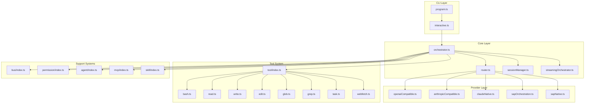
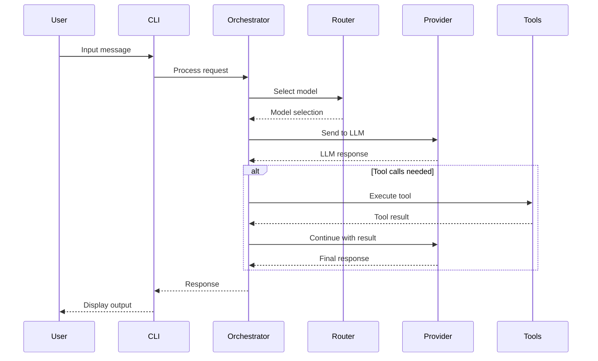
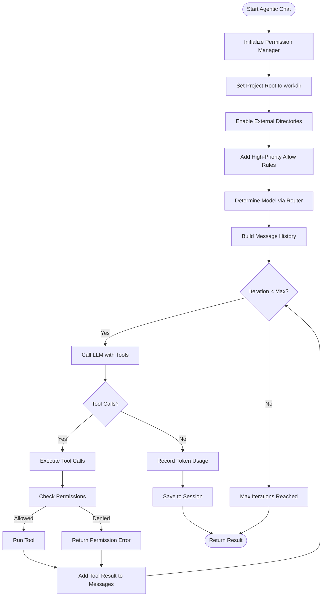
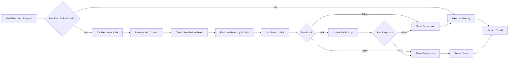

# Alexi Architecture

This document describes the high-level architecture of Alexi, an AI-powered CLI assistant.

## Overview

Alexi is a TypeScript/Node.js application that orchestrates multiple LLM providers with intelligent routing, session management, and extensible tool systems.

## System Architecture



## Module Descriptions

### CLI Layer

| Module | File | Description |
|--------|------|-------------|
| Program | `src/cli/program.ts` | CLI entry point using Commander.js |
| Interactive | `src/cli/interactive.ts` | Interactive mode with streaming UI |

### Core Layer

| Module | File | Description |
|--------|------|-------------|
| Orchestrator | `src/core/orchestrator.ts` | Main orchestration logic |
| Router | `src/core/router.ts` | Model selection and routing |
| Session Manager | `src/core/sessionManager.ts` | Conversation session persistence |
| Streaming Orchestrator | `src/core/streamingOrchestrator.ts` | Real-time streaming support |
| Agentic Chat | `src/core/agenticChat.ts` | Autonomous agent with tool execution loop |
| Stage Manager | `src/core/stageManager.ts` | Workflow stage management |
| Workflow Manager | `src/core/workflowManager.ts` | Multi-stage workflow orchestration |

### Provider Layer

| Module | File | Description |
|--------|------|-------------|
| OpenAI Compatible | `src/providers/openaiCompatible.ts` | OpenAI API compatible provider |
| Anthropic Compatible | `src/providers/anthropicCompatible.ts` | Anthropic Messages API |
| Claude Native | `src/providers/claudeNative.ts` | Direct Claude integration |
| SAP Orchestration | `src/providers/sapOrchestration.ts` | SAP AI Core via SDK |
| SAP Native | `src/providers/sapNative.ts` | Native SAP AI Core API |

### Tool System

| Tool | File | Description |
|------|------|-------------|
| Bash | `src/tool/tools/bash.ts` | Execute shell commands |
| Read | `src/tool/tools/read.ts` | Read files and directories |
| Write | `src/tool/tools/write.ts` | Write files |
| Edit | `src/tool/tools/edit.ts` | Edit files with string replacement |
| Glob | `src/tool/tools/glob.ts` | Find files by pattern |
| Grep | `src/tool/tools/grep.ts` | Search file contents |
| Task | `src/tool/tools/task.ts` | Launch sub-agents |
| WebFetch | `src/tool/tools/webfetch.ts` | Fetch web content |
| Question | `src/tool/tools/question.ts` | Ask user questions |
| TodoWrite | `src/tool/tools/todowrite.ts` | Manage task lists |

### Support Systems

| Module | File | Description |
|--------|------|-------------|
| Event Bus | `src/bus/index.ts` | Pub/sub event system |
| Permission | `src/permission/index.ts` | File access control |
| Agent | `src/agent/index.ts` | Autonomous agent system |
| MCP | `src/mcp/index.ts` | Model Context Protocol |
| Skill | `src/skill/index.ts` | Specialized prompt skills |
| Compaction | `src/compaction/index.ts` | Context compression |
| Profile | `src/profile/index.ts` | User profile management |

## Data Flow



## Agentic Chat Flow



## Permission System Flow



## Configuration

### Environment Variables

```
AICORE_SERVICE_KEY    # SAP AI Core credentials
AICORE_RESOURCE_GROUP # SAP AI Core resource group
OPENAI_API_KEY        # OpenAI API key (optional)
ANTHROPIC_API_KEY     # Anthropic API key (optional)
```

### Routing Configuration

Routing rules are defined in `routing-config.json` or `~/.alexi/routing-config.json`:

```json
{
  "rules": [
    {
      "name": "code-tasks",
      "priority": 100,
      "condition": { "contains": ["code", "implement", "fix"] },
      "model": "anthropic--claude-4-sonnet"
    }
  ],
  "default": {
    "model": "anthropic--claude-4-sonnet"
  }
}
```

## Directory Structure

```
alexi/
├── src/
│   ├── cli/           # CLI entry points
│   ├── core/          # Core orchestration
│   ├── providers/     # LLM providers
│   ├── tool/          # Tool system
│   │   └── tools/     # Individual tools
│   ├── agent/         # Agent system
│   ├── bus/           # Event bus
│   ├── permission/    # Permission system
│   ├── mcp/           # MCP integration
│   ├── skill/         # Skill system
│   ├── config/        # Configuration
│   ├── log/           # Logging
│   ├── profile/       # Profile management
│   └── ...
├── tests/             # Test files
├── dist/              # Compiled output
└── docs/              # Documentation
```

## Key Design Decisions

### 1. Multi-Provider Architecture

Alexi supports multiple LLM providers through a unified interface, allowing:
- Easy switching between providers
- Fallback mechanisms
- Cost optimization through routing

### 2. Tool System with Permission Control

Tools are implemented as independent modules that:
- Follow a consistent interface based on Zod schema validation
- Can be enabled/disabled per session
- Support permission-based access control with last-match-wins rule evaluation
- Resolve relative paths using workdir context for agentic operations
- Support interactive permission prompts and high-priority allow rules

### 3. Agentic Execution Mode

The agentic chat system enables autonomous file operations:
- Automatic permission configuration for write and execute actions
- High-priority allow rules (priority 200) override default ask prompts
- External directory access for full workspace capability
- Tool execution loop with LLM-driven decision making
- Iteration limits to prevent infinite loops (default: 50)

### 4. Event-Driven Architecture

The event bus enables:
- Loose coupling between modules
- Plugin extensibility
- Real-time streaming updates
- Permission events (DoomLoopDetected, ExternalAccessAttempted)

### 5. Session Management

Sessions provide:
- Multi-turn conversation context
- Persistence across CLI invocations
- Export and sharing capabilities

## Security Considerations

1. **Secrets Management**: Secrets are redacted in exports and logs
2. **Permission System**: File access is controlled by configurable rules
3. **Environment Isolation**: Sensitive config stored in `~/.alexi/`

## Future Improvements

- [ ] Add more provider implementations
- [ ] Improve test coverage
- [ ] Add metrics and telemetry
- [ ] Implement caching layer
- [ ] Add web UI option
